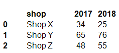
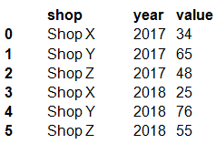
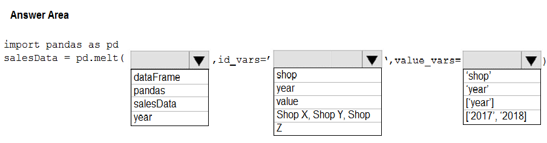
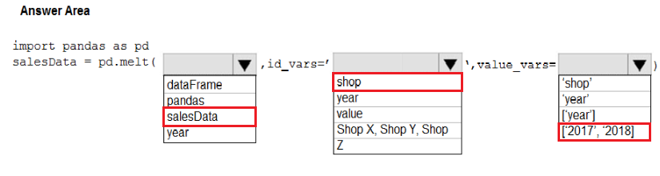

# Question 199

HOTSPOT -

You have a Python data frame named salesData in the following format:

The data frame must be unpivoted to a long data format as follows:

You need to use the pandas.melt() function in Python to perform the transformation.

How should you complete the code segment? To answer, select the appropriate options in the answer area.

NOTE: Each correct selection is worth one point.

Hot Area:

  
Show Suggested Answer

 

  
Show Discussions

<blockquote>
<strong>meswapnilspal</strong> <code>(Sun 08 Nov 2020 20:59)</code> - <em>Upvotes: 58</em>

if salesData contains data in pivoted form ,the syntax should be,
newsalesData = pd.melt(salesData, id_vars = ...............
</blockquote>
<blockquote>
<strong>FuzzyF</strong> <code>(Tue 13 Apr 2021 07:40)</code> - <em>Upvotes: 40</em>

Just tried out: 
pd.melt(salesData, id_vars=[&#x27;shop&#x27;], value_vars=[2017, 2018], var_name=&#x27;year&#x27;) works as desired. [2017, 2018] for value_vars is correct. Side note: without &#x27;var_name&#x27; parameter a default name is given to column 2.
</blockquote>
<blockquote>
<strong>evangelist</strong> <code>(Mon 02 Dec 2024 13:20)</code> - <em>Upvotes: 1</em>

salesData = pd.melt(salesData, id_vars=&#x27;shop&#x27;, value_vars=[&#x27;2017&#x27;, &#x27;2018&#x27;])
</blockquote>
<blockquote>
<strong>kay1101</strong> <code>(Fri 22 Nov 2024 03:34)</code> - <em>Upvotes: 1</em>

I think this question is missing a step of:
whateverdfname = pd.DataFrame(....)
then we can use
salesData =pd.melt(whateverdfname, ...,...)

so the second and third answer are correct, first box not sure.
</blockquote>

<blockquote>
<strong>Ahmed_Gehad</strong> <code>(Tue 30 Jan 2024 11:39)</code> - <em>Upvotes: 2</em>

The answer is wrong. It shall be
pd.melt(salesData, id_vars=[&#x27;shop&#x27;], value_vars=[&#x27;2017&#x27;, &#x27;2018&#x27;])
</blockquote>
<blockquote>
<strong>PI_Team</strong> <code>(Sun 28 Jan 2024 09:47)</code> - <em>Upvotes: 2</em>

import pandas as pd

salesData = pd.DataFrame({
&#x27;shop&#x27;: [&#x27;ShopX&#x27;, &#x27;ShopY&#x27;, &#x27;ShopZ&#x27;],
&#x27;2017&#x27;: [34, 65, 48],
&#x27;2018&#x27;: [25, 76, 55]
})

meltedData = pd.melt(salesData, id_vars=[&#x27;shop&#x27;], value_vars=[&#x27;2017&#x27;, &#x27;2018&#x27;], var_name=&#x27;year&#x27;, value_name=&#x27;value&#x27;)
</blockquote>

<blockquote>
<strong>silva_831</strong> <code>(Wed 03 May 2023 01:03)</code> - <em>Upvotes: 14</em>

Please do not mislead the people. The correct answer should be as below:
1. salesData
2. shop
3. [2017, 2018]
</blockquote>
<blockquote>
<strong>MohammadKhubeb</strong> <code>(Thu 04 Aug 2022 03:51)</code> - <em>Upvotes: 1</em>

why not YEAR, because we are giving the values of col YEAR i.e., 2017,... ?
</blockquote>
<blockquote>
<strong>trickerk</strong> <code>(Fri 28 Jan 2022 12:52)</code> - <em>Upvotes: 9</em>

Correct answer:
salesData
shop
[2017, 2018]
</blockquote>
<blockquote>
<strong>ljljljlj</strong> <code>(Tue 11 Jan 2022 15:01)</code> - <em>Upvotes: 6</em>

On exam 2021/7/10
</blockquote>
<blockquote>
<strong>ali25</strong> <code>(Thu 30 Sep 2021 05:46)</code> - <em>Upvotes: 8</em>

import pandas as pd
salesData = pd.DataFrame({&#x27;shop&#x27;: {0: &#x27;shopx&#x27;, 1: &#x27;shopy&#x27;, 2: &#x27;shopz&#x27;},
                   &#x27;2017&#x27;: {0: &#x27;34&#x27;, 1: &#x27;65&#x27;, 2: &#x27;48&#x27;}, 
                   &#x27;2018&#x27;: {0: &#x27;25&#x27;, 1: &#x27;76&#x27;, 2: &#x27;55&#x27;}}) 
salesData

salesData = salesData.reset_index()
salesData

salesData = pd.melt(salesData, id_vars =[&#x27;shop&#x27;], value_vars=[&#x27;2017&#x27;, &#x27;2018&#x27;])
salesData
</blockquote>

<blockquote>
<strong>Raxy</strong> <code>(Sun 04 Jul 2021 16:13)</code> - <em>Upvotes: 3</em>

Is this a test question that will be included in real exam?
</blockquote>
<blockquote>
<strong>alphmzla</strong> <code>(Thu 01 Jul 2021 02:09)</code> - <em>Upvotes: 1</em>

Just tried df = pd.melt(df, id_vars= [&#x27;Shop&#x27;], value_vars=[&#x27;2017&#x27;, &#x27;2018&#x27;]), it returns desired outcome
</blockquote>
<blockquote>
<strong>worker_3141592</strong> <code>(Sat 01 May 2021 08:03)</code> - <em>Upvotes: 4</em>

import pandas as pd
salesData = pd.DataFrame({&#x27;shop&#x27;: {0: &#x27;Shop X&#x27;, 1: &#x27;Shop Y&#x27;, 2: &#x27;Shop Z&#x27;},
                   &#x27;2017&#x27;: {0: 34, 1: 65, 2: 48},
                   &#x27;2018&#x27;: {0: 25, 1: 76, 2: 55}})

salesData = pd.melt(salesData,id_vars=&#x27;shop&#x27;,value_vars=[&#x27;2017&#x27;,&#x27;2018&#x27;])
print(salesData)

---

     shop variable  value

0 Shop X 2017 34
1 Shop Y 2017 65
2 Shop Z 2017 48
3 Shop X 2018 25
4 Shop Y 2018 76
5 Shop Z 2018 55
</blockquote>

<blockquote>
<strong>dsyouness</strong> <code>(Sun 02 May 2021 08:54)</code> - <em>Upvotes: 1</em>

but if we use dataFrame instead of salesData : 
dataFrame = pd.DataFrame({&#x27;shop&#x27;: {0: &#x27;Shop X&#x27;, 1: &#x27;Shop Y&#x27;, 2: &#x27;Shop Z&#x27;},
&#x27;2017&#x27;: {0: 34, 1: 65, 2: 48},
&#x27;2018&#x27;: {0: 25, 1: 76, 2: 55}})
</blockquote>
<blockquote>
<strong>SN22</strong> <code>(Sun 18 Apr 2021 20:09)</code> - <em>Upvotes: 2</em>

salesData is correct
</blockquote>
<blockquote>
<strong>ARC</strong> <code>(Tue 02 Mar 2021 13:14)</code> - <em>Upvotes: 2</em>

pd.melt(salesData, id_vars=[&#x27;shop&#x27;], value_vars=[&#x27;year&#x27;])
</blockquote>
<blockquote>
<strong>user11111</strong> <code>(Sun 28 Feb 2021 23:41)</code> - <em>Upvotes: 2</em>

Box 2 should be year, because that is the ID of the column you wish to unpivot. You cant use shop because shop doesn&#x27;t have a value [&#x27;2017,&#x27;2018&#x27;]
</blockquote>
<blockquote>
<strong>user11111</strong> <code>(Tue 02 Mar 2021 07:10)</code> - <em>Upvotes: 4</em>

The above is wrong, one is not evaluating columns but rather unpivoting columns therefore Box should be shop. One is unpivoting [&#x27;2017,&#x27;2018&#x27;] relative to shop (column 1)
</blockquote>

---

[<< Previous Question](question_198.md) | [Home](../index.md) | [Next Question >>](question_200.md)
