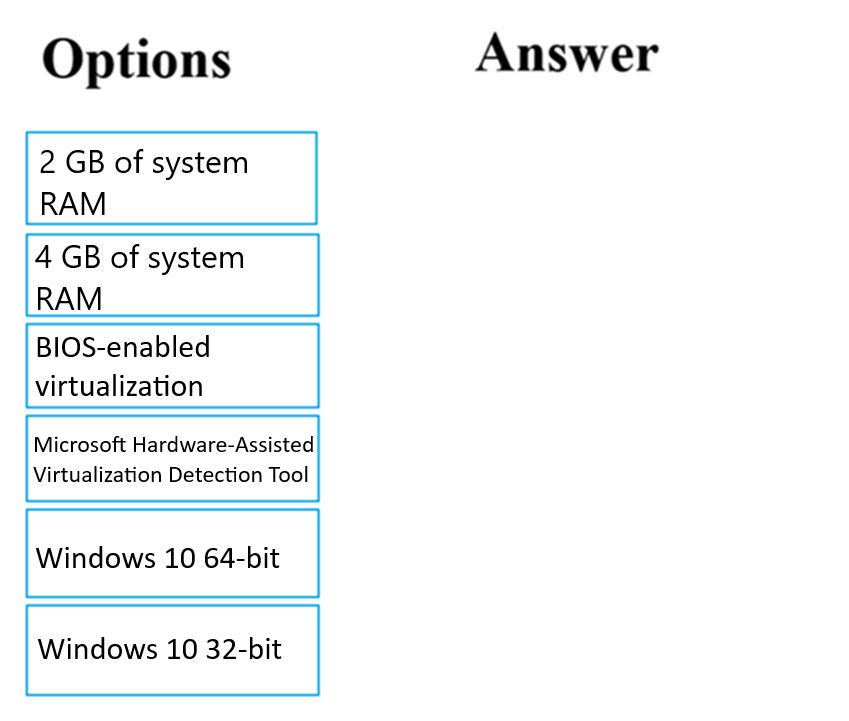
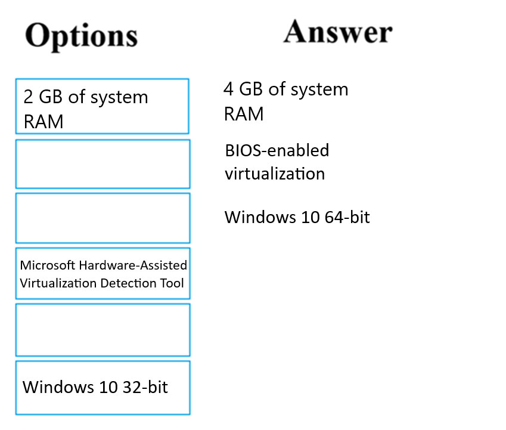
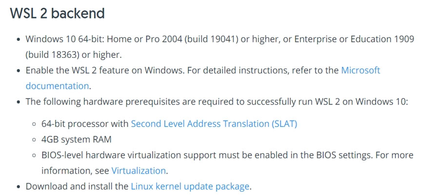

# Question 2

DRAG DROP -

You are planning to host practical training to acquaint staff with Docker for Windows.

Staff devices must support the installation of Docker.

Which of the following are requirements for this installation? Answer by dragging the correct options from the list to the answer area.

Select and Place:

  
Show Suggested Answer

 

Reference:

https://docs.docker.com/toolbox/toolbox_install_windows/

https://blogs.technet.microsoft.com/canitpro/2015/09/08/step-by-step-enabling-hyper-v-for-use-on-windows-10/ https://docs.docker.com/docker-for-windows/install/

 

  
Show Discussions

<blockquote>
<strong>emmanuelodenyire</strong> <code>(Wed 31 Jan 2024 06:59)</code> - <em>Upvotes: 15</em>

Here are the requirements for installing Docker on Windows:

Windows 10 Pro, Enterprise, or Education (64-bit)
Hyper-V and Containers Windows features must be enabled.
The CPU must support Hardware Virtualization.
At least 4GB of RAM.
Windows 10 Anniversary Update (Build 1607+) or Windows Server 2016.
A 64-bit processor.
These requirements should be checked before hosting the practical training to ensure that all staff devices meet the necessary specifications.
So the answer is correct
</blockquote>

<blockquote>
<strong>eternaleclipse</strong> <code>(Thu 17 Oct 2024 12:25)</code> - <em>Upvotes: 2</em>

This wasn&#x27;t in the study material for the exam.
</blockquote>
<blockquote>
<strong>jason_mils</strong> <code>(Wed 11 Dec 2024 13:26)</code> - <em>Upvotes: 1</em>

Hello, you mean this won&#x27;t be in the exam or you mean this is just not in the study material but it can be a question? To be clear: may I find this question in the exam?
</blockquote>
<blockquote>
<strong>james2033</strong> <code>(Sat 12 Oct 2024 04:22)</code> - <em>Upvotes: 3</em>

1) 4 GB of system RAM
2) BIOS-enabled virtualization
3) Windows 10 64-bit
</blockquote>
<blockquote>
<strong>Gabonia</strong> <code>(Sat 19 Aug 2023 13:13)</code> - <em>Upvotes: 4</em>

Correct
</blockquote>

---

[<< Previous Question](question_1.md) | [Home](../index.md) | [Next Question >>](question_3.md)
