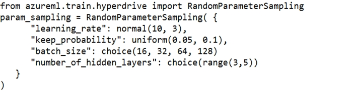
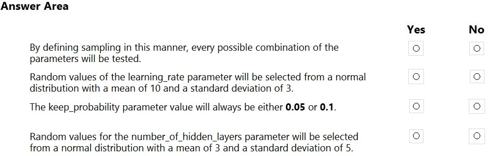
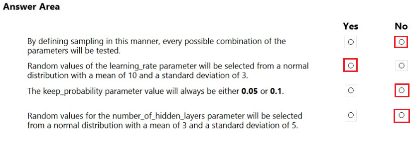

# Question 208

HOTSPOT -

You are using the Hyperdrive feature in Azure Machine Learning to train a model.

You configure the Hyperdrive experiment by running the following code:

For each of the following statements, select Yes if the statement is true. Otherwise, select No.

NOTE: Each correct selection is worth one point.

Hot Area:

  
Show Suggested Answer

 

  
Show Discussions

<blockquote>
<strong>hendriktytgatpwc</strong> <code>(Mon 13 Sep 2021 16:20)</code> - <em>Upvotes: 89</em>

Box 1 should be NO:
only grid sampling does an exhaustive search
 https://docs.microsoft.com/en-us/azure/machine-learning/how-to-tune-hyperparameters#define-search-space
</blockquote>
<blockquote>
<strong>stonefl</strong> <code>(Sun 19 Sep 2021 12:47)</code> - <em>Upvotes: 5</em>

agree, too.
</blockquote>
<blockquote>
<strong>kty</strong> <code>(Sat 18 Sep 2021 08:10)</code> - <em>Upvotes: 4</em>

I agree
</blockquote>
<blockquote>
<strong>jasonbourne7158</strong> <code>(Sun 07 Nov 2021 07:00)</code> - <em>Upvotes: 29</em>

It should be: No, Yes, No, No
</blockquote>
<blockquote>
<strong>zainkhazi</strong> <code>(Mon 09 Sep 2024 06:46)</code> - <em>Upvotes: 1</em>

For those who are still thinking it must be Grid Sampling:
All combination + Reduce computing resource , because &quot;Research has shown that this method (Random Grid Sweep) yields the same results, but is more efficient computationally.&quot; I think D would be the best choice

Referred from: Topic 1 Question 37 in DP-100
Credit: @lookaaaa
</blockquote>

<blockquote>
<strong>NullVoider_0</strong> <code>(Thu 20 Jun 2024 07:50)</code> - <em>Upvotes: 1</em>

Based on the Hyperdrive configuration code snippet provided:

1. False - Using RandomParameterSampling does not test every possible parameter combination, only randomly selected values from the specified distributions.
2. True - The learning_rate parameter is configured to select values randomly from a normal distribution with mean 10 and standard deviation 3.
3. False - The keep_probability parameter uses a uniform distribution between 0.05 and 0.1, so it can take on any value in that range.
4. False - The number_of_hidden_layers parameter samples from a choice of discrete values from 3 to 5, not from a normal distribution.
</blockquote>
<blockquote>
<strong>phdykd</strong> <code>(Thu 18 Jan 2024 03:34)</code> - <em>Upvotes: 4</em>

No, Yes, No, No
</blockquote>
<blockquote>
<strong>Deathking15</strong> <code>(Tue 14 May 2024 15:47)</code> - <em>Upvotes: 1</em>

&quot;No, Yes, No, No&quot; should be the correct answer, the only point of contention being the first answer. Random searching does not exhaustively search, except maybe in instances where the search space is entirely discrete (which, because it contains a Normal distribution, the question&#x27;s is not).
</blockquote>
<blockquote>
<strong>ajay0011</strong> <code>(Sat 07 Oct 2023 03:52)</code> - <em>Upvotes: 2</em>

No,Yes,No,No
</blockquote>
<blockquote>
<strong>Yuriy_Ch</strong> <code>(Fri 08 Sep 2023 11:18)</code> - <em>Upvotes: 4</em>

was on exam 07/March/2023
</blockquote>
<blockquote>
<strong>Edriv</strong> <code>(Sun 16 Jul 2023 10:44)</code> - <em>Upvotes: 1</em>

No, Yes, Yes, Yes
</blockquote>
<blockquote>
<strong>MattAnya</strong> <code>(Tue 04 Jul 2023 05:44)</code> - <em>Upvotes: 6</em>

on 03 Jan 2023
</blockquote>
<blockquote>
<strong>Arend78</strong> <code>(Mon 12 Jun 2023 12:32)</code> - <em>Upvotes: 1</em>

Please note that range() in Python is excluding the upper boundary value, see https://docs.microsoft.com/en-us/azure/machine-learning/how-to-tune-hyperparameters:

command_job_for_sweep = command_job(
batch_size=Choice(values=[16, 32, 64, 128]),
number_of_hidden_layers=Choice(values=range(1,5)),
command_job_for_sweep = command_job(
batch_size=Choice(values=[16, 32, 64, 128]),
number_of_hidden_layers=Choice(values=range(1,5)),
)

In this case, batch_size one of the values [16, 32, 64, 128] and number_of_hidden_layers takes one of the values [1, 2, 3, 4].
</blockquote>

<blockquote>
<strong>therealola</strong> <code>(Sun 18 Dec 2022 02:41)</code> - <em>Upvotes: 3</em>

Similar question on exam 18-06-22
</blockquote>
<blockquote>
<strong>kevinvbc</strong> <code>(Tue 25 Oct 2022 19:19)</code> - <em>Upvotes: 2</em>

It should be No, Yes,No, No. It is random sampling not grid sampling, so not all possible combinations will be tested (which would be impossible here anyway, since some of the parameters are coming from continuous distributions).
</blockquote>
<blockquote>
<strong>kkkk_jjjj</strong> <code>(Sun 18 Sep 2022 08:42)</code> - <em>Upvotes: 3</em>

on exam 18/03/2022
</blockquote>
<blockquote>
<strong>Ankicaa</strong> <code>(Wed 21 Sep 2022 10:47)</code> - <em>Upvotes: 1</em>

what is the right answer? Is the suggested answer here correct? I am doubtful for the first box. Does every combination be tested?
</blockquote>
<blockquote>
<strong>JoshuaXu</strong> <code>(Fri 06 May 2022 21:51)</code> - <em>Upvotes: 2</em>

on 7 Nov 2021, same question about RandomSample, but different question (very similar), be aware of  different distributions and traits of RandomSample
</blockquote>
<blockquote>
<strong>hargur</strong> <code>(Wed 20 Apr 2022 09:44)</code> - <em>Upvotes: 2</em>

on 19Oct2021
</blockquote>
<blockquote>
<strong>pkal</strong> <code>(Fri 25 Mar 2022 00:13)</code> - <em>Upvotes: 2</em>

on exam 9/24/2021
</blockquote>
<blockquote>
<strong>ljljljlj</strong> <code>(Tue 11 Jan 2022 15:03)</code> - <em>Upvotes: 5</em>

On exam 2021/7/10
</blockquote>

---

[<< Previous Question](question_207.md) | [Home](../index.md) | [Next Question >>](question_209.md)
