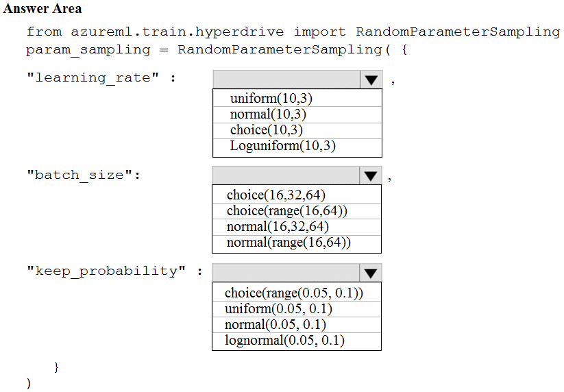
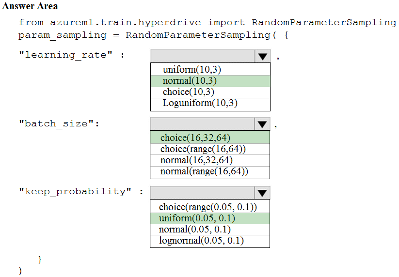

# Question 211

HOTSPOT -

You are using the Azure Machine Learning Service to automate hyperparameter exploration of your neural network classification model.

You must define the hyperparameter space to automatically tune hyperparameters using random sampling according to following requirements:

✑ The learning rate must be selected from a normal distribution with a mean value of 10 and a standard deviation of 3.

✑ Batch size must be 16, 32 and 64.

✑ Keep probability must be a value selected from a uniform distribution between the range of 0.05 and 0.1.

You need to use the param_sampling method of the Python API for the Azure Machine Learning Service.

How should you complete the code segment? To answer, select the appropriate options in the answer area.

NOTE: Each correct selection is worth one point.

Hot Area:

  
Show Suggested Answer

 

Box 1: normal(10,3)

Box 2: choice(16, 32, 64)

Box 3: uniform(0.05, 0.1)

In random sampling, hyperparameter values are randomly selected from the defined search space. Random sampling allows the search space to include both discrete and continuous hyperparameters.

Example:

from azureml.train.hyperdrive import RandomParameterSampling

param_sampling = RandomParameterSampling( {

&quot;learning_rate&quot;: normal(10, 3),

&quot;keep_probability&quot;: uniform(0.05, 0.1),

&quot;batch_size&quot;: choice(16, 32, 64)

}

Reference:

https://docs.microsoft.com/en-us/azure/machine-learning/service/how-to-tune-hyperparameters

  
Show Discussions

<blockquote>
<strong>Andrexx</strong> <code>(Wed 12 May 2021 23:39)</code> - <em>Upvotes: 14</em>

Agree with the answer
</blockquote>
<blockquote>
<strong>ahson0124</strong> <code>(Tue 15 Aug 2023 12:45)</code> - <em>Upvotes: 6</em>

In exam on 2023-02-15
</blockquote>
<blockquote>
<strong>umair_hanu</strong> <code>(Thu 11 Jan 2024 08:11)</code> - <em>Upvotes: 1</em>

correct
</blockquote>
<blockquote>
<strong>Arend78</strong> <code>(Mon 12 Jun 2023 12:42)</code> - <em>Upvotes: 4</em>

I think the correct syntax for choice is
Choice(values=[16, 32, 64, 128])
Just mentioning this in case it will become question on the exam  ;)

https://learn.microsoft.com/en-us/azure/machine-learning/how-to-tune-hyperparameters
</blockquote>

<blockquote>
<strong>og44</strong> <code>(Thu 12 Sep 2024 11:10)</code> - <em>Upvotes: 1</em>

Also the requirement &quot;Batch size must be 16, 32 and 64.&quot; is mal-formed. This implies all the the same time. However, it is one of them. as indicated  in the documentation. Besides, I guess random.choice[ 16, 32,64] would return one of the options.

https://learn.microsoft.com/en-us/azure/machine-learning/how-to-tune-hyperparameters?view=azureml-api-2
</blockquote>

<blockquote>
<strong>nato16</strong> <code>(Mon 29 Mar 2021 11:26)</code> - <em>Upvotes: 2</em>

How can the learning rate have a value of mean, just curious, usually it less then 1.
</blockquote>
<blockquote>
<strong>lollo1234</strong> <code>(Fri 09 Apr 2021 11:45)</code> - <em>Upvotes: 4</em>

it can just be an arbitrary scalar value to weight new observations of gradients
</blockquote>

---

[<< Previous Question](question_210.md) | [Home](../index.md) | [Next Question >>](question_212.md)
