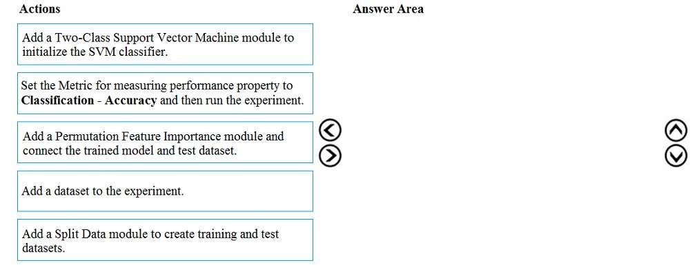
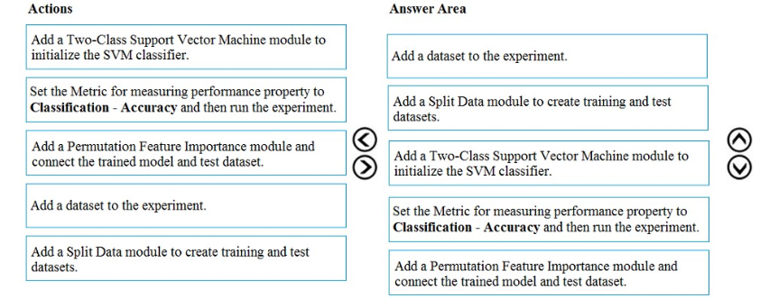

# Question 212

DRAG DROP -

You have a dataset that contains over 150 features. You use the dataset to train a Support Vector Machine (SVM) binary classifier.

You need to use the Permutation Feature Importance module in Azure Machine Learning Studio to compute a set of feature importance scores for the dataset.

In which order should you perform the actions? To answer, move all actions from the list of actions to the answer area and arrange them in the correct order.

Select and Place:

  
Show Suggested Answer

 

  
Show Discussions

<blockquote>
<strong>slash_nyk</strong> <code>(Fri 16 Jul 2021 03:53)</code> - <em>Upvotes: 69</em>

Solution is wrong. Add dataset, Add split, Add Two Class, Add Permutation, Set Accuracy
</blockquote>
<blockquote>
<strong>hkay</strong> <code>(Fri 23 Jul 2021 06:31)</code> - <em>Upvotes: 24</em>

According to the link https://gallery.azure.ai/Experiment/e2ccb5a5d9dc480489ba8ff0b7eb98ac correct answer - add data, split data, add two class, set accuracy, add permutation. You calculate the feature importance post you train your model and get the metrics.a
</blockquote>
<blockquote>
<strong>thhvancouver</strong> <code>(Sat 31 Jul 2021 14:56)</code> - <em>Upvotes: 17</em>

You can&#x27;t run the experiment before connect train and and test. Set accuracy has to be the last step
</blockquote>
<blockquote>
<strong>hargur</strong> <code>(Wed 13 Oct 2021 04:30)</code> - <em>Upvotes: 3</em>

Correct, The right answer is Add dataset, train test split, add two class, set accuracy and add permutation
</blockquote>
<blockquote>
<strong>Arend78</strong> <code>(Mon 12 Dec 2022 13:18)</code> - <em>Upvotes: 4</em>

Here&#x27;s the full text from the SVM example on https://gallery.azure.ai/Experiment/e2ccb5a5d9dc480489ba8ff0b7eb98ac:

Experiment Details

1.  Add the Adult Census Income Binary Classification dataset to your experiment.
2.  Add a Split module to create a training and test datasets.
3.  Add a Two-Class Support Vector Machine module to initialize the SVM classifier.
4.  Add a Train Model module to train the classifier, and connect the SVM module to the left input port and the training dataset to the right input port. Using the column selector set the Label column to income.
5.  Add a Permutation Feature Importance module and connect the trained model and the test dataset to the left and right input ports respectively. Set the Metric for measuring performance property to Classification - Accuracy.
</blockquote>
<blockquote>
<strong>jl420</strong> <code>(Wed 13 Nov 2024 13:00)</code> - <em>Upvotes: 1</em>

1) Add a dataset to the experiment.

2) Add a Split Data module to create training and test datasets.
3) Add a Two-Class Support Vector Machine module to initialize the SVM classifier.
4) Set the Metric for measuring performance property to Classification - Accuracy and then run the experiment.
5) Add a Permutation Feature Importance module and connect to the trained model and test dataset.
</blockquote>
<blockquote>
<strong>evangelist</strong> <code>(Sun 02 Jun 2024 12:03)</code> - <em>Upvotes: 1</em>

given answer is not correct:
Add a dataset to the experiment
Add a Split Data module to create training and test datasets
Add a Two-Class Support Vector Machine module to initialize the SVM classifier
Set the Metric for measuring performance property to Classification - Accuracy and then run the experiment
Add a Permutation Feature Importance module and connect the trained model and test dataset
</blockquote>
<blockquote>
<strong>sl_mslconsulting</strong> <code>(Fri 17 May 2024 21:56)</code> - <em>Upvotes: 1</em>

The provided answer is correct. Have a closer look at the doc provided:

1. Add the Permutation Feature Importance module to your experiment.
   ....
2. For metric for measuring performance, select ...
</blockquote>
<blockquote>
<strong>thea_ipynb69</strong> <code>(Sun 25 Feb 2024 22:04)</code> - <em>Upvotes: 2</em>

Add a dataset to the experiment ➡️ Add a split data module to create training and test datasets ➡️ Add a two-class support vector machine module to initialize the SVM classifier ➡️ Set the metric for measuring performance property classification - accuracy and then run the experiment ➡️ Add a permutation feature importance module and connect the trained model and test dataset.
</blockquote>
<blockquote>
<strong>phdykd</strong> <code>(Tue 18 Jul 2023 02:04)</code> - <em>Upvotes: 2</em>

4-5-1-2-3
</blockquote>
<blockquote>
<strong>fhlos</strong> <code>(Tue 27 Jun 2023 20:26)</code> - <em>Upvotes: 1</em>

Incorrect solution.
Correct from ChatGPT is:
Add a dataset to the experiment.
Add a Split Data module to create training and test datasets.
Add a Two-Class Support Vector Machine module to initialize the SVM classifier.
Add a Permutation Feature Importance module and connect the trained model and test dataset.
Set the Metric for measuring performance property to &quot;Classification - Accuracy&quot; and then run the experiment.
</blockquote>
<blockquote>
<strong>phdykd</strong> <code>(Wed 15 Feb 2023 20:20)</code> - <em>Upvotes: 1</em>

4-5-1-3-2
</blockquote>
<blockquote>
<strong>Edriv</strong> <code>(Sun 15 Jan 2023 20:49)</code> - <em>Upvotes: 2</em>

https://learn.microsoft.com/en-us/azure/machine-learning/component-reference/permutation-feature-importance#how-to-use-permutation-feature-importance
</blockquote>
<blockquote>
<strong>therealola</strong> <code>(Sat 18 Jun 2022 01:41)</code> - <em>Upvotes: 4</em>

on exam 18-06-22
</blockquote>
<blockquote>
<strong>ning</strong> <code>(Mon 23 May 2022 17:22)</code> - <em>Upvotes: 4</em>

1. add dataset
3. split into train vs test
4. add model
5. connect everything
6. run experiment
</blockquote>
<blockquote>
<strong>ning</strong> <code>(Wed 15 Jun 2022 11:54)</code> - <em>Upvotes: 2</em>

On a second thought, you can add model anytime before step 4 ...
So cannot really tell which one is better ...
Either way is good from a practical view ...
</blockquote>
<blockquote>
<strong>Tj87</strong> <code>(Mon 25 Apr 2022 01:40)</code> - <em>Upvotes: 3</em>

There&#x27;s a similar example on this page that explains the order properly:
https://gallery.azure.ai/Experiment/e2ccb5a5d9dc480489ba8ff0b7eb98ac

1- Add the Adult Census Income Binary Classification dataset to your experiment.
2- Add a Split module to create training and test datasets.
3- Add a Two-Class Support Vector Machine module to initialize the SVM classifier.
4- Add a Train Model module to train the classifier, and connect the SVM module to the left input port and the training dataset to the right input port. Using the column selector set the Label column to income.
5- Add a Permutation Feature Importance module and connect the trained model and the test dataset to the left and right input ports respectively. Set the Metric for measuring
6- performance property to Classification - Accuracy.

So the order seems to be, read data, split data, add Two-Class, add Permutation, set Accuracy
</blockquote>

<blockquote>
<strong>TheCyanideLancer</strong> <code>(Thu 13 Jan 2022 08:18)</code> - <em>Upvotes: 1</em>

Solution appears to be correct as I tried it out in old ml studio, except that steps one and two can be reversed or be kept the as mentioned in the solution.
</blockquote>
<blockquote>
<strong>dija123</strong> <code>(Mon 13 Dec 2021 17:29)</code> - <em>Upvotes: 1</em>

Answer is correct,
Add Two Class, Add dataset, Add split, Add Permutation, Set Accuracy
</blockquote>
<blockquote>
<strong>hargur</strong> <code>(Wed 20 Oct 2021 09:44)</code> - <em>Upvotes: 2</em>

on 19Oct2021
</blockquote>
<blockquote>
<strong>hkay</strong> <code>(Fri 23 Jul 2021 02:54)</code> - <em>Upvotes: 3</em>

But according to this link https://docs.microsoft.com/en-us/azure/machine-learning/studio-module-reference/two-class-support-vector-machine, given answer is correct. Still confused because both the methods works fine, either you drag &amp; drop Add two class or add dataset first.
</blockquote>
<blockquote>
<strong>santhoshgoku</strong> <code>(Sat 28 Aug 2021 14:53)</code> - <em>Upvotes: 3</em>

Both would work since they would be in parallel in the designer view
</blockquote>
<blockquote>
<strong>Tj87</strong> <code>(Mon 25 Apr 2022 01:32)</code> - <em>Upvotes: 1</em>

Another link in the URL you shared shows the Two class is added after reading data and splitting it. https://gallery.azure.ai/Experiment/1cd3b4b943484e3ca27eebedacdd6da6
</blockquote>

---

[<< Previous Question](question_211.md) | [Home](/index.md) | [Next Question >>](question_213.md)
