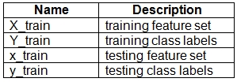
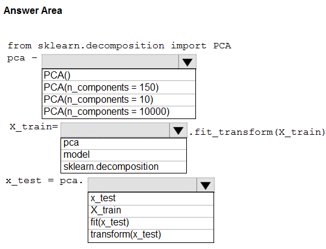
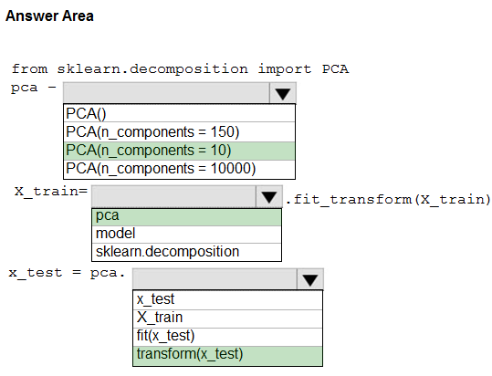

# Question 218

HOTSPOT -

You have a dataset created for multiclass classification tasks that contains a normalized numerical feature set with 10,000 data points and 150 features.

You use 75 percent of the data points for training and 25 percent for testing. You are using the scikit-learn machine learning library in Python. You use X to denote the feature set and Y to denote class labels.

You create the following Python data frames:

You need to apply the Principal Component Analysis (PCA) method to reduce the dimensionality of the feature set to 10 features in both training and testing sets.

How should you complete the code segment? To answer, select the appropriate options in the answer area.

NOTE: Each correct selection is worth one point.

Hot Area:

  
Show Suggested Answer

 

Box 1: PCA(n_components = 10)

Need to reduce the dimensionality of the feature set to 10 features in both training and testing sets.

Example:

from sklearn.decomposition import PCA

pca = PCA(n_components=2) ;2 dimensions

principalComponents = pca.fit_transform(x)

Box 2: pca -

fit_transform(X[, y])    fits the model with X and apply the dimensionality reduction on X.

Box 3: transform(x_test)

transform(X) applies dimensionality reduction to X.

Reference:

https://scikit-learn.org/stable/modules/generated/sklearn.decomposition.PCA.html

  
Show Discussions

<blockquote>
<strong>Yong2020</strong> <code>(Fri 20 Nov 2020 10:42)</code> - <em>Upvotes: 9</em>

n_components should be 10 (the features to reduce to)
</blockquote>
<blockquote>
<strong>ljljljlj</strong> <code>(Tue 11 Jan 2022 15:04)</code> - <em>Upvotes: 5</em>

On exam 2021/7/10
</blockquote>
<blockquote>
<strong>NullVoider_0</strong> <code>(Wed 10 Jul 2024 13:32)</code> - <em>Upvotes: 1</em>

Given answer is correct.
</blockquote>
<blockquote>
<strong>AzureJobsTillRetire</strong> <code>(Sat 05 Aug 2023 01:18)</code> - <em>Upvotes: 3</em>

There are typos in the question.

Name: x_train should be x_test. Description: testing feature set
Name: y_train should be y_test. Description: testing class labels
</blockquote>

<blockquote>
<strong>ning</strong> <code>(Fri 25 Nov 2022 12:40)</code> - <em>Upvotes: 2</em>

Seems correct
</blockquote>
<blockquote>
<strong>WeiD</strong> <code>(Tue 15 Nov 2022 01:41)</code> - <em>Upvotes: 2</em>

There is no x_test in the question, a typo?
</blockquote>
<blockquote>
<strong>PremPatrick</strong> <code>(Sat 13 May 2023 01:16)</code> - <em>Upvotes: 1</em>

Seems like typo in the question!
</blockquote>
<blockquote>
<strong>trickerk</strong> <code>(Fri 28 Jan 2022 13:16)</code> - <em>Upvotes: 2</em>

Given answer is correct!
</blockquote>

---

[<< Previous Question](question_217.md) | [Home](../index.md) | [Next Question >>](question_219.md)
