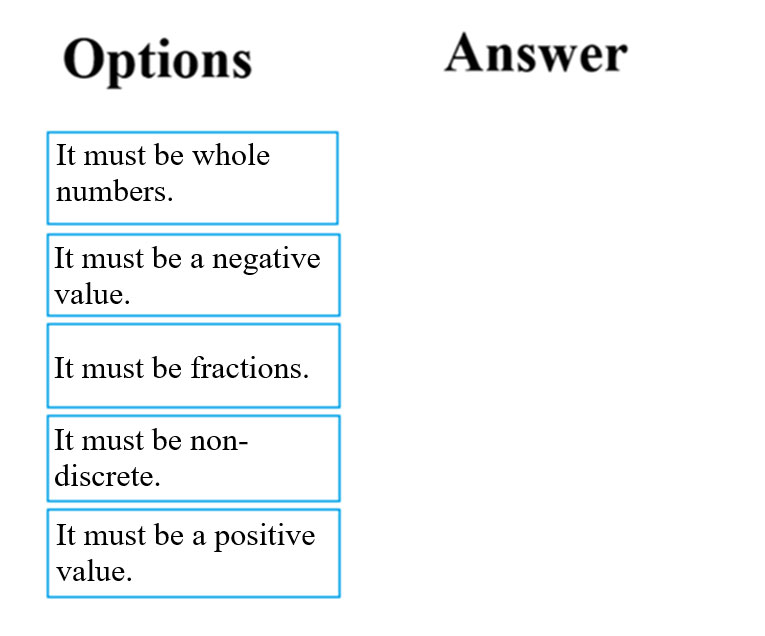
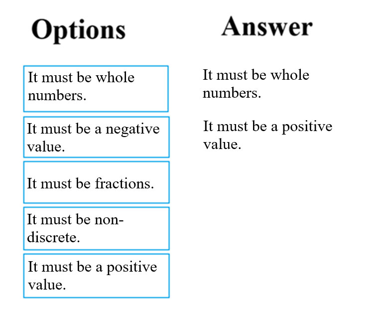

# Question 22

DRAG DROP -

You are in the process of constructing a regression model.

You would like to make it a Poisson regression model. To achieve your goal, the feature values need to meet certain conditions.

Which of the following are relevant conditions with regards to the label data? Answer by dragging the correct options from the list to the answer area.

Select and Place:

  
Show Suggested Answer

 

Poisson regression is intended for use in regression models that are used to predict numeric values, typically counts. Therefore, you should use this module to create your regression model only if the values you are trying to predict fit the following conditions:

✑ The response variable has a Poisson distribution.

✑ Counts cannot be negative. The method will fail outright if you attempt to use it with negative labels.

✑ A Poisson distribution is a discrete distribution; therefore, it is not meaningful to use this method with non-whole numbers.

Reference:

https://docs.microsoft.com/en-us/azure/machine-learning/studio-module-reference/poisson-regression

  
Show Discussions

<blockquote>
<strong>pancman</strong> <code>(Thu 13 Oct 2022 18:58)</code> - <em>Upvotes: 13</em>

Here are the requirements of the Poisson regression: The response variable has a Poisson distribution. Counts cannot be negative. The method will fail outright if you attempt to use it with negative labels. A Poisson distribution is a discrete distribution; therefore, it is not meaningful to use this method with non-whole numbers.
</blockquote>
<blockquote>
<strong>pancman</strong> <code>(Thu 13 Oct 2022 18:57)</code> - <em>Upvotes: 7</em>

Answer is correct
</blockquote>
<blockquote>
<strong>evangelist</strong> <code>(Wed 21 Aug 2024 11:43)</code> - <em>Upvotes: 1</em>

For constructing a Poisson regression model, the label (dependent variable) must meet specific conditions due to the nature of Poisson distribution. Poisson regression is used for modeling count data and the events occurrence in a fixed interval of time or space. The correct conditions for the label data in a Poisson regression model are:

Explanation:
It must be whole numbers: Poisson regression models the count of occurrences of an event, thus the dependent variable must indeed be whole numbers (integers) since you cannot have a fraction of an occurrence.

It must be a positive value: More precisely, the values must be non-negative integers (including zero). Poisson regression is suitable for counts which cannot be negative.
</blockquote>

<blockquote>
<strong>james2033</strong> <code>(Fri 19 Apr 2024 07:57)</code> - <em>Upvotes: 3</em>

* It must be whole numbers.
* It must be a positive value.
</blockquote>
<blockquote>
<strong>phydev</strong> <code>(Sat 20 Jan 2024 08:36)</code> - <em>Upvotes: 3</em>

Yep, Poisson regression do be like that.
</blockquote>

---

[<< Previous Question](question_21.md) | [Home](/index.md) | [Next Question >>](question_23.md)
