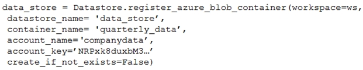
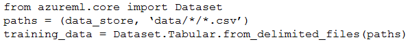

# Question 227

Note: This question is part of a series of questions that present the same scenario. Each question in the series contains a unique solution that might meet the stated goals. Some question sets might have more than one correct solution, while others might not have a correct solution.

After you answer a question in this section, you will NOT be able to return to it. As a result, these questions will not appear in the review screen.

You create an Azure Machine Learning service datastore in a workspace. The datastore contains the following files:

✑ /data/2018/Q1.csv

✑ /data/2018/Q2.csv

✑ /data/2018/Q3.csv

✑ /data/2018/Q4.csv

✑ /data/2019/Q1.csv

All files store data in the following format:

id,f1,f2,I

1,1,2,0

2,1,1,1

3,2,1,0

4,2,2,1

You run the following code:

You need to create a dataset named training_data and load the data from all files into a single data frame by using the following code:

Solution: Run the following code:

Does the solution meet the goal?

- A.Yes
- B.No

  
Show Suggested Answer

<strong>A</strong> 

  
Show Discussions

<blockquote>
<strong>Haet</strong> <code>(Mon 25 Apr 2022 07:42)</code> - <em>Upvotes: 15</em>

The Answer is clearly no
</blockquote>
<blockquote>
<strong>reddragondms</strong> <code>(Tue 26 Sep 2023 09:41)</code> - <em>Upvotes: 11</em>

Its seems the question has been changed/updated since some of these comments.
</blockquote>
<blockquote>
<strong>james2033</strong> <code>(Sat 19 Oct 2024 02:23)</code> - <em>Upvotes: 1</em>

This question is out-of-date, obsoleted. Should be

from azure.ai.ml import ...

not

from azureml.core import Dataset

Reference: https://github.com/Azure/azure-sdk-for-python/tree/azure-ai-ml_1.11.1/sdk/ml/azure-ai-ml#authenticate-the-client
</blockquote>

<blockquote>
<strong>PI_Team</strong> <code>(Thu 01 Aug 2024 12:54)</code> - <em>Upvotes: 1</em>

It meets the requirements. See example below from Microsoft:

# create tabular dataset from all csv files in the directory

tabular_dataset_3 = Dataset.Tabular.from_delimited_files(path=(datastore,&#x27;weather/\*_/_.csv&#x27;))

# create tabular dataset from multiple paths

data_paths = [(datastore, &#x27;weather/2018/11.csv&#x27;), (datastore, &#x27;weather/2018/12.csv&#x27;)]
tabular_dataset_4 = Dataset.Tabular.from_delimited_files(path=data_paths)

Link: https://learn.microsoft.com/en-us/python/api/azureml-core/azureml.data.dataset_factory.tabulardatasetfactory?view=azure-ml-py#azureml-data-dataset-factory-tabulardatasetfactory-from-delimited-files

SaM
</blockquote>

<blockquote>
<strong>fhlos</strong> <code>(Fri 28 Jun 2024 11:46)</code> - <em>Upvotes: 1</em>

No, the solution does not meet the goal. The code provided to create the dataset and load the data into a single DataFrame is incorrect.

To create a dataset named training_data and load the data from all files into a single DataFrame, you need to modify the code as follows:

python
Copy code
from azureml.core import Dataset

paths = [(data_store, &#x27;data/2018/*.csv&#x27;), (data_store, &#x27;data/2019/*.csv&#x27;)]
training_data = Dataset.Tabular.from_delimited_files(paths)
data_frame = training_data.to_pandas_dataframe()
Explanation:

The paths variable is updated to specify the paths of all files to be included in the dataset. In this case, it includes all CSV files in the /data/2018 and /data/2019 directories.
The Dataset.Tabular.from_delimited_files() method is used to create the dataset training_data by providing the paths variable.
The to_pandas_dataframe() method is called on the training_data dataset to load the data from all files into a single pandas DataFrame.
By making these changes, the code will create the desired dataset and load the data from all files into a single DataFrame.
</blockquote>

<blockquote>
<strong>abhishekm94</strong> <code>(Sun 16 Jun 2024 06:14)</code> - <em>Upvotes: 1</em>

Correct answer is Yes
Link :: https://learn.microsoft.com/en-us/python/api/azureml-core/azureml.data.dataset_factory.tabulardatasetfactory?view=azure-ml-py&amp;viewFallbackFrom=azure-ml-pyandhttps%3A%2F%2Flearn.microsoft.com%2Fen-us%2Fpython%2Fapi%2Fazureml-core%2Fazureml.data.tabulardataset%3Fview%3Dazure-ml-py
</blockquote>
<blockquote>
<strong>centurion2020</strong> <code>(Fri 09 Feb 2024 18:57)</code> - <em>Upvotes: 9</em>

Question updated as of Jan 2023.... based on
https://learn.microsoft.com/en-us/python/api/azureml-core/azureml.data.dataset_factory.tabulardatasetfactory?view=azure-ml-py
and
https://learn.microsoft.com/en-us/python/api/azureml-core/azureml.data.tabulardataset?view=azure-ml-py

Answer seems to be A - YES
</blockquote>

<blockquote>
<strong>sultanmr123</strong> <code>(Sun 26 Nov 2023 21:46)</code> - <em>Upvotes: 1</em>

yes Answer is B
</blockquote>
<blockquote>
<strong>casiopa</strong> <code>(Sat 09 Dec 2023 12:07)</code> - <em>Upvotes: 1</em>

Why B?
The Dataset is Tabular, and there is no need for two file paths.
</blockquote>
<blockquote>
<strong>ai_lover</strong> <code>(Thu 07 Sep 2023 13:21)</code> - <em>Upvotes: 2</em>

Answer is correct
</blockquote>
<blockquote>
<strong>YipingRuan</strong> <code>(Mon 25 Jul 2022 02:28)</code> - <em>Upvotes: 1</em>

web_path =&#x27;https://dprepdata.blob.core.windows.net/demo/Titanic.csv&#x27;
titanic_ds = Dataset.Tabular.from_delimited_files(path=web_path, set_column_types={&#x27;Survived&#x27;: DataType.to_bool()})

# preview the first 3 rows of titanic_ds

titanic_ds.take(3).to_pandas_dataframe()

https://docs.microsoft.com/en-us/azure/machine-learning/how-to-create-register-datasets#set-data-schema
</blockquote>

<blockquote>
<strong>brendal89</strong> <code>(Fri 08 Apr 2022 14:11)</code> - <em>Upvotes: 3</em>

I think the answer might be &#x27;yes&#x27;.

see this similar example for parquet files:
datastore_path = [(dstore, dset_name + &#x27;/*/*/data.parquet&#x27;)]
dataset = Dataset.Tabular.from_parquet_files(path=datastore_path, partition_format = dset_name + &#x27;/{partition_time:yyyy/MM}/data.parquet&#x27;)

the partition_format argument appears optional.
reference: https://github.com/Azure/MachineLearningNotebooks/blob/master/how-to-use-azureml/work-with-data/datasets-tutorial/timeseries-datasets/tabular-timeseries-dataset-filtering.ipynb
</blockquote>

<blockquote>
<strong>l2azure</strong> <code>(Sat 09 Apr 2022 12:30)</code> - <em>Upvotes: 13</em>

Answer is &#x27;No&#x27;.
You must create a pandas dataframe which is only possible from a Dataset.Tabular object.
In this case (see last line) the dataframe cannot be made since it is a Dataset.File object.
</blockquote>
<blockquote>
<strong>Arend78</strong> <code>(Wed 13 Dec 2023 11:02)</code> - <em>Upvotes: 3</em>

I think they changed the question. The code now ends with a Tabular Dataset, that indeed can be user as input to as_pandas_dataframe() 
I think the answer is now &quot;Yes&quot;
</blockquote>
<blockquote>
<strong>l2azure</strong> <code>(Sat 09 Apr 2022 12:33)</code> - <em>Upvotes: 2</em>

https://docs.microsoft.com/en-us/python/api/azureml-core/azureml.core.dataset.dataset?view=azure-ml-py
</blockquote>
<blockquote>
<strong>dev2dev</strong> <code>(Thu 17 Mar 2022 11:34)</code> - <em>Upvotes: 1</em>

answer is yes.
</blockquote>
<blockquote>
<strong>dev2dev</strong> <code>(Thu 17 Mar 2022 11:41)</code> - <em>Upvotes: 9</em>

no. its not calling the correct function it should be &quot;from_delimited_files&quot; instead of &quot;from_files&quot;
</blockquote>

---

[<< Previous Question](question_226.md) | [Home](/index.md) | [Next Question >>](question_228.md)
