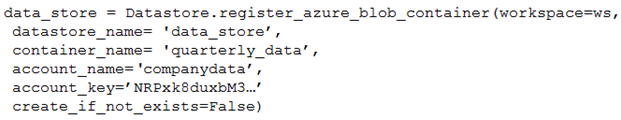
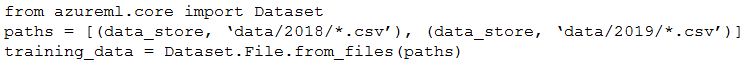

# Question 228

Note: This question is part of a series of questions that present the same scenario. Each question in the series contains a unique solution that might meet the stated goals. Some question sets might have more than one correct solution, while others might not have a correct solution.

After you answer a question in this section, you will NOT be able to return to it. As a result, these questions will not appear in the review screen.

You create an Azure Machine Learning service datastore in a workspace. The datastore contains the following files:

✑ /data/2018/Q1.csv

✑ /data/2018/Q2.csv

✑ /data/2018/Q3.csv

✑ /data/2018/Q4.csv

✑ /data/2019/Q1.csv

All files store data in the following format:

id,f1,f2,I

1,1,2,0

2,1,1,1

3,2,1,0

4,2,2,1

You run the following code:

You need to create a dataset named training_data and load the data from all files into a single data frame by using the following code:

Solution: Run the following code:

Does the solution meet the goal?

- A.Yes
- B.No

  
Show Suggested Answer

<strong>B</strong> 

Use two file paths.

Use Dataset.Tabular_from_delimeted, instead of Dataset.File.from_files as the data isn&#x27;t cleansed.

Note:

A FileDataset references single or multiple files in your datastores or public URLs. If your data is already cleansed, and ready to use in training experiments, you can download or mount the files to your compute as a FileDataset object.

A TabularDataset represents data in a tabular format by parsing the provided file or list of files. This provides you with the ability to materialize the data into a pandas or Spark DataFrame so you can work with familiar data preparation and training libraries without having to leave your notebook. You can create a

TabularDataset object from .csv, .tsv, .parquet, .jsonl files, and from SQL query results.

Reference:

https://docs.microsoft.com/en-us/azure/machine-learning/how-to-create-register-datasets

  
Show Discussions

<blockquote>
<strong>slash_nyk</strong> <code>(Sat 09 Jul 2022 03:54)</code> - <em>Upvotes: 8</em>

Yes. It works
</blockquote>
<blockquote>
<strong>Marcello83</strong> <code>(Sat 27 Aug 2022 13:14)</code> - <em>Upvotes: 5</em>

Tried in aml. It works...
</blockquote>
<blockquote>
<strong>james2033</strong> <code>(Sat 19 Oct 2024 02:23)</code> - <em>Upvotes: 1</em>

This question is out-of-date, obsoleted. Should be

from azure.ai.ml import ...

not

from azureml.core import Dataset

Reference: https://github.com/Azure/azure-sdk-for-python/tree/azure-ai-ml_1.11.1/sdk/ml/azure-ai-ml#authenticate-the-client
</blockquote>

<blockquote>
<strong>fhlos</strong> <code>(Fri 28 Jun 2024 11:50)</code> - <em>Upvotes: 1</em>

No - ChatGPT
No, the solution does not meet the goal. The code provided to create the dataset and load the data into a single DataFrame is incorrect.

To create a dataset named training_data and load the data from all files into a single DataFrame, you need to modify the code as follows:

from azureml.core import Dataset

paths = [(data_store, &#x27;data/2018/*.csv&#x27;), (data_store, &#x27;data/2019/*.csv&#x27;)]
training_data = Dataset.Tabular.from_delimited_files(paths)
data_frame = training_data.to_pandas_dataframe()
Explanation:

The paths variable is updated to specify the paths of all files to be included in the dataset. In this case, it includes all CSV files in the /data/2018 and /data/2019 directories.
The Dataset.Tabular.from_delimited_files() method is used to create the dataset training_data by providing the paths variable.
The to_pandas_dataframe() method is called on the training_data dataset to load the data from all files into a single pandas DataFrame.
By making these changes, the code will create the desired dataset and load the data from all files into a single DataFrame.
</blockquote>

<blockquote>
<strong>abhishekm94</strong> <code>(Sun 16 Jun 2024 06:14)</code> - <em>Upvotes: 1</em>

As per documentation, the correct answer is Yes. 
link:: https://learn.microsoft.com/en-us/python/api/azureml-core/azureml.data.dataset_factory.tabulardatasetfactory?view=azure-ml-py&amp;viewFallbackFrom=azure-ml-pyandhttps%3A%2F%2Flearn.microsoft.com%2Fen-us%2Fpython%2Fapi%2Fazureml-core%2Fazureml.data.tabulardataset%3Fview%3Dazure-ml-py
</blockquote>
<blockquote>
<strong>Crusader2k13</strong> <code>(Tue 19 Dec 2023 23:01)</code> - <em>Upvotes: 1</em>

It is clearly No and the answer is correct!

You can&#x27;t create a pandas dataframe from Dataset.File.from_files(), only from a Tabular dataset!

See:
https://learn.microsoft.com/en-us/python/api/azureml-core/azureml.data.tabulardataset?view=azure-ml-py

FileDataset has no to_pandas_dataframe() method. See:
https://learn.microsoft.com/en-us/python/api/azureml-core/azureml.data.file_dataset.filedataset?view=azure-ml-py
</blockquote>

<blockquote>
<strong>nick234987</strong> <code>(Fri 14 Oct 2022 09:10)</code> - <em>Upvotes: 2</em>

it should be YES. Check this link: https://docs.microsoft.com/en-us/python/api/azureml-core/azureml.data.dataset_factory.tabulardatasetfactory?view=azure-ml-py#from-delimited-files-path--validate-true--include-path-false--infer-column-types-true--set-column-types-none--separator------header-true--partition-format-none--support-multi-line-false--empty-as-string-false--encoding--utf8--
</blockquote>
<blockquote>
<strong>skrjha20</strong> <code>(Thu 29 Sep 2022 08:05)</code> - <em>Upvotes: 3</em>

It should be Yes
# create tabular dataset from all csv files in the directory
   tabular_dataset_3 = Dataset.Tabular.from_delimited_files(path=(datastore,&#x27;weather/**/*.csv&#x27;))
</blockquote>
<blockquote>
<strong>YipingRuan</strong> <code>(Sun 24 Jul 2022 14:44)</code> - <em>Upvotes: 4</em>

# create tabular dataset from all csv files in the directory
   tabular_dataset_3 = Dataset.Tabular.from_delimited_files(path=(datastore,&#x27;weather/**/*.csv&#x27;))

https://docs.microsoft.com/en-us/python/api/azureml-core/azureml.data.dataset_factory.tabulardatasetfactory?view=azure-ml-py
</blockquote>

<blockquote>
<strong>trickerk</strong> <code>(Thu 07 Jul 2022 11:04)</code> - <em>Upvotes: 4</em>

Answer should be Yes.
</blockquote>

---

[<< Previous Question](question_227.md) | [Home](/index.md) | [Next Question >>](question_229.md)
