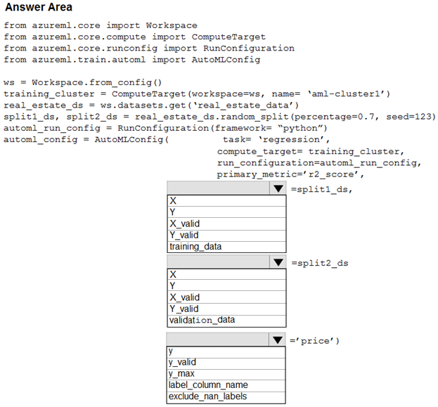

# Question 230

HOTSPOT -

Your Azure Machine Learning workspace has a dataset named real_estate_data. A sample of the data in the dataset follows.

You want to use automated machine learning to find the best regression model for predicting the price column.

You need to configure an automated machine learning experiment using the Azure Machine Learning SDK.

How should you complete the code? To answer, select the appropriate options in the answer area.

NOTE: Each correct selection is worth one point.

Hot Area:

  
Show Suggested Answer

 

Box 1: training_data -

The training data to be used within the experiment. It should contain both training features and a label column (optionally a sample weights column). If training_data is specified, then the label_column_name parameter must also be specified.

Box 2: validation_data -

Provide validation data: In this case, you can either start with a single data file and split it into training and validation sets or you can provide a separate data file for the validation set. Either way, the validation_data parameter in your AutoMLConfig object assigns which data to use as your validation set.

Example, the following code example explicitly defines which portion of the provided data in dataset to use for training and validation. dataset = Dataset.Tabular.from_delimited_files(data) training_data, validation_data = dataset.random_split(percentage=0.8, seed=1) automl_config = AutoMLConfig(compute_target = aml_remote_compute, task = &#x27;classification&#x27;, primary_metric = &#x27;AUC_weighted&#x27;, training_data = training_data, validation_data = validation_data, label_column_name = &#x27;Class&#x27;

)

Box 3: label_column_name -

label_column_name:

The name of the label column. If the input data is from a pandas.DataFrame which doesn&#x27;t have column names, column indices can be used instead, expressed as integers.

This parameter is applicable to training_data and validation_data parameters.

Incorrect Answers:

X: The training features to use when fitting pipelines during an experiment. This setting is being deprecated. Please use training_data and label_column_name instead.

Y: The training labels to use when fitting pipelines during an experiment. This is the value your model will predict. This setting is being deprecated. Please use training_data and label_column_name instead.

X_valid: Validation features to use when fitting pipelines during an experiment.

If specified, then y_valid or sample_weight_valid must also be specified.

Y_valid: Validation labels to use when fitting pipelines during an experiment.

Both X_valid and y_valid must be specified together.

exclude_nan_labels: Whether to exclude rows with NaN values in the label. The default is True. y_max: y_max (float)

Maximum value of y for a regression experiment. The combination of y_min and y_max are used to normalize test set metrics based on the input data range. If not specified, the maximum value is inferred from the data.

Reference:

https://docs.microsoft.com/en-us/python/api/azureml-train-automl-client/azureml.train.automl.automlconfig.automlconfig?view=azure-ml-py

  
Show Discussions

<blockquote>
<strong>treadst0ne</strong> <code>(Mon 20 Dec 2021 02:28)</code> - <em>Upvotes: 15</em>

Answer is correct.
https://docs.microsoft.com/en-us/learn/modules/automate-model-selection-with-azure-automl/4-automl-experiments
</blockquote>
<blockquote>
<strong>Matt2000</strong> <code>(Wed 14 Aug 2024 10:19)</code> - <em>Upvotes: 1</em>

Answer is correct. By the way, X, Y, X_valid, Y_valid are being deprecated. Use training_data and label_column_name or alternatively validation_data and label_column_name instead. Reference: https://learn.microsoft.com/en-us/python/api/azureml-train-automl-client/azureml.train.automl.automlconfig.automlconfig?view=azure-ml-py
</blockquote>
<blockquote>
<strong>orionduo</strong> <code>(Thu 29 Feb 2024 06:45)</code> - <em>Upvotes: 1</em>

from azureml.train.automl import AutoMLConfig

automl_run_config = RunConfiguration(framework=&#x27;python&#x27;)
automl_config = AutoMLConfig(name=&#x27;Automated ML Experiment&#x27;,
task=&#x27;classification&#x27;,
primary_metric = &#x27;AUC_weighted&#x27;,
compute_target=aml_compute,
training_data = train_dataset,
validation_data = test_dataset,
label_column_name=&#x27;Label&#x27;,
featurization=&#x27;auto&#x27;,
iterations=12,
max_concurrent_iterations=4)
</blockquote>

<blockquote>
<strong>RoohiSaanjh</strong> <code>(Mon 26 Sep 2022 20:01)</code> - <em>Upvotes: 1</em>

If specified, then y_valid or sample_weight_valid must also be specified. This setting is being deprecated. Please use validation_data and label_column_name instead.

Both X_valid and y_valid must be specified together. This setting is being deprecated. Please use validation_data and label_column_name instead.

https://docs.microsoft.com/en-us/python/api/azureml-train-automl-client/azureml.train.automl.automlconfig.automlconfig?view=azure-ml-py
</blockquote>

<blockquote>
<strong>hargur</strong> <code>(Wed 20 Apr 2022 09:46)</code> - <em>Upvotes: 2</em>

on 19Oct2021
</blockquote>
<blockquote>
<strong>VJPrakash</strong> <code>(Fri 11 Feb 2022 17:23)</code> - <em>Upvotes: 1</em>

on exam in August 2021
</blockquote>
<blockquote>
<strong>ljljljlj</strong> <code>(Tue 11 Jan 2022 15:06)</code> - <em>Upvotes: 1</em>

On exam 2021/7/10
</blockquote>

---

[<< Previous Question](question_229.md) | [Home](/index.md) | [Next Question >>](question_231.md)
