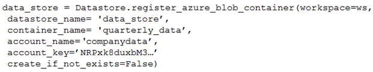
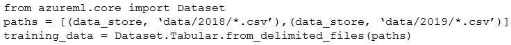

# Question 231

Note: This question is part of a series of questions that present the same scenario. Each question in the series contains a unique solution that might meet the stated goals. Some question sets might have more than one correct solution, while others might not have a correct solution.

After you answer a question in this section, you will NOT be able to return to it. As a result, these questions will not appear in the review screen.

You create an Azure Machine Learning service datastore in a workspace. The datastore contains the following files:

✑ /data/2018/Q1.csv

✑ /data/2018/Q2.csv

✑ /data/2018/Q3.csv

✑ /data/2018/Q4.csv

✑ /data/2019/Q1.csv

All files store data in the following format:

id,f1,f2,I

1,1,2,0

2,1,1,1

3,2,1,0

4,2,2,1

You run the following code:

You need to create a dataset named training_data and load the data from all files into a single data frame by using the following code:

Solution: Run the following code:

Does the solution meet the goal?

- A.Yes
- B.No

  
Show Suggested Answer

<strong>A</strong> 

Use two file paths.

Use Dataset.Tabular_from_delimeted as the data isn&#x27;t cleansed.

Note:

A TabularDataset represents data in a tabular format by parsing the provided file or list of files. This provides you with the ability to materialize the data into a pandas or Spark DataFrame so you can work with familiar data preparation and training libraries without having to leave your notebook. You can create a

TabularDataset object from .csv, .tsv, .parquet, .jsonl files, and from SQL query results.

Reference:

https://docs.microsoft.com/en-us/azure/machine-learning/how-to-create-register-datasets

  
Show Discussions

<blockquote>
<strong>PakE</strong> <code>(Mon 28 Mar 2022 07:05)</code> - <em>Upvotes: 18</em>

The correct answer should be Yes. I have tested that the code works.
</blockquote>
<blockquote>
<strong>brendal89</strong> <code>(Fri 08 Apr 2022 14:15)</code> - <em>Upvotes: 11</em>

I think the answer might be &#x27;yes&#x27;.

see this similar example for parquet files:
datastore_path = [(dstore, dset_name + &#x27;/*/*/data.parquet&#x27;)]
dataset = Dataset.Tabular.from_parquet_files(path=datastore_path, partition_format = dset_name + &#x27;/{partition_time:yyyy/MM}/data.parquet&#x27;)

the partition_format argument appears optional.
reference: https://github.com/Azure/MachineLearningNotebooks/blob/master/how-to-use-azureml/work-with-data/datasets-tutorial/timeseries-datasets/tabular-timeseries-dataset-filtering.ipynb
</blockquote>

<blockquote>
<strong>james2033</strong> <code>(Sat 19 Oct 2024 02:24)</code> - <em>Upvotes: 1</em>

This question is out-of-date, obsoleted. Should be

from azure.ai.ml import ...

not

from azureml.core import Dataset

Reference: https://github.com/Azure/azure-sdk-for-python/tree/azure-ai-ml_1.11.1/sdk/ml/azure-ai-ml#authenticate-the-client
</blockquote>

<blockquote>
<strong>fhlos</strong> <code>(Fri 28 Jun 2024 11:53)</code> - <em>Upvotes: 1</em>

YES - Chat GPT
Yes, the solution meets the goal. The provided code correctly creates a dataset named training_data and loads the data from all files into a single DataFrame.

from azureml.core import Dataset

paths = [(data_store, &#x27;data/2018/*.csv&#x27;), (data_store, &#x27;data/2019/*.csv&#x27;)]
training_data = Dataset.Tabular.from_delimited_files(paths)
data_frame = training_data.to_pandas_dataframe()
Explanation:

The code registers the Azure Blob container datastore named data_store in the workspace.
The paths variable is defined to specify the paths of all files to be included in the dataset. It includes all CSV files in the /data/2018 and /data/2019 directories.
The Dataset.Tabular.from_delimited_files() method is used to create the dataset training_data by providing the paths variable.
The to_pandas_dataframe() method is called on the training_data dataset to load the data from all files into a single pandas DataFrame.
By executing this code, the dataset training_data will be created, and the data from all files will be loaded into a single DataFrame for further processing.
</blockquote>

<blockquote>
<strong>therealola</strong> <code>(Sun 18 Jun 2023 01:43)</code> - <em>Upvotes: 2</em>

On exam 18-06-22
</blockquote>
<blockquote>
<strong>azurelearner666</strong> <code>(Fri 14 Apr 2023 06:25)</code> - <em>Upvotes: 1</em>

A. Yes.

from azureml.core import Dataset

# Get the default datastore

default_ds = ws.get_default_datastore()

#Create a tabular dataset from the path on the datastore (this may take a short while)
tab_data_set = Dataset.Tabular.from_delimited_files(path=(default_ds, &#x27;diabetes-data/\*.csv&#x27;))

# Display the first 20 rows as a Pandas dataframe

tab_data_set.take(20).to_pandas_dataframe()
</blockquote>

<blockquote>
<strong>Thornehead</strong> <code>(Thu 23 Mar 2023 21:51)</code> - <em>Upvotes: 1</em>

Read the question again. The answer is not yes because it has missing values in it. The data has to be processed first then it should be put in for the training.
</blockquote>
<blockquote>
<strong>nick234987</strong> <code>(Fri 14 Oct 2022 09:15)</code> - <em>Upvotes: 5</em>

It is yes, no doubt
</blockquote>
<blockquote>
<strong>slash_nyk</strong> <code>(Sun 26 Jun 2022 03:25)</code> - <em>Upvotes: 1</em>

Hi All. The code works but answer should be yes. Pay attention to the output. Print out the the  dataset and you will notice the difference in soruce
</blockquote>
<blockquote>
<strong>surfing</strong> <code>(Sat 18 Jun 2022 20:22)</code> - <em>Upvotes: 3</em>

The answer is Yes.

from azureml.core import Dataset

# Get the default datastore

default_ds = ws.get_default_datastore()

#Create a tabular dataset from the path on the datastore (this may take a short while)
tab_data_set = Dataset.Tabular.from_delimited_files(path=(default_ds, &#x27;diabetes-data/\*.csv&#x27;))

# Display the first 20 rows as a Pandas dataframe

tab_data_set.take(20).to_pandas_dataframe()
</blockquote>

<blockquote>
<strong>rsamant</strong> <code>(Tue 31 May 2022 18:39)</code> - <em>Upvotes: 5</em>

answer is yes. tested
</blockquote>
<blockquote>
<strong>scipio</strong> <code>(Mon 16 May 2022 18:25)</code> - <em>Upvotes: 2</em>

I think the problem is the * for the directory. Something like this:
paths = [(data_store, &#x27;data/2018/*.csv&#x27;),(data_store, &#x27;data/2019/*.csv&#x27;)]
it would be the correct way
</blockquote>
<blockquote>
<strong>treadst0ne</strong> <code>(Thu 23 Jun 2022 05:34)</code> - <em>Upvotes: 2</em>

I had the same concern, but after testing it, it is possible to create a Tabular dataset passing &quot;parent_folder/*/*.csv&quot; as a path.
So yes, answer should be A.
</blockquote>
<blockquote>
<strong>ali25</strong> <code>(Thu 31 Mar 2022 12:26)</code> - <em>Upvotes: 1</em>

from azureml.core import Workspace, Datastore, Dataset

datastore_name = &#x27;your datastore name&#x27;

# get existing workspace

workspace = Workspace.from_config()

# retrieve an existing datastore in the workspace by name

datastore = Datastore.get(workspace, datastore_name)

# create a TabularDataset from 3 file paths in datastore

datastore_paths = [(datastore, &#x27;weather/2018/11.csv&#x27;),
(datastore, &#x27;weather/2018/12.csv&#x27;),
(datastore, &#x27;weather/2019/*.csv&#x27;)]

weather_ds = Dataset.Tabular.from_delimited_files(path=datastore_paths)
</blockquote>

---

[<< Previous Question](question_230.md) | [Home](../index.md) | [Next Question >>](question_232.md)
