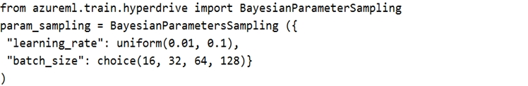
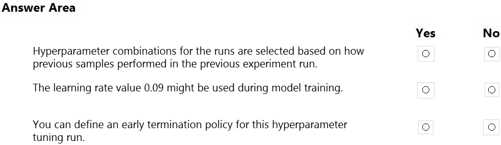
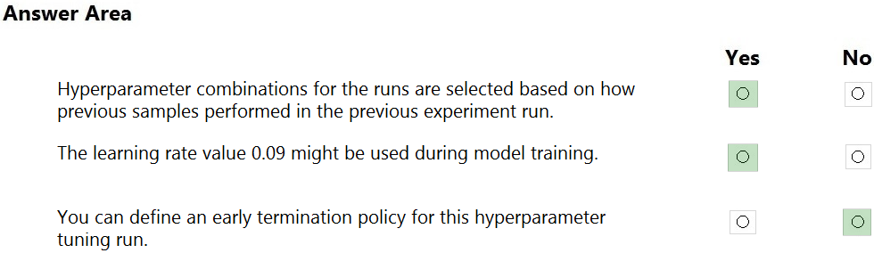

# Question 232

HOTSPOT -

You have a multi-class image classification deep learning model that uses a set of labeled photographs. You create the following code to select hyperparameter values when training the model.

For each of the following statements, select Yes if the statement is true. Otherwise, select No.

NOTE: Each correct selection is worth one point.

Hot Area:

  
Show Suggested Answer

 

Box 1: Yes -

Hyperparameters are adjustable parameters you choose to train a model that govern the training process itself. Azure Machine Learning allows you to automate hyperparameter exploration in an efficient manner, saving you significant time and resources. You specify the range of hyperparameter values and a maximum number of training runs. The system then automatically launches multiple simultaneous runs with different parameter configurations and finds the configuration that results in the best performance, measured by the metric you choose. Poorly performing training runs are automatically early terminated, reducing wastage of compute resources. These resources are instead used to explore other hyperparameter configurations.

Box 2: Yes -

uniform(low, high) - Returns a value uniformly distributed between low and high

Box 3: No -

Bayesian sampling does not currently support any early termination policy.

Reference:

https://docs.microsoft.com/en-us/azure/machine-learning/how-to-tune-hyperparameters

  
Show Discussions

<blockquote>
<strong>Anty85</strong> <code>(Tue 21 Sep 2021 17:45)</code> - <em>Upvotes: 40</em>

Yes - Bayesian sampling  IS based on previous experiments
Yes - obviously
No - There is no early termination policy in Bayesian sampling
</blockquote>
<blockquote>
<strong>rishi_ram</strong> <code>(Wed 01 Dec 2021 18:01)</code> - <em>Upvotes: 7</em>

Bayesian sampling is based on the Bayesian optimization algorithm. It picks samples based on how previous samples did, so that new samples improve the primary metric.
Bayesian sampling only supports choice, uniform, and quniform distributions over the search space.
Bayesian sampling does not support early termination. When using Bayesian sampling, set early_termination_policy = None.
Based on this Answers are : YES, YES and NO
</blockquote>
<blockquote>
<strong>NullVoider_0</strong> <code>(Mon 12 Aug 2024 14:57)</code> - <em>Upvotes: 2</em>

On exam 12-02-2024.
</blockquote>
<blockquote>
<strong>james2033</strong> <code>(Fri 19 Apr 2024 03:07)</code> - <em>Upvotes: 1</em>

- Yes
- Yes
- No

Has not any relation between &#x27;Bayesian sampling&#x27; to &#x27;Early termination policy for hyperparameter tuning&#x27;.

Bayesian sampling does not support early termination policies.

Reference https://learn.microsoft.com/en-us/python/api/azureml-train-core/azureml.train.hyperdrive.bayesianparametersampling?view=azure-ml-py#:~:text=Bayesian%20sampling%20does%20not%20support%20early%20termination%20policies.
</blockquote>

<blockquote>
<strong>rishi_ram</strong> <code>(Tue 28 Nov 2023 09:14)</code> - <em>Upvotes: 2</em>

https://learn.microsoft.com/en-us/python/api/azureml-train-core/azureml.train.hyperdrive.bayesianparametersampling?view=azure-ml-py
YES YES NO
</blockquote>
<blockquote>
<strong>therealola</strong> <code>(Sun 18 Dec 2022 02:44)</code> - <em>Upvotes: 2</em>

On exam 18-06-22
</blockquote>
<blockquote>
<strong>racnaoamo</strong> <code>(Sat 19 Nov 2022 08:55)</code> - <em>Upvotes: 1</em>

similar question on 18-5-22
</blockquote>
<blockquote>
<strong>tunaktunak</strong> <code>(Thu 26 May 2022 11:15)</code> - <em>Upvotes: 4</em>

On exam 26/11/2021
</blockquote>
<blockquote>
<strong>JoshuaXu</strong> <code>(Fri 06 May 2022 21:54)</code> - <em>Upvotes: 2</em>

on exam 6 Nov 2021
</blockquote>
<blockquote>
<strong>ljljljlj</strong> <code>(Tue 11 Jan 2022 15:07)</code> - <em>Upvotes: 6</em>

On exam 2021/7/10
</blockquote>
<blockquote>
<strong>ali25</strong> <code>(Mon 04 Oct 2021 07:31)</code> - <em>Upvotes: 3</em>

yes, yes, no, verify the first
</blockquote>
<blockquote>
<strong>BilJon</strong> <code>(Wed 29 Sep 2021 08:16)</code> - <em>Upvotes: 1</em>

Bayesian sampling does not support early termination policies. When using Bayesian parameter sampling, use NoTerminationPolicy, set early termination policy to None, or leave off the early_termination_policy parameter.

https://docs.microsoft.com/en-us/python/api/azureml-train-core/azureml.train.hyperdrive.bayesianparametersampling?view=azure-ml-py
</blockquote>

<blockquote>
<strong>BilJon</strong> <code>(Wed 29 Sep 2021 08:15)</code> - <em>Upvotes: 1</em>

Bayesian sampling tries to intelligently pick the next sample of hyperparameters, based on how the previous samples performed, such that the new sample improves the reported primary metric.
</blockquote>
<blockquote>
<strong>dev2dev</strong> <code>(Mon 20 Sep 2021 04:02)</code> - <em>Upvotes: 1</em>

1 No -- hyper tuning doesnt consider previous experiment,
2 Yes - because 0.09 falls between given uniform range 
3 Yes - You can define early termination
</blockquote>
<blockquote>
<strong>woyaodp100</strong> <code>(Sat 23 Oct 2021 02:06)</code> - <em>Upvotes: 7</em>

not correct
</blockquote>
<blockquote>
<strong>Afotechque</strong> <code>(Mon 20 Sep 2021 16:17)</code> - <em>Upvotes: 2</em>

Bayesian sampling tries to intelligently pick the next sample of hyperparameters, based on how the previous samples performed, such that the new sample improves the reported primary metric
</blockquote>
<blockquote>
<strong>Afotechque</strong> <code>(Mon 20 Sep 2021 16:23)</code> - <em>Upvotes: 1</em>

https://docs.microsoft.com/en-us/python/api/azureml-train-core/azureml.train.hyperdrive?view=azure-ml-py
</blockquote>

---

[<< Previous Question](question_231.md) | [Home](../index.md) | [Next Question >>](question_233.md)
