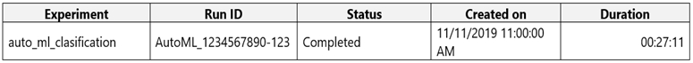
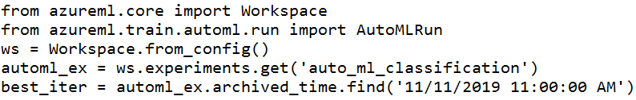
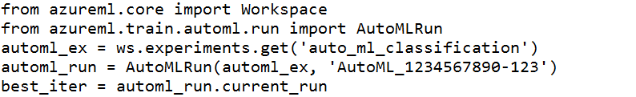
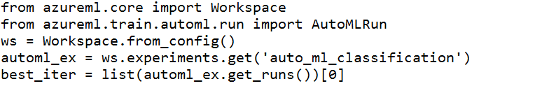
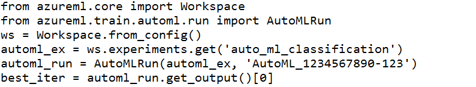
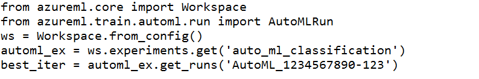

# Question 233

You run an automated machine learning experiment in an Azure Machine Learning workspace. Information about the run is listed in the table below:

You need to write a script that uses the Azure Machine Learning SDK to retrieve the best iteration of the experiment run.

Which Python code segment should you use?

A.

B.

C.

D.

E.

  
Show Suggested Answer

<strong>D</strong> 

The get_output method on automl_classifier returns the best run and the fitted model for the last invocation. Overloads on get_output allow you to retrieve the best run and fitted model for any logged metric or for a particular iteration.

In [ ]:

best_run, fitted_model = local_run.get_output()

Reference:

https://notebooks.azure.com/azureml/projects/azureml-getting-started/html/how-to-use-azureml/automated-machine-learning/classification-with-deployment/auto- ml-classification-with-deployment.ipynb

  
Show Discussions

<blockquote>
<strong>G14th</strong> <code>(Thu 12 May 2022 15:09)</code> - <em>Upvotes: 11</em>

answer is correct
</blockquote>
<blockquote>
<strong>dev2dev</strong> <code>(Sun 20 Mar 2022 05:07)</code> - <em>Upvotes: 9</em>

check section &quot;Retrieve the best model&quot;
https://docs.microsoft.com/en-us/azure/machine-learning/tutorial-auto-train-models
</blockquote>
<blockquote>
<strong>james2033</strong> <code>(Sat 19 Oct 2024 02:42)</code> - <em>Upvotes: 2</em>

This question is out-of-date, obsoleted since Microsoft release Azure SDK Machine Learning SDK v2. Should be

from azure.ai.ml import ...

not

from azureml.core import Dataset

Reference: https://github.com/Azure/azure-sdk-for-python/tree/azure-ai-ml_1.11.1/sdk/ml/azure-ai-ml#authenticate-the-client

https://learn.microsoft.com/en-us/python/api/azure-ai-ml/azure.ai.ml.automl.trainingsettings?view=azure-python
</blockquote>

<blockquote>
<strong>RamundiGR</strong> <code>(Tue 06 Feb 2024 20:23)</code> - <em>Upvotes: 1</em>

answer is correct
</blockquote>
<blockquote>
<strong>hargur</strong> <code>(Thu 20 Oct 2022 09:47)</code> - <em>Upvotes: 3</em>

on 19Oct2021
</blockquote>
<blockquote>
<strong>hargur</strong> <code>(Thu 20 Oct 2022 09:46)</code> - <em>Upvotes: 2</em>

on 19Oct2021
</blockquote>
<blockquote>
<strong>VJPrakash</strong> <code>(Thu 11 Aug 2022 16:24)</code> - <em>Upvotes: 3</em>

on exam in August 2021
</blockquote>
<blockquote>
<strong>ACSC</strong> <code>(Fri 08 Apr 2022 12:18)</code> - <em>Upvotes: 5</em>

Answer is correct: use get_output()
</blockquote>

---

[<< Previous Question](question_232.md) | [Home](../index.md) | [Next Question >>](question_234.md)
