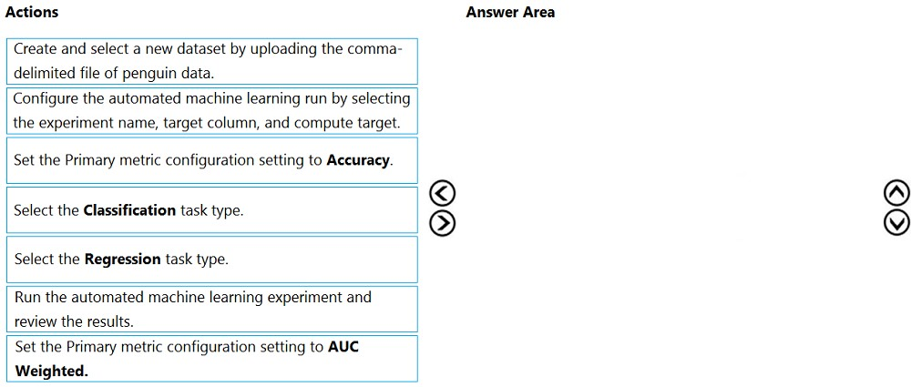
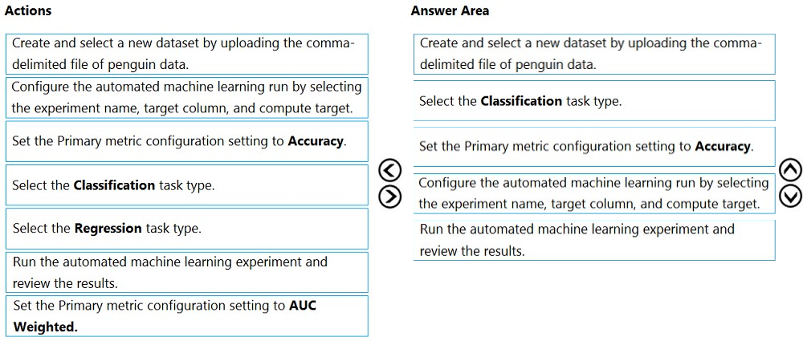

# Question 242

DRAG DROP -

You are creating a machine learning model that can predict the species of a penguin from its measurements. You have a file that contains measurements for three species of penguin in comma-delimited format.

The model must be optimized for area under the received operating characteristic curve performance metric, averaged for each class.

You need to use the Automated Machine Learning user interface in Azure Machine Learning studio to run an experiment and find the best performing model.

Which five actions should you perform in sequence? To answer, move the appropriate actions from the list of actions to the answer area and arrange them in the correct order.

Select and Place:

  
Show Suggested Answer

 

Step 1:Create and select a new dataset by uploading he command-delimited file of penguin data.

Step 2: Select the Classification task type

Step 3: Set the Primary metric configuration setting to Accuracy.

The available metrics you can select is determined by the task type you choose.

Primary metrics for classification scenarios:

Post thresholded metrics, like accuracy, average_precision_score_weighted, norm_macro_recall, and precision_score_weighted may not optimize as well for datasets which are very small, have very large class skew (class imbalance), or when the expected metric value is very close to 0.0 or 1.0. In those cases,

AUC_weighted can be a better choice for the primary metric.

Step 4: Configure the automated machine learning run by selecting the experiment name, target column, and compute target

Step 5: Run the automated machine learning experiment and review the results.

Reference:

https://docs.microsoft.com/en-us/azure/machine-learning/how-to-configure-auto-train

  
Show Discussions

<blockquote>
<strong>ImogenW</strong> <code>(Fri 11 Mar 2022 16:52)</code> - <em>Upvotes: 107</em>

This is incorrect, its create dataset &gt; configure experiment &gt; select classification &gt; select metric (AUC)&gt; run exp
</blockquote>
<blockquote>
<strong>gunn_m</strong> <code>(Sun 15 Dec 2024 20:34)</code> - <em>Upvotes: 1</em>

I was in the Submit an Automated ML job tab
We have the following flow:
1Training method:
Where we choose whether it will be automatic training, custom script,

Perform hyperparameter tuning.
2Basic settings:
Experiment name and description
3Task type &amp; data:
We select the dataset and the task type
4Task settings:
We configure metrics among others
5Compute
We select the computing resources
6Review

It is important to note that the UI has changed recently.
</blockquote>

<blockquote>
<strong>MohsenSic</strong> <code>(Thu 30 Jun 2022 04:15)</code> - <em>Upvotes: 2</em>

Why is this incorrect, if we assume the training is done in train.py (which we import data, define model, and then predict and measure the accuracy), and then in python, we define SriptRunConfig (again we can define primary metric name) and then run the experiment, then the suggested order is correct
</blockquote>
<blockquote>
<strong>azure1000</strong> <code>(Fri 05 Aug 2022 04:32)</code> - <em>Upvotes: 7</em>

It says &quot;Automated Machine Learning user interface in Azure Machine Learning studio &quot; why will you use python?
</blockquote>
<blockquote>
<strong>Sabrina442</strong> <code>(Wed 06 Apr 2022 12:22)</code> - <em>Upvotes: 3</em>

You are totally right
</blockquote>
<blockquote>
<strong>kty</strong> <code>(Fri 18 Mar 2022 07:48)</code> - <em>Upvotes: 3</em>

I agree
</blockquote>
<blockquote>
<strong>slash_nyk</strong> <code>(Sat 16 Jul 2022 04:54)</code> - <em>Upvotes: 22</em>

Create Dataset, Configure, Select Classification, AUC Weighted, Submit experiment.

Tested
</blockquote>

<blockquote>
<strong>harkamal</strong> <code>(Mon 08 Jul 2024 04:47)</code> - <em>Upvotes: 4</em>

metric should be AUC Weighted
</blockquote>
<blockquote>
<strong>Yuriy_Ch</strong> <code>(Fri 08 Mar 2024 12:20)</code> - <em>Upvotes: 3</em>

Exactly this question was on exam 07/March/2023
</blockquote>
<blockquote>
<strong>phdykd</strong> <code>(Fri 16 Feb 2024 19:33)</code> - <em>Upvotes: 1</em>

Create Dataset, Configure, Select Classification, AUC Weighted, Submit experiment.
</blockquote>
<blockquote>
<strong>therealola</strong> <code>(Sun 18 Jun 2023 01:44)</code> - <em>Upvotes: 3</em>

On exam 18-06-22
</blockquote>
<blockquote>
<strong>hargur</strong> <code>(Thu 20 Oct 2022 09:50)</code> - <em>Upvotes: 4</em>

on 19Oct2021
</blockquote>
<blockquote>
<strong>kisskeo</strong> <code>(Sat 08 Oct 2022 21:03)</code> - <em>Upvotes: 2</em>

On Exam 01 Oct 2021
</blockquote>
<blockquote>
<strong>RyanTsai</strong> <code>(Thu 22 Sep 2022 07:45)</code> - <em>Upvotes: 1</em>

agree: create dataset &gt; configure experiment &gt; select classification &gt; select metric (AUC)&gt; run exp
</blockquote>
<blockquote>
<strong>mthombenindhl84</strong> <code>(Sun 11 Sep 2022 22:02)</code> - <em>Upvotes: 1</em>

on exam 11/9/2021
</blockquote>
<blockquote>
<strong>dushmantha</strong> <code>(Sun 04 Sep 2022 05:33)</code> - <em>Upvotes: 1</em>

On exam 2021/08/31
</blockquote>
<blockquote>
<strong>snsnsnsn</strong> <code>(Sat 03 Sep 2022 07:35)</code> - <em>Upvotes: 1</em>

on 2/9/21
</blockquote>
<blockquote>
<strong>datamijn</strong> <code>(Tue 02 Aug 2022 09:01)</code> - <em>Upvotes: 4</em>

on exam 2/8/2021
</blockquote>
<blockquote>
<strong>rishi_ram</strong> <code>(Sat 04 Jun 2022 06:36)</code> - <em>Upvotes: 4</em>

https://docs.microsoft.com/en-us/azure/machine-learning/tutorial-first-experiment-automated-ml
Answer should be Create DataSet&gt;Configure run&gt;Select Classification as the machine learning task type&gt;Select AUC_weighted&gt; Run
</blockquote>
<blockquote>
<strong>BilJon</strong> <code>(Sat 26 Mar 2022 20:03)</code> - <em>Upvotes: 3</em>

AUC Weighted is correct as shown here: https://docs.microsoft.com/en-us/azure/machine-learning/tutorial-first-experiment-automated-ml
</blockquote>

---

[<< Previous Question](question_241.md) | [Home](/index.md) | [Next Question >>](question_243.md)
