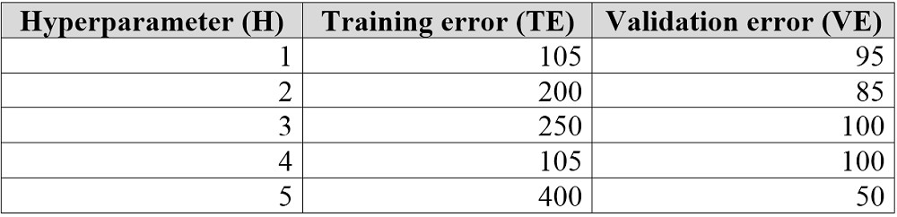
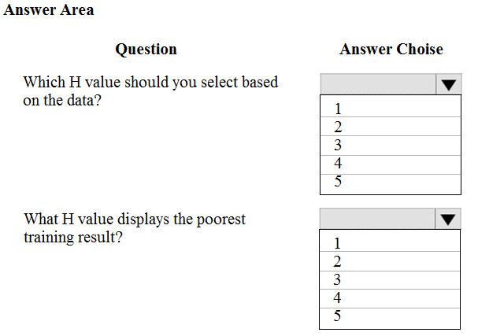
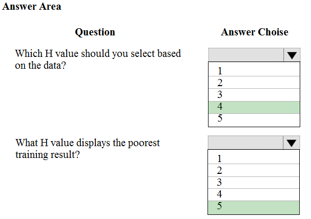

# Question 243

HOTSPOT -

You are tuning a hyperparameter for an algorithm. The following table shows a data set with different hyperparameter, training error, and validation errors.

Use the drop-down menus to select the answer choice that answers each question based on the information presented in the graphic.

Hot Area:

  
Show Suggested Answer

 

Box 1: 4 -

Choose the one which has lower training and validation error and also the closest match.

Minimize variance (difference between validation error and train error).

Box 2: 5 -

Minimize variance (difference between validation error and train error).

Reference:

https://medium.com/comet-ml/organizing-machine-learning-projects-project-management-guidelines-2d2b85651bbd

  
Show Discussions

<blockquote>
<strong>pepmir</strong> <code>(Thu 24 Dec 2020 00:41)</code> - <em>Upvotes: 41</em>

Answers looks correct to me
Difference between Erros:
105-095: 10
200-085: 115
250-100: 150
105-100: 5 ---&gt; This is the best H value. Agree with #4 for Q1
400-050: 350 -&gt; Highest Diff. So Poor for Q2
</blockquote>
<blockquote>
<strong>HkIsCrazY</strong> <code>(Fri 06 Aug 2021 14:07)</code> - <em>Upvotes: 16</em>

Why would you take the difference? it makes no sense! Best H value should be option A. 105 and 95

reason - validation error in option A is 95 whereas for option D it is 100.Training error is same in both case.
</blockquote>

<blockquote>
<strong>snegnik</strong> <code>(Wed 29 Nov 2023 11:35)</code> - <em>Upvotes: 1</em>

It depends on the main measure we use. If it is bias, we should find low numbers, and if it is variance, we should find a small difference. The best way to find a good trade-off between bias and variance is to have low error numbers and a small difference between test and validation errors.
</blockquote>
<blockquote>
<strong>Yoshizn</strong> <code>(Sun 13 Aug 2023 11:03)</code> - <em>Upvotes: 1</em>

Doing the difference here makes no sense since in the #1H and #4H both has 105 so we will look to the smallest Validation error between #1H and #4H, so 100 &gt; 95 then we will take #1H 1 as the H value to choose.
</blockquote>
<blockquote>
<strong>akgarg00</strong> <code>(Thu 26 Aug 2021 07:06)</code> - <em>Upvotes: 1</em>

This depends on the trade-off curve validation error and training error are making. If they intersect then we cannot use this logic
</blockquote>
<blockquote>
<strong>Yilu</strong> <code>(Mon 16 Nov 2020 05:52)</code> - <em>Upvotes: 22</em>

Why not 1 with lowest value in both training and validation?
</blockquote>
<blockquote>
<strong>swatidorge</strong> <code>(Wed 12 May 2021 05:09)</code> - <em>Upvotes: 2</em>

exactly normally training isn&#x27;t greater than 70% data. if we have 50%-50% split of test and training then it&#x27;s fine to have a closest match.
</blockquote>
<blockquote>
<strong>nato16</strong> <code>(Tue 30 Mar 2021 08:01)</code> - <em>Upvotes: 2</em>

Yes, why not 1
</blockquote>
<blockquote>
<strong>sl_mslconsulting</strong> <code>(Tue 19 Nov 2024 20:48)</code> - <em>Upvotes: 1</em>

used ChatGpt 4 and got this explanation which I agreed:
The best hyperparameters to select would be the ones that have the lowest validation error, as this indicates how well the model is likely to perform on unseen data. In this case, that would be the one with a validation error of 50.

The poorest training result would be the one with the highest training error. In this case, that would be the one with a training error of 400.
In general, the goal of hyperparameter tuning is to minimize the validation error, which indicates how well the model is likely to perform on unseen data. The model with the lowest variance isn&#x27;t necessarily the best model. A model with high bias can have low variance, but still be inaccurate. Similarly, a model with low bias can have high variance, but still be accurate. This is known as the bias-variance tradeoff.
</blockquote>

<blockquote>
<strong>phdykd</strong> <code>(Sat 20 Jan 2024 03:31)</code> - <em>Upvotes: 2</em>

Based on these values, the optimal hyperparameter setting seems to be H1. It has the lowest total error when you consider both the training and validation error, which suggests it may be the best compromise between underfitting and overfitting.

The hyperparameter setting that displays the poorest training result would be H5, as it has the highest training error (TE=400), suggesting it might be underfitting to the training data.
</blockquote>

<blockquote>
<strong>Gferreira</strong> <code>(Tue 11 Jul 2023 23:39)</code> - <em>Upvotes: 2</em>

chatGcP said : 
The best results are those that have a low training error and a low validation error. In the first case, the training error is 105 and the validation error is 95, while in the second case the training error is 105 and the validation error is 100. Therefore, the first case is better, as the validation error is lower. This indicates that the model is generalizing well and is not &quot;memorizing&quot; the training data.
</blockquote>
<blockquote>
<strong>Mckay_</strong> <code>(Tue 11 Apr 2023 23:24)</code> - <em>Upvotes: 7</em>

The answer should be 1 and 5. When training/testing a model, the problem of overfitting and underfitting need to be considered. In the case of the best H value. H = 1 clearly produced the best model with minimum validation error on the test dataset (which is the dataset we care about).
</blockquote>
<blockquote>
<strong>ning</strong> <code>(Thu 01 Dec 2022 14:13)</code> - <em>Upvotes: 1</em>

Poorest training result --&gt; 5
Best H Parameter, this question does not have enough information, we do not know the sample size for training and test data,  If there are both in millions, then no one cares about 100 errors vs 500 errors, if they are only in thousands, then I will only consider 1 and 4, in this case I guess 4 is given slight better results in testing, so I will go 4
</blockquote>
<blockquote>
<strong>David_Tadeu</strong> <code>(Wed 05 Oct 2022 22:29)</code> - <em>Upvotes: 1</em>

The question is on stack exchange

https://stats.stackexchange.com/questions/570322/how-to-choose-a-models-hyperparameters-in-terms-of-the-variance/570485#570485
</blockquote>

<blockquote>
<strong>synapse</strong> <code>(Sun 11 Sep 2022 23:00)</code> - <em>Upvotes: 3</em>

The answer is 1 and 5...  Why would you choose an option with the two closest error? Would you choose 300 and 299 as the best ?
</blockquote>
<blockquote>
<strong>TheCyanideLancer</strong> <code>(Fri 15 Jul 2022 03:32)</code> - <em>Upvotes: 1</em>

Agree with pepmir. 4 has least difference between validation and training result, and box 2 is about &quot;poorest training result&quot; which is by data given, 5
</blockquote>
<blockquote>
<strong>dija123</strong> <code>(Tue 14 Jun 2022 05:09)</code> - <em>Upvotes: 2</em>

Underfitting – Validation and training error high
Overfitting – Validation error is high, training error low
Good fit – Validation error low, slightly higher than the training error
Unknown fit - Validation error low, training error &#x27;high&#x27;
</blockquote>
<blockquote>
<strong>nit687</strong> <code>(Wed 15 Dec 2021 21:17)</code> - <em>Upvotes: 2</em>

We have to see which model generalizes well on test data..clearly in option 1 difference of train and test is 10..while in option 4 difference is only 5. So 4th one may generalize well .When we do train and test split , our target is to have as close train and test error along with minimum error
</blockquote>
<blockquote>
<strong>kty</strong> <code>(Sat 18 Sep 2021 19:49)</code> - <em>Upvotes: 17</em>

the answer is 1 and 5 
for those who calculate the difference between losses, 
if we have 500 and 498 we would then chose this option?
</blockquote>
<blockquote>
<strong>adbush</strong> <code>(Sat 14 Aug 2021 10:20)</code> - <em>Upvotes: 3</em>

the best model is not 4, it is 1
looking at the difference between training and validation errors is not helpful - by this logic a model with TE 105 VE 110 would also be better than model 1. This is clearly not the case.
</blockquote>
<blockquote>
<strong>fredgu</strong> <code>(Fri 04 Jun 2021 08:55)</code> - <em>Upvotes: 1</em>

Pepmir&#x27;s explanation is correct.
</blockquote>
<blockquote>
<strong>Pucha</strong> <code>(Wed 12 May 2021 04:48)</code> - <em>Upvotes: 1</em>

Why not opt 2
</blockquote>
<blockquote>
<strong>CleMue</strong> <code>(Sat 16 Jan 2021 12:52)</code> - <em>Upvotes: 6</em>

This question is a weird one. The training error here is much higher than the validation error. Usually it&#x27;s the other way around. Depending on the degree of overfitting, the VE can be a lot higher than the TE, but almost never smaller than the TE.

Still the general rule for such a question is:

1. Go for the H with the smallest VE
2. The H with the highest VE is the worst. Unfortunately here H=3 and H=4 are equally bad, so doesn&#x27;t make sense to choose only one of them
w
</blockquote>
<blockquote>
<strong>Paa_Kwesi</strong> <code>(Thu 03 Jun 2021 11:04)</code> - <em>Upvotes: 2</em>

So rather this is a case of underfitting
</blockquote>

---

[<< Previous Question](question_242.md) | [Home](/index.md) | [Next Question >>](question_244.md)
