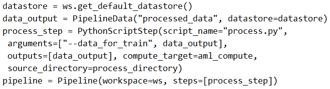

# Question 245

Note: This question is part of a series of questions that present the same scenario. Each question in the series contains a unique solution that might meet the stated goals. Some question sets might have more than one correct solution, while others might not have a correct solution.

After you answer a question in this section, you will NOT be able to return to it. As a result, these questions will not appear in the review screen.

You create a model to forecast weather conditions based on historical data.

You need to create a pipeline that runs a processing script to load data from a datastore and pass the processed data to a machine learning model training script.

Solution: Run the following code:

Does the solution meet the goal?

- A.Yes
- B.No

  
Show Suggested Answer

<strong>B</strong> 

train_step is missing.

Reference:

https://docs.microsoft.com/en-us/python/api/azureml-pipeline-core/azureml.pipeline.core.pipelinedata?view=azure-ml-py

  
Show Discussions

<blockquote>
<strong>Peeking</strong> <code>(Fri 13 Sep 2024 02:33)</code> - <em>Upvotes: 1</em>

There is no training step where the PipelineData (output of process_step) will be used as input.
</blockquote>
<blockquote>
<strong>ning</strong> <code>(Fri 01 Dec 2023 14:25)</code> - <em>Upvotes: 2</em>

Missing training step
</blockquote>
<blockquote>
<strong>TheYazan</strong> <code>(Thu 07 Sep 2023 11:42)</code> - <em>Upvotes: 1</em>

prepped_data = OutputFileDatasetConfig(&quot;prepped_data&quot;)
then add prepped_data  to the arguments parameter
</blockquote>

---

[<< Previous Question](question_244.md) | [Home](/index.md) | [Next Question >>](question_246.md)
