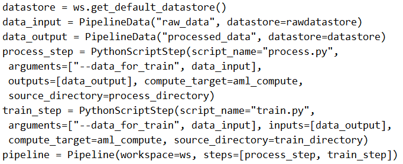

# Question 246

Note: This question is part of a series of questions that present the same scenario. Each question in the series contains a unique solution that might meet the stated goals. Some question sets might have more than one correct solution, while others might not have a correct solution.

After you answer a question in this section, you will NOT be able to return to it. As a result, these questions will not appear in the review screen.

You create a model to forecast weather conditions based on historical data.

You need to create a pipeline that runs a processing script to load data from a datastore and pass the processed data to a machine learning model training script.

Solution: Run the following code:

Does the solution meet the goal?

- A.Yes
- B.No

  
Show Suggested Answer

<strong>B</strong> 

Note: Data used in pipeline can be produced by one step and consumed in another step by providing a PipelineData object as an output of one step and an input of one or more subsequent steps.

Compare with this example, the pipeline train step depends on the process_step_output output of the pipeline process step: from azureml.pipeline.core import Pipeline, PipelineData from azureml.pipeline.steps import PythonScriptStep datastore = ws.get_default_datastore() process_step_output = PipelineData(&quot;processed_data&quot;, datastore=datastore) process_step = PythonScriptStep(script_name=&quot;process.py&quot;, arguments=[&quot;--data_for_train&quot;, process_step_output], outputs=[process_step_output], compute_target=aml_compute, source_directory=process_directory) train_step = PythonScriptStep(script_name=&quot;train.py&quot;, arguments=[&quot;--data_for_train&quot;, process_step_output], inputs=[process_step_output], compute_target=aml_compute, source_directory=train_directory) pipeline = Pipeline(workspace=ws, steps=[process_step, train_step])

Reference:

https://docs.microsoft.com/en-us/python/api/azureml-pipeline-core/azureml.pipeline.core.pipelinedata?view=azure-ml-py

  
Show Discussions

<blockquote>
<strong>lander_c</strong> <code>(Sun 27 Mar 2022 04:02)</code> - <em>Upvotes: 7</em>

in train step the arguments=[&quot;--data_for_train&quot;, data_input] should be arguments=[&quot;--data_for_train&quot;, data_output]
</blockquote>
<blockquote>
<strong>YipingRuan</strong> <code>(Sun 09 Jan 2022 04:31)</code> - <em>Upvotes: 5</em>

In train step, &quot;arguments=[&quot;--data_for_train&quot;, data_input]&quot; is not correct.
</blockquote>
<blockquote>
<strong>deyoz</strong> <code>(Wed 14 Aug 2024 01:06)</code> - <em>Upvotes: 1</em>

I think in both the steps, it should be arguments=[&quot;--data_for_train&quot;, data_output]
</blockquote>
<blockquote>
<strong>deyoz</strong> <code>(Wed 14 Aug 2024 01:07)</code> - <em>Upvotes: 1</em>

training step
</blockquote>
<blockquote>
<strong>deyoz</strong> <code>(Wed 14 Aug 2024 01:08)</code> - <em>Upvotes: 1</em>

i mean not just in training step.
</blockquote>
<blockquote>
<strong>ning</strong> <code>(Thu 01 Dec 2022 14:24)</code> - <em>Upvotes: 1</em>

Missing data input for training step
</blockquote>
<blockquote>
<strong>jkuz</strong> <code>(Fri 22 Apr 2022 10:24)</code> - <em>Upvotes: 1</em>

in second line it&#x27;s a &#x27;rawdatastore` which is not created before
</blockquote>
<blockquote>
<strong>silva_831</strong> <code>(Mon 08 May 2023 01:50)</code> - <em>Upvotes: 1</em>

agree, since rawdatastore is not created in context.
</blockquote>
<blockquote>
<strong>VJPrakash</strong> <code>(Thu 10 Feb 2022 08:53)</code> - <em>Upvotes: 1</em>

I think the answer should be &#x27;YES&#x27;.
The value is passed from process to train. How its being used depends on the script
</blockquote>
<blockquote>
<strong>BigSoda</strong> <code>(Mon 06 Dec 2021 11:20)</code> - <em>Upvotes: 3</em>

the &quot;date_input&#x27; line doesn&#x27;t seem to be needed here
</blockquote>

---

[<< Previous Question](question_245.md) | [Home](/index.md) | [Next Question >>](question_247.md)
