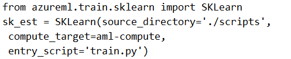

# Question 248

Note: This question is part of a series of questions that present the same scenario. Each question in the series contains a unique solution that might meet the stated goals. Some question sets might have more than one correct solution, while others might not have a correct solution.

After you answer a question in this section, you will NOT be able to return to it. As a result, these questions will not appear in the review screen.

You have a Python script named train.py in a local folder named scripts. The script trains a regression model by using scikit-learn. The script includes code to load a training data file which is also located in the scripts folder.

You must run the script as an Azure ML experiment on a compute cluster named aml-compute.

You need to configure the run to ensure that the environment includes the required packages for model training. You have instantiated a variable named aml- compute that references the target compute cluster.

Solution: Run the following code:

Does the solution meet the goal?

- A.Yes
- B.No

  
Show Suggested Answer

<strong>B</strong> 

  
Show Discussions

<blockquote>
<strong>Peeking</strong> <code>(Wed 21 Aug 2024 19:19)</code> - <em>Upvotes: 3</em>

The Environment class was not imported and there was no .from_conda_specification or python dependencies. The answer is &#x27;No&#x27;
</blockquote>
<blockquote>
<strong>phdykd</strong> <code>(Fri 16 Aug 2024 20:37)</code> - <em>Upvotes: 1</em>

No. from azureml.core import Environment
from azureml.train.sklearn import SKLearn

# Create a Python environment for the experiment

env = Environment.from_conda_specification(name=&#x27;sklearn-env&#x27;, file_path=&#x27;./scripts/myenv.yml&#x27;)

# Specify the required packages

env.python.conda_dependencies.add_pip_package(&quot;scikit-learn&quot;)

# Create an estimator for the experiment

estimator = SKLearn(source_directory=&#x27;./scripts&#x27;,
compute_target=aml_compute,
entry_script=&#x27;train.py&#x27;,
environment_definition=env)
</blockquote>

<blockquote>
<strong>michaelmorar</strong> <code>(Sat 08 Jun 2024 20:55)</code> - <em>Upvotes: 2</em>

Nowhere in the code does this solution include the required packages for model training
</blockquote>
<blockquote>
<strong>jkuz</strong> <code>(Sat 22 Apr 2023 11:26)</code> - <em>Upvotes: 4</em>

Deprecated. 
https://docs.microsoft.com/en-us/python/api/azureml-train-core/azureml.train.estimator.estimator?view=azure-ml-py

If ignore deprecated, it seems to work (see the link).
</blockquote>

<blockquote>
<strong>Arend78</strong> <code>(Sat 15 Jun 2024 07:50)</code> - <em>Upvotes: 2</em>

src = ScriptRunConfig(source_directory=project_folder,
                      script=&#x27;train.py&#x27;,
                      compute_target=my_compute_target,
                      environment=myenv)

Indeed the environment seems to be missing:
https://learn.microsoft.com/en-us/azure/machine-learning/v1/how-to-set-up-training-targets?view=azure-ml-py
</blockquote>

<blockquote>
<strong>medsimus</strong> <code>(Sun 02 Oct 2022 14:32)</code> - <em>Upvotes: 4</em>

outdated
https://docs.microsoft.com/en-us/python/api/azureml-train-core/azureml.train.sklearn.sklearn?view=azure-ml-py
</blockquote>

---

[<< Previous Question](question_247.md) | [Home](../index.md) | [Next Question >>](question_249.md)
