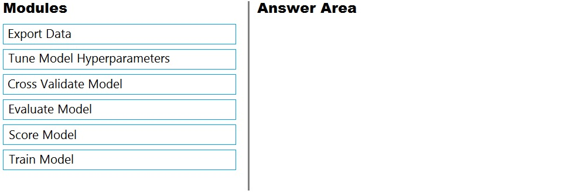
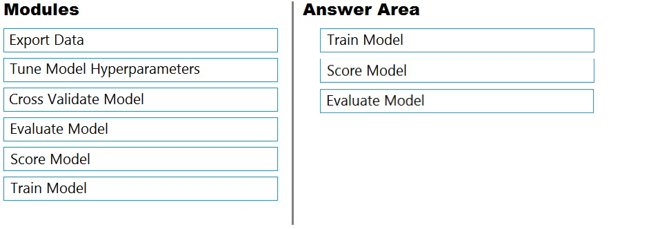
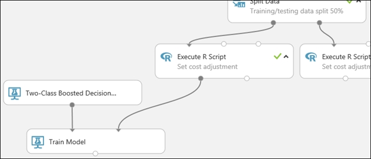
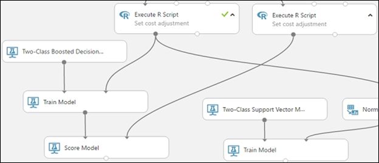
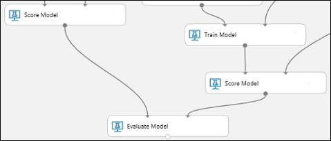

# Question 251

DRAG DROP -

You are building an experiment using the Azure Machine Learning designer.

You split a dataset into training and testing sets. You select the Two-Class Boosted Decision Tree as the algorithm.

You need to determine the Area Under the Curve (AUC) of the model.

Which three modules should you use in sequence? To answer, move the appropriate modules from the list of modules to the answer area and arrange them in the correct order.

Select and Place:

  
Show Suggested Answer

 

Step 1: Train Model -

Two-Class Boosted Decision Tree -

First, set up the boosted decision tree model.

1. Find the Two-Class Boosted Decision Tree module in the module palette and drag it onto the canvas.

2. Find the Train Model module, drag it onto the canvas, and then connect the output of the Two-Class Boosted Decision Tree module to the left input port of the

Train Model module.

The Two-Class Boosted Decision Tree module initializes the generic model, and Train Model uses training data to train the model.

3. Connect the left output of the left Execute R Script module to the right input port of the Train Model module (in this tutorial you used the data coming from the left side of the Split Data module for training).

This portion of the experiment now looks something like this:

 

Step 2: Score Model -

Score and evaluate the models -

You use the testing data that was separated out by the Split Data module to score our trained models. You can then compare the results of the two models to see which generated better results.

Add the Score Model modules -

1. Find the Score Model module and drag it onto the canvas.

2. Connect the Train Model module that&#x27;s connected to the Two-Class Boosted Decision Tree module to the left input port of the Score Model module.

3. Connect the right Execute R Script module (our testing data) to the right input port of the Score Model module.

 

Step 3: Evaluate Model -

To evaluate the two scoring results and compare them, you use an Evaluate Model module.

1. Find the Evaluate Model module and drag it onto the canvas.

2. Connect the output port of the Score Model module associated with the boosted decision tree model to the left input port of the Evaluate Model module.

3. Connect the other Score Model module to the right input port.

 

  
Show Discussions

<blockquote>
<strong>ac45863</strong> <code>(Thu 07 Oct 2021 23:07)</code> - <em>Upvotes: 15</em>

It&#x27;s correct
</blockquote>
<blockquote>
<strong>Matt2000</strong> <code>(Thu 15 Aug 2024 07:43)</code> - <em>Upvotes: 1</em>

You can identify what should work by looking at the inputs and outputs of the models in designer.

&quot;Train, Score, Evaluate&quot; should work but also &quot;Tune Model Hyperparameter, Score, Evaluate&quot;. The latter should give yield an improved model compared to the former.
</blockquote>

<blockquote>
<strong>deyoz</strong> <code>(Fri 02 Aug 2024 23:29)</code> - <em>Upvotes: 1</em>

correct.
</blockquote>
<blockquote>
<strong>james2033</strong> <code>(Fri 19 Apr 2024 04:08)</code> - <em>Upvotes: 1</em>

In sequence

1. Train
2. Score model
3. Evaluate
</blockquote>
<blockquote>
<strong>MattAnya</strong> <code>(Tue 04 Jul 2023 05:49)</code> - <em>Upvotes: 3</em>

on 03 Jan 2023
</blockquote>
<blockquote>
<strong>ning</strong> <code>(Fri 02 Dec 2022 15:12)</code> - <em>Upvotes: 3</em>

not sure about the evaluate step ...
for this step you will need two scored test sets ...
one is from two class boosted decision tree ...
where is the other one from ...
</blockquote>
<blockquote>
<strong>Matt2000</strong> <code>(Thu 15 Aug 2024 07:37)</code> - <em>Upvotes: 1</em>

you need only one, the second one is optional
</blockquote>
<blockquote>
<strong>racnaoamo</strong> <code>(Sat 19 Nov 2022 08:58)</code> - <em>Upvotes: 1</em>

on exam 18-5-22
</blockquote>
<blockquote>
<strong>hargur</strong> <code>(Wed 20 Apr 2022 09:50)</code> - <em>Upvotes: 2</em>

on 19Oct2021
</blockquote>
<blockquote>
<strong>kisskeo</strong> <code>(Sat 02 Apr 2022 21:16)</code> - <em>Upvotes: 1</em>

Exam 01 Oct 2021
</blockquote>
<blockquote>
<strong>erp31</strong> <code>(Mon 31 Jan 2022 04:03)</code> - <em>Upvotes: 4</em>

on exam 30/07/2021
</blockquote>

---

[<< Previous Question](question_250.md) | [Home](../index.md) | [Next Question >>](question_252.md)
