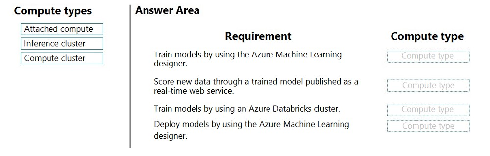
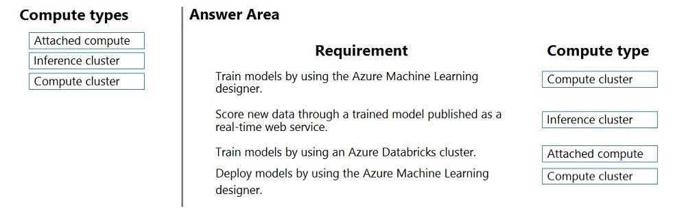

# Question 252

DRAG DROP -

You create machine learning models by using Azure Machine Learning.

You plan to train and score models by using a variety of compute contexts. You also plan to create a new compute resource in Azure Machine Learning studio.

You need to select the appropriate compute types.

Which compute types should you select? To answer, drag the appropriate compute types to the correct requirements. Each compute type may be used once, more than once, or not at all. You may need to drag the split bar between panes or scroll to view content.

NOTE: Each correct selection is worth one point.

Select and Place:

  
Show Suggested Answer

 

Box 1: Compute cluster -

Create a single or multi node compute cluster for your training, batch inferencing or reinforcement learning workloads.

Box 2: Inference cluster -

Box 3: Attached compute -

The compute types that can currently be attached for training include:

A remote VM -

Azure Databricks (for use in machine learning pipelines)

Azure Data Lake Analytics (for use in machine learning pipelines)

Azure HDInsight -

Box 4: Compute cluster -

Note: There are four compute types:

Compute instance -

Compute clusters -

Inference clusters -

Attached compute -

Note 2:

Compute clusters -

Create a single or multi node compute cluster for your training, batch inferencing or reinforcement learning workloads.

Attached compute -

To use compute targets created outside the Azure Machine Learning workspace, you must attach them. Attaching a compute target makes it available to your workspace. Use Attached compute to attach a compute target for training. Use Inference clusters to attach an AKS cluster for inferencing.

Inference clusters -

Create or attach an Azure Kubernetes Service (AKS) cluster for large scale inferencing.

Reference:

https://docs.microsoft.com/en-us/azure/machine-learning/how-to-create-attach-compute-studio

  
Show Discussions

<blockquote>
<strong>syed_ahmed</strong> <code>(Tue 11 Jan 2022 11:30)</code> - <em>Upvotes: 52</em>

This is the correct answer :

Compute
Inference
Attached
Inference
</blockquote>

<blockquote>
<strong>gunn_m</strong> <code>(Sun 15 Dec 2024 21:27)</code> - <em>Upvotes: 1</em>

We deploy the model to an inference cluster, but to perform the deployment action we need a cluster or an instance.
</blockquote>
<blockquote>
<strong>DennisWitjes</strong> <code>(Tue 15 Feb 2022 22:07)</code> - <em>Upvotes: 2</em>

Agreed. When deploying in AML Designer you have to select inference cluster. See example where they use AKS.
https://docs.microsoft.com/en-us/azure/machine-learning/tutorial-designer-automobile-price-deploy
</blockquote>
<blockquote>
<strong>htiwari</strong> <code>(Thu 04 Nov 2021 14:48)</code> - <em>Upvotes: 7</em>

This answer is correct!

https://docs.microsoft.com/en-us/azure/machine-learning/concept-compute-target
</blockquote>

<blockquote>
<strong>deyoz</strong> <code>(Fri 02 Aug 2024 23:23)</code> - <em>Upvotes: 1</em>

For the deployment is it inference or compute cluster, I understand as inference but folks are saying compute cluster.
</blockquote>
<blockquote>
<strong>A_PL300</strong> <code>(Wed 13 Mar 2024 16:32)</code> - <em>Upvotes: 2</em>

Question like this one on September 4, 2023 exam
</blockquote>
<blockquote>
<strong>Yuriy_Ch</strong> <code>(Fri 08 Sep 2023 11:21)</code> - <em>Upvotes: 1</em>

on exam 07/March/2023
</blockquote>
<blockquote>
<strong>phdykd</strong> <code>(Thu 17 Aug 2023 01:26)</code> - <em>Upvotes: 1</em>

Requirement A: To train models by using the Azure Machine Learning designer, you can use a compute cluster. This will allow you to allocate resources to run your training jobs in a distributed fashion, enabling you to complete training faster and at a lower cost.

Requirement B: To score new data through a trained model published as a real-time web service, you can use an inference cluster. This will allow you to deploy your model as a scalable web service that can handle incoming requests for real-time predictions.

Requirement C: To train models by using an Azure Databricks cluster, you can use both an attached compute and a compute cluster. An attached compute allows you to connect your Azure Machine Learning workspace to your Databricks workspace, while a compute cluster allows you to allocate resources to run your training jobs in a distributed fashion.

Requirement D: To deploy models by using the Azure Machine Learning Designer, you can use a compute cluster. This will allow you to allocate resources to run your deployment job, enabling you to complete the deployment faster and at a lower cost.
</blockquote>

<blockquote>
<strong>deyoz</strong> <code>(Wed 14 Aug 2024 01:39)</code> - <em>Upvotes: 1</em>

but   realtime deployment doesn&#x27;t work in compute cluster. Hence, inference cluster. In my opinion. i am still not sure tough.
</blockquote>
<blockquote>
<strong>phdykd</strong> <code>(Thu 17 Aug 2023 01:24)</code> - <em>Upvotes: 2</em>

Requirement A:
3- Compute cluster

Requirement B:
2- Inference cluster

Requirement C:
1-Attached compute
3- Compute cluster

Requirement D:
3- Compute cluster
</blockquote>

<blockquote>
<strong>racnaoamo</strong> <code>(Sat 19 Nov 2022 08:58)</code> - <em>Upvotes: 3</em>

on exam 18-5-22
</blockquote>
<blockquote>
<strong>kkkk_jjjj</strong> <code>(Sun 18 Sep 2022 08:44)</code> - <em>Upvotes: 2</em>

on exam 18/03/2022
</blockquote>
<blockquote>
<strong>JoshuaXu</strong> <code>(Fri 06 May 2022 21:56)</code> - <em>Upvotes: 2</em>

on Exam 6 Nov 2021
</blockquote>
<blockquote>
<strong>pkal</strong> <code>(Fri 25 Mar 2022 00:20)</code> - <em>Upvotes: 1</em>

on exam 9/24/2021
</blockquote>
<blockquote>
<strong>azure1000</strong> <code>(Sat 05 Feb 2022 05:48)</code> - <em>Upvotes: 6</em>

https://docs.microsoft.com/en-us/azure/machine-learning/how-to-deploy-model-designer

last one is Inference cluster

\*\*In the Models asset page, select the registered model.

Select the Deploy button.

In the configuration menu, enter the following information:

Input a name for the endpoint.
Select to deploy the model to Azure Kubernetes Service or Azure Container Instance. \*\*
</blockquote>

<blockquote>
<strong>erp31</strong> <code>(Mon 31 Jan 2022 04:02)</code> - <em>Upvotes: 3</em>

on exam 30/07/2021
</blockquote>
<blockquote>
<strong>ACSC</strong> <code>(Sat 09 Oct 2021 07:27)</code> - <em>Upvotes: 3</em>

Answer is correct. See the link https://docs.microsoft.com/en-us/azure/machine-learning/how-to-create-attach-compute-studio
</blockquote>
<blockquote>
<strong>ac45863</strong> <code>(Thu 07 Oct 2021 23:05)</code> - <em>Upvotes: 7</em>

In my opinion:
- Compute cluster
- Compute cluster
- Attached compute
- Inference cluster
</blockquote>

---

[<< Previous Question](question_251.md) | [Home](../index.md) | [Next Question >>](question_253.md)
