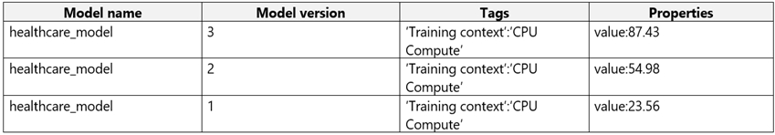
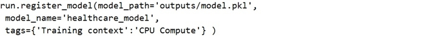
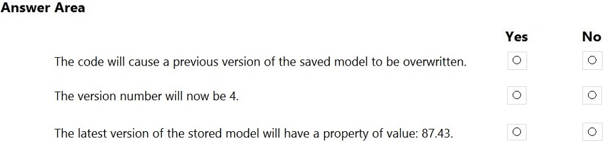
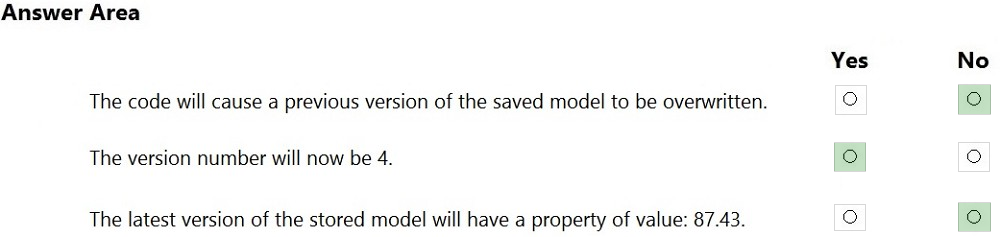

# Question 254

HOTSPOT -

You register the following versions of a model.

You use the Azure ML Python SDK to run a training experiment. You use a variable named run to reference the experiment run.

After the run has been submitted and completed, you run the following code:

For each of the following statements, select Yes if the statement is true. Otherwise, select No.

NOTE: Each correct selection is worth one point.

Hot Area:

  
Show Suggested Answer

 

Reference:

https://docs.microsoft.com/en-us/azure/machine-learning/how-to-deploy-and-where

  
Show Discussions

<blockquote>
<strong>ac45863</strong> <code>(Fri 07 Oct 2022 23:23)</code> - <em>Upvotes: 7</em>

It&#x27;s correct.
</blockquote>
<blockquote>
<strong>ljljljlj</strong> <code>(Wed 11 Jan 2023 15:09)</code> - <em>Upvotes: 6</em>

On exam 2021/7/10
</blockquote>
<blockquote>
<strong>silva_831</strong> <code>(Wed 08 May 2024 05:57)</code> - <em>Upvotes: 1</em>

Don&#x27;t understand that why the first answer is NO?
</blockquote>
<blockquote>
<strong>Peeking</strong> <code>(Fri 13 Sep 2024 05:50)</code> - <em>Upvotes: 1</em>

No version will be overwritten. Version 4 will be registered.
</blockquote>
<blockquote>
<strong>claps92</strong> <code>(Mon 11 Mar 2024 14:40)</code> - <em>Upvotes: 1</em>

why the 1st answer is no??
</blockquote>
<blockquote>
<strong>kkkk_jjjj</strong> <code>(Mon 18 Sep 2023 08:44)</code> - <em>Upvotes: 3</em>

on exam 18/03/2022
</blockquote>
<blockquote>
<strong>JoshuaXu</strong> <code>(Sat 06 May 2023 21:59)</code> - <em>Upvotes: 2</em>

on Exam 6 Nov 2021, doing an experiment will help to understand the topic
</blockquote>
<blockquote>
<strong>kisskeo</strong> <code>(Sun 09 Apr 2023 20:55)</code> - <em>Upvotes: 1</em>

On Exam 01 Oct 2021
</blockquote>
<blockquote>
<strong>pkal</strong> <code>(Sat 25 Mar 2023 00:21)</code> - <em>Upvotes: 1</em>

on exam 9/24/2021
</blockquote>
<blockquote>
<strong>saurabh288</strong> <code>(Fri 20 Jan 2023 08:32)</code> - <em>Upvotes: 5</em>

Property value would be blank, as property argument has not been passed while registering the model.
</blockquote>
<blockquote>
<strong>kunibert</strong> <code>(Sat 19 Nov 2022 06:40)</code> - <em>Upvotes: 5</em>

How can we know the whether the property value will 87.43 be or not?
</blockquote>
<blockquote>
<strong>karu_m</strong> <code>(Fri 15 Nov 2024 14:34)</code> - <em>Upvotes: 1</em>

I agree, we don&#x27;t know... theoretically it could be &quot;yes&quot; - but probably &quot;no&quot;.
</blockquote>
<blockquote>
<strong>treadst0ne</strong> <code>(Fri 16 Dec 2022 01:15)</code> - <em>Upvotes: 7</em>

Exactly, that&#x27;s why it is &quot;No&quot;.
</blockquote>
<blockquote>
<strong>Arend78</strong> <code>(Sat 15 Jun 2024 09:52)</code> - <em>Upvotes: 1</em>

I read it as &quot;the latest version of the model HAS a property value of 87.43&quot;
That would be version 3 and then I should it would be yes (correct)
</blockquote>

---

[<< Previous Question](question_253.md) | [Home](/index.md) | [Next Question >>](question_255.md)
