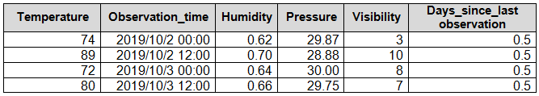
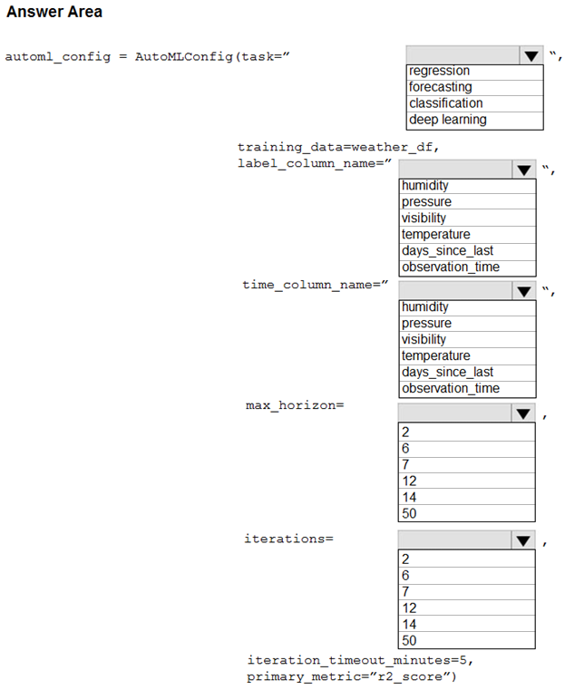
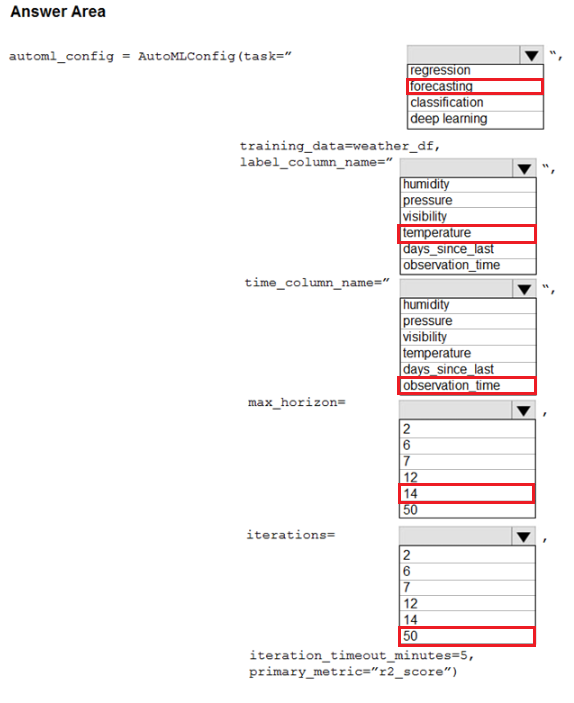

# Question 257

HOTSPOT -

You collect data from a nearby weather station. You have a pandas dataframe named weather_df that includes the following data:

The data is collected every 12 hours: noon and midnight.

You plan to use automated machine learning to create a time-series model that predicts temperature over the next seven days. For the initial round of training, you want to train a maximum of 50 different models.

You must use the Azure Machine Learning SDK to run an automated machine learning experiment to train these models.

You need to configure the automated machine learning run.

How should you complete the AutoMLConfig definition? To answer, select the appropriate options in the answer area.

NOTE: Each correct selection is worth one point.

Hot Area:

  
Show Suggested Answer

 

  
Show Discussions

<blockquote>
<strong>Anty85</strong> <code>(Thu 15 Sep 2022 13:15)</code> - <em>Upvotes: 39</em>

Shouldn&#x27;t max_horizon be 14?
</blockquote>
<blockquote>
<strong>TsotneT</strong> <code>(Sun 18 Sep 2022 19:59)</code> - <em>Upvotes: 7</em>

Agreed.
</blockquote>
<blockquote>
<strong>jiglesia22</strong> <code>(Wed 21 Sep 2022 11:35)</code> - <em>Upvotes: 2</em>

max_horizon is 7, not 14. The pattern is repeated over time is every two observations, that is to say every day, so max_horizon 7 will show a prediction for the next 7 &quot;patterns&quot;, the next 7 days.
</blockquote>
<blockquote>
<strong>ACSC</strong> <code>(Tue 11 Oct 2022 10:41)</code> - <em>Upvotes: 19</em>

Time interval is 12 hours, so answer is 14.
</blockquote>
<blockquote>
<strong>ac45863</strong> <code>(Fri 07 Oct 2022 23:35)</code> - <em>Upvotes: 18</em>

In my opinion max_horizon should be 14, i.e. 14 units of 12 hours frequency mean 7 days ahead.
</blockquote>
<blockquote>
<strong>MattAnya</strong> <code>(Thu 04 Jul 2024 05:51)</code> - <em>Upvotes: 6</em>

on 03 Jan 2023
</blockquote>
<blockquote>
<strong>giusecozza</strong> <code>(Thu 07 Mar 2024 11:44)</code> - <em>Upvotes: 2</em>

&quot;The forecast horizon is how many periods forward you would like to forecast. This integer horizon is in units of the timeseries frequency (e.g. daily, weekly). Periods are inferred from your data.&quot;

In our case, time interval is 12 hours. We would need to forecast 14 periods forward to gain a prediction over the next 7 days. So, 14 should be the answer

https://github.com/Azure/azureml-examples/blob/main/python-sdk/tutorials/automl-with-azureml/forecasting-hierarchical-timeseries/auto-ml-forecasting-hierarchical-timeseries.ipynb
</blockquote>

<blockquote>
<strong>pancman</strong> <code>(Wed 11 Oct 2023 02:10)</code> - <em>Upvotes: 2</em>

max_horizon should certainly be 14
</blockquote>
<blockquote>
<strong>kkkk_jjjj</strong> <code>(Mon 18 Sep 2023 08:44)</code> - <em>Upvotes: 2</em>

on exam 18/03/2022
</blockquote>
<blockquote>
<strong>JoshuaXu</strong> <code>(Sat 06 May 2023 22:01)</code> - <em>Upvotes: 2</em>

on Exam 6 Nov 2021, and max_horizon in my opinion is 14.
</blockquote>
<blockquote>
<strong>pkal</strong> <code>(Sat 25 Mar 2023 00:22)</code> - <em>Upvotes: 1</em>

on exam 9/24/2021
</blockquote>
<blockquote>
<strong>ljljljlj</strong> <code>(Wed 11 Jan 2023 15:10)</code> - <em>Upvotes: 2</em>

On exam 2021/7/10
</blockquote>
<blockquote>
<strong>levm39</strong> <code>(Sat 10 Dec 2022 09:28)</code> - <em>Upvotes: 6</em>

max_horizon
The desired maximum forecast horizon in units of time-series frequency. The default value is 1.

Units are based on the time interval of your training data, e.g., monthly, weekly that the forecaster should predict out. When task type is forecasting, this parameter is required. For more information on setting forecasting parameters, see Auto-train a time-series forecast model. This setting is being deprecated. Please use forecasting_parameters instead

Answer is 14 instead of 7 based on the documentation. (Units are based on the time interval of your training data)
</blockquote>

<blockquote>
<strong>rishi_ram</strong> <code>(Wed 07 Dec 2022 13:47)</code> - <em>Upvotes: 3</em>

Exact Question was there in June 2021 Exam
</blockquote>
<blockquote>
<strong>Lucario95</strong> <code>(Wed 23 Nov 2022 10:56)</code> - <em>Upvotes: 3</em>

I also agree with 14 as max_horizon
</blockquote>
<blockquote>
<strong>ziizai</strong> <code>(Tue 15 Nov 2022 03:10)</code> - <em>Upvotes: 2</em>

It says max_horizon is deprecated.
https://docs.microsoft.com/en-us/python/api/azureml-train-automl-client/azureml.train.automl.automlconfig.automlconfig?view=azure-ml-py
</blockquote>

---

[<< Previous Question](question_256.md) | [Home](/index.md) | [Next Question >>](question_258.md)
