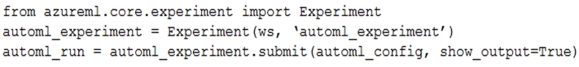

# Question 259

You run an experiment that uses an AutoMLConfig class to define an automated machine learning task with a maximum of ten model training iterations. The task will attempt to find the best performing model based on a metric named accuracy.

You submit the experiment with the following code:

You need to create Python code that returns the best model that is generated by the automated machine learning task.

Which code segment should you use?

- A.best_model = automl_run.get_details()
- B.best_model = automl_run.get_metrics()
- C.best_model = automl_run.get_file_names()[1]
- D.best_model = automl_run.get_output()[1]

  
Show Suggested Answer

<strong>D</strong> 

  
Show Discussions

<blockquote>
<strong>l2azure</strong> <code>(Fri 07 Oct 2022 10:19)</code> - <em>Upvotes: 20</em>

answer is indeed D
best_run, fitted_model = run.get_output()

have a look at the documentation for configuring autoML using the python SDK
https://docs.microsoft.com/en-us/azure/machine-learning/how-to-configure-auto-train
</blockquote>

<blockquote>
<strong>kty</strong> <code>(Sun 25 Sep 2022 16:44)</code> - <em>Upvotes: 6</em>

the answer is correct :  &#x27;D&#x27;

If no input parameters are provided, get_output returns the best pipeline according to the primary metric.

best_run, model = parent_run.get_output()
</blockquote>

<blockquote>
<strong>Peeking</strong> <code>(Sat 24 Aug 2024 18:39)</code> - <em>Upvotes: 2</em>

D is the closest answer but What of: run.get_output()[0]?
</blockquote>
<blockquote>
<strong>synapse</strong> <code>(Tue 12 Sep 2023 00:31)</code> - <em>Upvotes: 1</em>

answer d is correct
</blockquote>
<blockquote>
<strong>dija123</strong> <code>(Wed 07 Jun 2023 16:52)</code> - <em>Upvotes: 2</em>

Answer is D
</blockquote>
<blockquote>
<strong>Jingking</strong> <code>(Sun 21 May 2023 18:36)</code> - <em>Upvotes: 1</em>

answer is D
</blockquote>
<blockquote>
<strong>hargur</strong> <code>(Thu 20 Apr 2023 09:51)</code> - <em>Upvotes: 2</em>

on 19Oct2021
</blockquote>
<blockquote>
<strong>kisskeo</strong> <code>(Sun 09 Apr 2023 21:26)</code> - <em>Upvotes: 1</em>

On Exam 01 Oct 2021
</blockquote>
<blockquote>
<strong>trickerk</strong> <code>(Mon 16 Jan 2023 05:21)</code> - <em>Upvotes: 5</em>

Given answer is correct: D. 
According https://docs.microsoft.com/en-us/python/api/azureml-train-automl-client/azureml.train.automl.run.automlrun?view=azure-ml-py:

best_run, model = parent_run.get_output()

The first item (index 0) of get_output() method list is the &quot;best run&quot; and the second (index 1) is the &quot;model&quot;. Question is asking for model.
</blockquote>

<blockquote>
<strong>ljljljlj</strong> <code>(Wed 11 Jan 2023 15:11)</code> - <em>Upvotes: 3</em>

On exam 2021/7/10
</blockquote>
<blockquote>
<strong>ACSC</strong> <code>(Tue 11 Oct 2022 13:01)</code> - <em>Upvotes: 2</em>

We can access the best run id and accuracy score with:
automl_run_metrics = automl_run.get_metrics()
https://github.com/elenacramer/Optimizing-an-ML-Pipeline-in-Azure
Answer is B
</blockquote>
<blockquote>
<strong>scipio</strong> <code>(Thu 17 Nov 2022 13:37)</code> - <em>Upvotes: 4</em>

B is worng!
get_metrics() is a method of a run object, you need that first:
best_run, fitted_model = automl_run.get_output()
Then you can do
best_run.get_metrics()
</blockquote>
<blockquote>
<strong>BilJon</strong> <code>(Tue 27 Sep 2022 09:03)</code> - <em>Upvotes: 1</em>

# Get the best run, and its metrics and arguments
best_run = run.get_best_run_by_primary_metric()
best_run_metrics = best_run.get_metrics()
script_arguments = best_run.get_details() [&#x27;runDefinition&#x27;][&#x27;arguments&#x27;]
print(&#x27;Best Run Id: &#x27;, best_run.id)
print(&#x27; -AUC:&#x27;, best_run_metrics[&#x27;AUC&#x27;])
print(&#x27; -Accuracy:&#x27;, best_run_metrics[&#x27;Accuracy&#x27;])
print(&#x27; -Arguments:&#x27;,script_arguments)
</blockquote>
<blockquote>
<strong>mans00767</strong> <code>(Sat 17 Sep 2022 21:33)</code> - <em>Upvotes: 4</em>

I think answer is B as get_metric get best model
D is wrong as get_output()[1] no get_output()[0]
Reference
https://docs.microsoft.com/en-us/python/api/azureml-train-automl-client/azureml.train.automl.run.automlrun?view=azure-ml-py
</blockquote>
<blockquote>
<strong>mans00767</strong> <code>(Sat 17 Sep 2022 21:32)</code> - <em>Upvotes: 1</em>

I think answer is B as get_metric get best model
D is wrong as  get_output()[1] no get_output()[0]
</blockquote>
<blockquote>
<strong>dev2dev</strong> <code>(Tue 20 Sep 2022 10:42)</code> - <em>Upvotes: 6</em>

automl run class doesnt have method get_metric.
given answer is correct. get_output() returns array
</blockquote>
<blockquote>
<strong>Mpalo</strong> <code>(Mon 12 Sep 2022 05:23)</code> - <em>Upvotes: 1</em>

Reference link does not work
</blockquote>

---

[<< Previous Question](question_258.md) | [Home](../index.md) | [Next Question >>](question_260.md)
