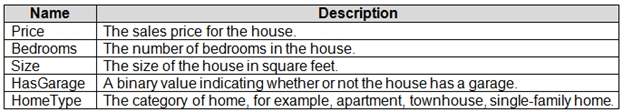
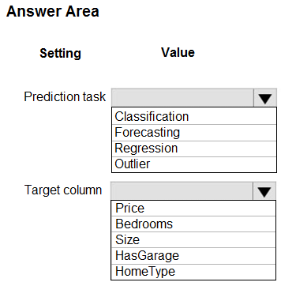
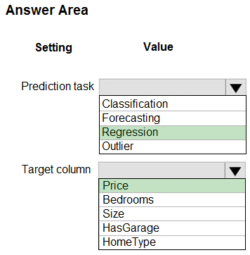

# Question 261

HOTSPOT -

You have a dataset that includes home sales data for a city. The dataset includes the following columns.

Each row in the dataset corresponds to an individual home sales transaction.

You need to use automated machine learning to generate the best model for predicting the sales price based on the features of the house.

Which values should you use? To answer, select the appropriate options in the answer area.

NOTE: Each correct selection is worth one point.

Hot Area:

  
Show Suggested Answer

 

Box 1: Regression -

Regression is a supervised machine learning technique used to predict numeric values.

Box 2: Price -

Reference:

https://docs.microsoft.com/en-us/learn/modules/create-regression-model-azure-machine-learning-designer

  
Show Discussions

<blockquote>
<strong>ljljljlj</strong> <code>(Wed 11 Jan 2023 15:12)</code> - <em>Upvotes: 6</em>

On exam 2021/7/10
</blockquote>
<blockquote>
<strong>Yuriy_Ch</strong> <code>(Sun 08 Sep 2024 11:23)</code> - <em>Upvotes: 2</em>

Exactly this question was on exam 07/March/2023
</blockquote>
<blockquote>
<strong>hargur</strong> <code>(Thu 20 Apr 2023 09:51)</code> - <em>Upvotes: 2</em>

on 19Oct2021
</blockquote>
<blockquote>
<strong>kisskeo</strong> <code>(Sun 09 Apr 2023 21:38)</code> - <em>Upvotes: 2</em>

On Exam 01 Oct 2021
</blockquote>

---

[<< Previous Question](question_260.md) | [Home](../index.md) | [Next Question >>](question_262.md)
