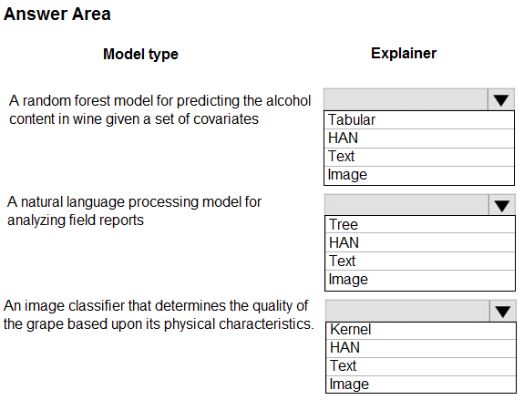
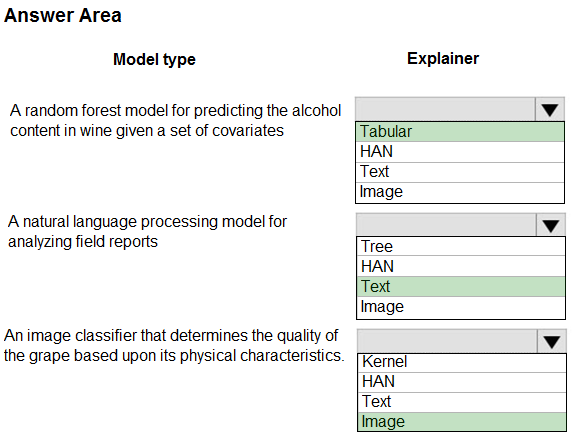

# Question 263

HOTSPOT -

You are hired as a data scientist at a winery. The previous data scientist used Azure Machine Learning.

You need to review the models and explain how each model makes decisions.

Which explainer modules should you use? To answer, select the appropriate options in the answer area.

NOTE: Each correct selection is worth one point.

Hot Area:

  
Show Suggested Answer

 

Meta explainers automatically select a suitable direct explainer and generate the best explanation info based on the given model and data sets. The meta explainers leverage all the libraries (SHAP, LIME, Mimic, etc.) that we have integrated or developed. The following are the meta explainers available in the SDK:

Tabular Explainer: Used with tabular datasets.

Text Explainer: Used with text datasets.

Image Explainer: Used with image datasets.

Box 1: Tabular -

Box 2: Text -

Box 3: Image -

Incorrect Answers:

Hierarchical Attention Network (HAN)

HAN was proposed by Yang et al. in 2016. Key features of HAN that differentiates itself from existing approaches to document classification are (1) it exploits the hierarchical nature of text data and (2) attention mechanism is adapted for document classification.

Reference:

https://medium.com/microsoftazure/automated-and-interpretable-machine-learning-d07975741298

  
Show Discussions

<blockquote>
<strong>Colourseun</strong> <code>(Tue 20 Aug 2024 18:40)</code> - <em>Upvotes: 13</em>

Tabular, Text, Image is the right answer
</blockquote>

---

[<< Previous Question](question_262.md) | [Home](/index.md) | [Next Question >>](question_264.md)
