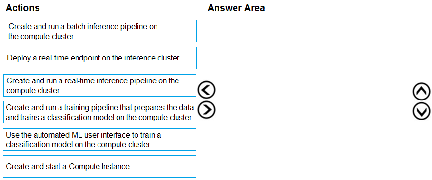
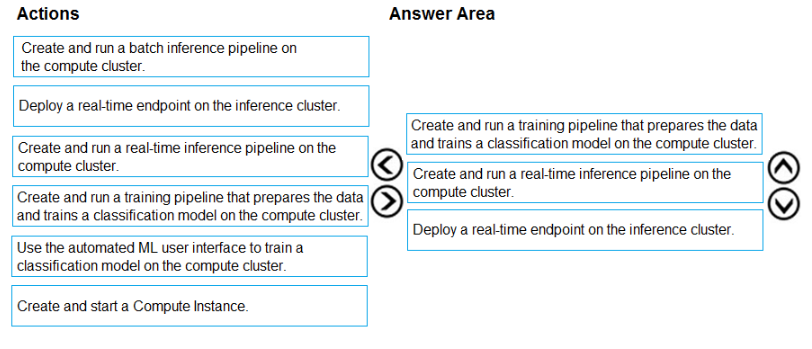

# Question 265

DRAG DROP -

You have an Azure Machine Learning workspace that contains a CPU-based compute cluster and an Azure Kubernetes Service (AKS) inference cluster. You create a tabular dataset containing data that you plan to use to create a classification model.

You need to use the Azure Machine Learning designer to create a web service through which client applications can consume the classification model by submitting new data and getting an immediate prediction as a response.

Which three actions should you perform in sequence? To answer, move the appropriate actions from the list of actions to the answer area and arrange them in the correct order.

Select and Place:

  
Show Suggested Answer

 

  
Show Discussions

<blockquote>
<strong>kty</strong> <code>(Sun 19 Sep 2021 06:26)</code> - <em>Upvotes: 96</em>

Create and run a training pipeline..
Create and run a real-time inference pipeline..
Deploy a real-time endpoint..
</blockquote>
<blockquote>
<strong>Matt2000</strong> <code>(Mon 29 Jul 2024 09:40)</code> - <em>Upvotes: 1</em>

Here is a reference: https://learn.microsoft.com/en-us/azure/machine-learning/tutorial-designer-automobile-price-deploy?view=azureml-api-1
</blockquote>
<blockquote>
<strong>kail85</strong> <code>(Mon 03 Jan 2022 01:16)</code> - <em>Upvotes: 5</em>

Wrong. Suggested answer is correct. You will need to create a compute instance (most likely with GPU) to launch a pipeline. Besides, what&#x27;s the point doing &#x27;Create and run a real-time inference pipeline&#x27; after a model is trained?
</blockquote>
<blockquote>
<strong>trickerk</strong> <code>(Tue 25 Jan 2022 07:17)</code> - <em>Upvotes: 4</em>

I don&#x27;t know... how to create a Web Service without deploy a real-time endpoint to consume its resources?
I believe the @kty answer is correct.
</blockquote>
<blockquote>
<strong>Enno4Certs</strong> <code>(Tue 07 Jun 2022 04:07)</code> - <em>Upvotes: 1</em>

Because you need to deploy an API service with the model.
</blockquote>
<blockquote>
<strong>rgdk</strong> <code>(Sun 03 Jul 2022 12:50)</code> - <em>Upvotes: 6</em>

the compute instance already exists so no need to re-create one
</blockquote>
<blockquote>
<strong>slash_nyk</strong> <code>(Sun 16 Jan 2022 10:54)</code> - <em>Upvotes: 1</em>

correct ..
</blockquote>
<blockquote>
<strong>hendriktytgatpwc</strong> <code>(Tue 14 Sep 2021 09:06)</code> - <em>Upvotes: 17</em>

Why create another compute instance? (it clearly states that he already has one)
I would remove that and move everything up and add the deploy the end point
https://docs.microsoft.com/en-us/azure/machine-learning/tutorial-designer-automobile-price-deploy
</blockquote>
<blockquote>
<strong>jiglesia22</strong> <code>(Tue 21 Sep 2021 14:28)</code> - <em>Upvotes: 5</em>

In fact, the second Answer clearly says a computer cluster is gonna be used, so no need of Create and Start a new Compute Instance:
Create and run a training pipeline that prepares the data and trains a classification model on the compute cluster.

And whatsmore, you must &quot;Deploy a real-time endpoint&quot; or otherwise you are not complying with the requirement of the question.
</blockquote>

<blockquote>
<strong>BleadFast</strong> <code>(Wed 15 Sep 2021 07:44)</code> - <em>Upvotes: 2</em>

I Agree
</blockquote>
<blockquote>
<strong>AkashV</strong> <code>(Sun 06 Feb 2022 16:44)</code> - <em>Upvotes: 2</em>

You need a compute instance to create, run and publish the pipeline for training the model.
</blockquote>
<blockquote>
<strong>haby</strong> <code>(Tue 18 Jun 2024 13:33)</code> - <em>Upvotes: 1</em>

D-C-B is correct for me. We can use pre-built compute cluster to run AML Designer, so no need to create a new compute instance.
</blockquote>
<blockquote>
<strong>phdykd</strong> <code>(Sun 21 Jan 2024 17:00)</code> - <em>Upvotes: 2</em>

The correct sequence of actions for creating a web service to consume the classification model would be:

D-Create and run a training pipeline that prepares the data and trains a classification model on the compute cluster.
First, you need to use the data in your tabular dataset to train a classification model. This is done on your compute cluster and involves creating a pipeline that prepares the data for machine learning and then trains the model.
C-Create and run a real-time inference pipeline on the compute cluster.
After your model is trained, you need to create an inference pipeline. This pipeline will take new data, run it through your model, and output the model&#x27;s prediction. Since you want the client applications to get an immediate response, you should use a real-time inference pipeline.
B-Deploy a real-time endpoint on the inference cluster.
After your inference pipeline is created, you deploy it as a web service on the AKS inference cluster. This endpoint will allow client applications to send new data and receive predictions in real-time.
</blockquote>

<blockquote>
<strong>phdykd</strong> <code>(Mon 21 Aug 2023 19:39)</code> - <em>Upvotes: 1</em>

The correct sequence of actions to use the Azure Machine Learning designer to create a web service for a classification model would be:
Create and run a training pipeline that prepares the data and trains a classification model on the computer cluster.
Use the automated ML user interface to train a classification model on the compute cluster.
Create and run a real-time inference pipeline on the compute cluster.
Deploy a real-time endpoint on the inference cluster.
The actions &quot;Create and start a Compute Instance&quot; and &quot;Create and run a batch inference pipeline on the compute cluster&quot; are not necessary for creating a web service to consume a classification model.
</blockquote>
<blockquote>
<strong>AlexZenMaster</strong> <code>(Sat 10 Feb 2024 04:31)</code> - <em>Upvotes: 1</em>

It says to use the designer, so why AutoML?
</blockquote>
<blockquote>
<strong>therealola</strong> <code>(Sun 18 Dec 2022 02:47)</code> - <em>Upvotes: 2</em>

Similar question on exam 18-06-22
</blockquote>
<blockquote>
<strong>AjoseO</strong> <code>(Fri 19 Aug 2022 11:42)</code> - <em>Upvotes: 1</em>

Question says workspace that contains a CPU-based compute cluster, so we don&#x27;t need to create a Compute Instance.

Questions says need to use the Azure Machine Learning designer to create a web service.

-&gt; Use the Automated ML user interference pipeline
-&gt; create and run a real-time inference pipeline on the computer cluster
-&gt; deploy a real-time endpoint on the inference cluster
</blockquote>

<blockquote>
<strong>TheCyanideLancer</strong> <code>(Fri 15 Jul 2022 04:44)</code> - <em>Upvotes: 1</em>

Given answer is wrong, you definitely need to deploy the model to consume it. We can run the pipeline on a compute cluster as well, I do not see a need to create and start a compute Instance again.
</blockquote>
<blockquote>
<strong>dija123</strong> <code>(Tue 14 Jun 2022 08:20)</code> - <em>Upvotes: 2</em>

Create and run a training pipeline 
Create and run a real-time inference pipeline.
Deploy a real-time endpoint.
</blockquote>
<blockquote>
<strong>dija123</strong> <code>(Tue 07 Jun 2022 18:52)</code> - <em>Upvotes: 1</em>

we do not need a compute instance, we already have CPU-based compute cluster, I agree with the answer of @kty
Create and run a training pipeline
Create and run a real-time inference pipeline.
Deploy a real-time endpoint.
</blockquote>
<blockquote>
<strong>kisskeo</strong> <code>(Sat 09 Apr 2022 21:45)</code> - <em>Upvotes: 3</em>

On Exam 01 Oct 2021
</blockquote>
<blockquote>
<strong>RyanTsai</strong> <code>(Fri 18 Mar 2022 10:48)</code> - <em>Upvotes: 1</em>

Create and start a compute instance
-&gt; create and run a real-time inference pipeline on the computer cluster
-&gt; deploy a real-time endpoint on the inference cluster
</blockquote>
<blockquote>
<strong>ljljljlj</strong> <code>(Tue 11 Jan 2022 15:12)</code> - <em>Upvotes: 3</em>

On exam 2021/7/10
</blockquote>

---

[<< Previous Question](question_264.md) | [Home](../index.md) | [Next Question >>](question_266.md)
