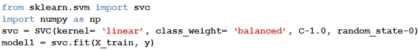
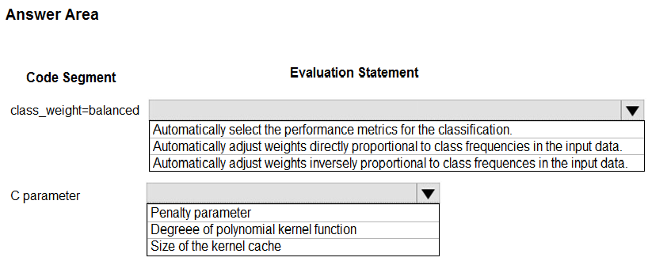
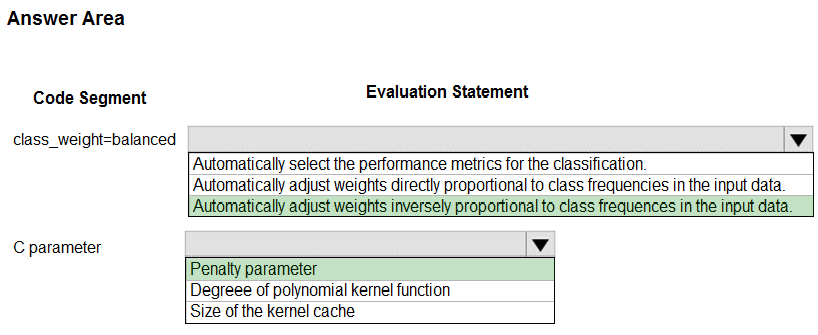

# Question 268

HOTSPOT -

You are using C-Support Vector classification to do a multi-class classification with an unbalanced training dataset. The C-Support Vector classification using

Python code shown below:

You need to evaluate the C-Support Vector classification code.

Which evaluation statement should you use? To answer, select the appropriate options in the answer area.

NOTE: Each correct selection is worth one point.

Hot Area:

  
Show Suggested Answer

 

Box 1: Automatically adjust weights inversely proportional to class frequencies in the input data

The ג€balancedג€ mode uses the values of y to automatically adjust weights inversely proportional to class frequencies in the input data as n_samples / (n_classes * np.bincount(y)).

Box 2: Penalty parameter -

Parameter: C : float, optional (default=1.0)

Penalty parameter C of the error term.

Reference:

https://scikit-learn.org/stable/modules/generated/sklearn.svm.SVC.html

  
Show Discussions

<blockquote>
<strong>Panos11</strong> <code>(Wed 27 Nov 2024 11:51)</code> - <em>Upvotes: 2</em>

correct
</blockquote>
<blockquote>
<strong>mis96</strong> <code>(Wed 07 Feb 2024 16:12)</code> - <em>Upvotes: 4</em>

Correct
</blockquote>

---

[<< Previous Question](question_267.md) | [Home](../index.md) | [Next Question >>](question_269.md)
