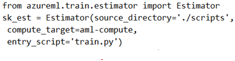

# Question 273

Note: This question is part of a series of questions that present the same scenario. Each question in the series contains a unique solution that might meet the stated goals. Some question sets might have more than one correct solution, while others might not have a correct solution.

After you answer a question in this section, you will NOT be able to return to it. As a result, these questions will not appear in the review screen.

You have a Python script named train.py in a local folder named scripts. The script trains a regression model by using scikit-learn. The script includes code to load a training data file which is also located in the scripts folder.

You must run the script as an Azure ML experiment on a compute cluster named aml-compute.

You need to configure the run to ensure that the environment includes the required packages for model training. You have instantiated a variable named aml- compute that references the target compute cluster.

Solution: Run the following code:

Does the solution meet the goal?

- A.Yes
- B.No

  
Show Suggested Answer

<strong>B</strong> 

There is a missing line: conda_packages=[&#x27;scikit-learn&#x27;], which is needed.

Correct example:

sk_est = Estimator(source_directory=&#x27;./my-sklearn-proj&#x27;,

script_params=script_params,

compute_target=compute_target,

entry_script=&#x27;train.py&#x27;,

conda_packages=[&#x27;scikit-learn&#x27;])

Note:

The Estimator class represents a generic estimator to train data using any supplied framework.

This class is designed for use with machine learning frameworks that do not already have an Azure Machine Learning pre-configured estimator. Pre-configured estimators exist for Chainer, PyTorch, TensorFlow, and SKLearn.

Example:

from azureml.train.estimator import Estimator

script_params = {

# to mount files referenced by mnist dataset

&#x27;--data-folder&#x27;: ds.as_named_input(&#x27;mnist&#x27;).as_mount(),

&#x27;--regularization&#x27;: 0.8

}

Reference:

https://docs.microsoft.com/en-us/python/api/azureml-train-core/azureml.train.estimator.estimator

  
Show Discussions

<blockquote>
<strong>walman</strong> <code>(Sat 27 Aug 2022 06:30)</code> - <em>Upvotes: 6</em>

should this be NO because it &quot;need to configure the run to ensure that the environment includes the required packages for model training&quot;?
</blockquote>
<blockquote>
<strong>evangelist</strong> <code>(Sun 08 Dec 2024 07:24)</code> - <em>Upvotes: 1</em>

correct code:
from azureml.train.estimator import Estimator
from azureml.core import Environment

env = Environment.from_conda_specification(name=&#x27;myenv&#x27;, file_path=&#x27;path_to_conda_dependencies.yml&#x27;)

sk_est = Estimator(source_directory=&#x27;./scripts&#x27;,
compute_target=aml-compute,
entry_script=&#x27;train.py&#x27;,
environment_definition=env)
</blockquote>

<blockquote>
<strong>prashantjoge</strong> <code>(Sat 27 Nov 2021 23:19)</code> - <em>Upvotes: 2</em>

deprecated, oos
</blockquote>
<blockquote>
<strong>levm39</strong> <code>(Wed 08 Dec 2021 13:16)</code> - <em>Upvotes: 1</em>

why is it deprecated?
</blockquote>
<blockquote>
<strong>Minghon</strong> <code>(Wed 29 Dec 2021 17:14)</code> - <em>Upvotes: 5</em>

He may mean the Estimator class is deprecated..., Please apply ScriptRunConfig class instead according to the official document.
</blockquote>

---

[<< Previous Question](question_272.md) | [Home](../index.md) | [Next Question >>](question_274.md)
