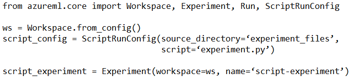

# Question 278

You have the following code. The code prepares an experiment to run a script:

The experiment must be run on local computer using the default environment.

You need to add code to start the experiment and run the script.

Which code segment should you use?

- A.run = script_experiment.start_logging()
- B.run = Run(experiment=script_experiment)
- C.ws.get_run(run_id=experiment.id)
- D.run = script_experiment.submit(config=script_config)

  
Show Suggested Answer

<strong>D</strong> 

  
Show Discussions

<blockquote>
<strong>MattAnya</strong> <code>(Tue 04 Jul 2023 05:25)</code> - <em>Upvotes: 6</em>

was on exam 01/03/2023
</blockquote>
<blockquote>
<strong>evangelist</strong> <code>(Sun 08 Dec 2024 07:44)</code> - <em>Upvotes: 1</em>

D is correct because it has a keyword :&quot;submit&quot; to run
</blockquote>
<blockquote>
<strong>james2033</strong> <code>(Sat 20 Apr 2024 04:40)</code> - <em>Upvotes: 1</em>

Experiment.submit(...)  is used to start the experiment.

The config parameter of the submit method is used to specify the configuration for the run, which includes details about the script to be run and the compute target.

In this case, since you want to run the experiment on your local computer using the default environment, you would use a ScriptRunConfig object, which you have already created as script_config, to specify the script and source directory.

The script will be run in the default environment because you have not specified an environment in the ScriptRunConfig.

run = script_experiment.submit(config = script_config)

This line of code will start the experiment and run the script in your local environment. You can then use methods of the Run object, such as wait_for_completion, to monitor the progress of the run.
</blockquote>

<blockquote>
<strong>james2033</strong> <code>(Sat 20 Apr 2024 04:40)</code> - <em>Upvotes: 2</em>

Experiment and Run classes serve different purposes:

Experiment: An Experiment in Azure Machine Learning is a container for a series of trials, or Runs. It’s a way to organize and group your machine learning work. You can have multiple runs under an experiment, each representing a different trial in your machine learning workflow. For example, you might create an experiment to test different algorithms on a dataset, with each run representing a trial with a specific algorithm.

Run: A Run in Azure Machine Learning represents a single trial in an experiment. It’s an individual execution of a script or pipeline, and it can be used to monitor the progress of an experiment run, log metrics, store output files, and more. Each run has a unique identifier within its parent experiment.

Experiment as a project or folder that contains related runs, and a Run as an individual trial or task within that project.
</blockquote>

<blockquote>
<strong>azurelearner666</strong> <code>(Fri 14 Oct 2022 07:46)</code> - <em>Upvotes: 1</em>

D is the answer
</blockquote>
<blockquote>
<strong>synapse</strong> <code>(Mon 12 Sep 2022 10:22)</code> - <em>Upvotes: 1</em>

D is correct
</blockquote>
<blockquote>
<strong>ranjsi01</strong> <code>(Tue 19 Jul 2022 15:33)</code> - <em>Upvotes: 4</em>

D is correct
</blockquote>

---

[<< Previous Question](question_277.md) | [Home](/index.md) | [Next Question >>](question_279.md)
