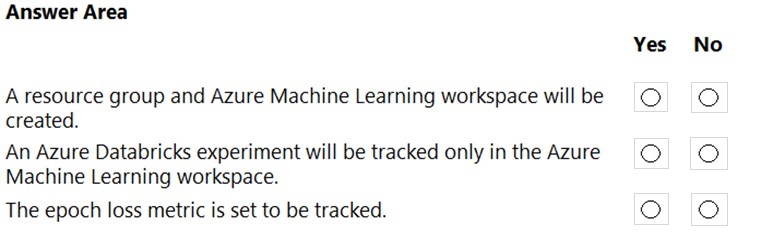
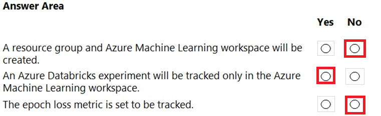

# Question 282

HOTSPOT -

You create an Azure Databricks workspace and a linked Azure Machine Learning workspace.

You have the following Python code segment in the Azure Machine Learning workspace: import mlflow import mlflow.azureml import azureml.mlflow import azureml.core from azureml.core import Workspace subscription_id = 'subscription_id' resourse_group = 'resource_group_name' workspace_name = 'workspace_name' ws = Workspace.get(name=workspace_name, subscription_id=subscription_id, resource_group=resource_group) experimentName = "/Users/{user_name}/{experiment_folder}/{experiment_name}" mlflow.set_experiment(experimentName) uri = ws.get_mlflow_tracking_uri() mlflow.set_tracking_uri(uri)

Instructions: For each of the following statements, select Yes if the statement is true. Otherwise, select No.

NOTE: Each correct selection is worth one point.

Hot Area:

  
Show Suggested Answer

 

  
Show Discussions

<blockquote>
<strong>TEO96B</strong> <code>(Wed 29 Jun 2022 10:09)</code> - <em>Upvotes: 27</em>

It should be NYN, shouldn&#x27;t it?
</blockquote>
<blockquote>
<strong>Lion007</strong> <code>(Fri 28 Jun 2024 18:28)</code> - <em>Upvotes: 2</em>

I agree, it should be NYN
Box 1: No -
This method does not create a new resource group or Azure Machine Learning workspace; it simply accesses an existing one​​.
Box 2: Yes -
The get_mlflow_tracking_uri() method retrieves the tracking URI of the Azure Machine Learning workspace, and set_tracking_uri() directs MLflow to send its tracking data to this URI​​.
Box 3: No -
The Python code provided does not include any code that specifically sets up tracking for the &quot;epoch loss&quot; metric. While MLflow is capable of tracking such a metric, it would require explicit calls to mlflow.log_metric() within the training loop, which are not present in the provided code segment​​.
</blockquote>
<blockquote>
<strong>vish9</strong> <code>(Tue 14 Nov 2023 14:27)</code> - <em>Upvotes: 6</em>

https://learn.microsoft.com/en-us/azure/machine-learning/how-to-use-mlflow-azure-databricks?view=azureml-api-2&amp;tabs=cli%2Cmlflow
The above link states: Azure Databricks can be configured to track experiments using MLflow in two ways:

Track in both Azure Databricks workspace and Azure Machine Learning workspace (dual-tracking)
Track exclusively on Azure Machine Learning
By default, dual-tracking is configured for you when you linked your Azure Databricks workspace.
Hence It should be NNN
</blockquote>

<blockquote>
<strong>Matt2000</strong> <code>(Mon 29 Jul 2024 14:29)</code> - <em>Upvotes: 1</em>

I followed your link. The code specified in this question occurs in the section &#x27;Tracking exclusively on Azure Machine Learning workspace&#x27;. I suppose that the second question should be &#x27;Yes&#x27;.
</blockquote>
<blockquote>
<strong>Secure_Defense</strong> <code>(Sun 02 Feb 2025 05:29)</code> - <em>Upvotes: 1</em>

Should be NNN.

For second box: NO
&quot;You can configure Azure Databricks to track experiments using MLflow in two ways:

- Track in both Azure Databricks workspace and Azure Machine Learning workspace (dual-tracking)
- Track exclusively on Azure Machine Learning

By default, when you link your Azure Databricks workspace, dual-tracking is configured for you.

Linking your Azure Databricks workspace to your Azure Machine Learning workspace enables you to track your experiment data in the Azure Machine Learning workspace and Azure Databricks workspace at the same time. This configuration is called Dual-tracking.

https://learn.microsoft.com/en-us/azure/machine-learning/how-to-use-mlflow-azure-databricks?view=azureml-api-2&amp;tabs=cli%2Cmlflow#track-azure-databricks-runs-with-mlflow

For third box: NO

The code doesn&#x27;t provide any segment to track metrics.
</blockquote>

<blockquote>
<strong>SunilB</strong> <code>(Thu 14 Sep 2023 11:55)</code> - <em>Upvotes: 5</em>

Should be NNN
After you link your Azure Databricks workspace with your Azure Machine Learning workspace, MLflow Tracking is automatically set to be tracked in all of the following places:
The linked Azure Machine Learning workspace.
Your original ADB workspace.
</blockquote>
<blockquote>
<strong>vishal_aiml164</strong> <code>(Sat 08 Jul 2023 15:28)</code> - <em>Upvotes: 6</em>

It should be N,N,N as i see that 1) we will not create ws 2) in latest Azure ML and Azure DB we can monitor the logs 3) there is no code for logging in mlflow
</blockquote>
<blockquote>
<strong>vishal_aiml164</strong> <code>(Sat 08 Jul 2023 15:30)</code> - <em>Upvotes: 1</em>

FYR : https://learn.microsoft.com/en-us/azure/machine-learning/how-to-use-mlflow-azure-databricks?tabs=cli%2Cmlflow
</blockquote>
<blockquote>
<strong>ning</strong> <code>(Thu 08 Dec 2022 18:34)</code> - <em>Upvotes: 1</em>

I do not fully understand this question, in the statements, there are no statement for logging, in order mlflow to log, one the following needs to be called:

mlflow.log_param(&quot;alpha&quot;, alpha)
mlflow.log_metric(&#x27;mse&#x27;, 1.23)
mlflow.log_artifact(&quot;actuals_vs_predictions.png&quot;)
mlflow.log_model(lr, &quot;linear Model&quot;)

if no statement to log, how would anything to be traced or logged???
</blockquote>

<blockquote>
<strong>AjoseO</strong> <code>(Sat 03 Sep 2022 05:35)</code> - <em>Upvotes: 4</em>

On 03 March 2022

The 3rd question was different
</blockquote>

---

[<< Previous Question](question_281.md) | [Home](../index.md) | [Next Question >>](question_283.md)
