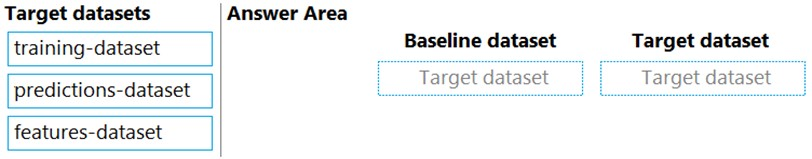
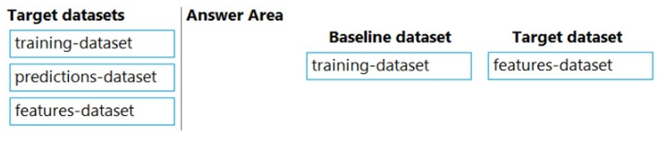

# Question 283

DRAG DROP -

You previously deployed a model that was trained using a tabular dataset named training-dataset, which is based on a folder of CSV files.

Over time, you have collected the features and predicted labels generated by the model in a folder containing a CSV file for each month. You have created two tabular datasets based on the folder containing the inference data: one named predictions-dataset with a schema that matches the training data exactly, including the predicted label; and another named features-dataset with a schema containing all of the feature columns and a timestamp column based on the filename, which includes the day, month, and year.

You need to create a data drift monitor to identify any changing trends in the feature data since the model was trained. To accomplish this, you must define the required datasets for the data drift monitor.

Which datasets should you use to configure the data drift monitor? To answer, drag the appropriate datasets to the correct data drift monitor options. Each source may be used once, more than once, or not at all. You may need to drag the split bar between panes or scroll to view content.

NOTE: Each correct selection is worth one point.

Select and Place:

  
Show Suggested Answer

 

  
Show Discussions

<blockquote>
<strong>David_Tadeu</strong> <code>(Fri 07 Apr 2023 10:44)</code> - <em>Upvotes: 18</em>

The answer should be
Box 1. Training dataset
Box 2. Features dataset

because in data drift monitor,
Baseline dataset = &quot;usually the training dataset for a model&quot;.
Target dataset = &quot;... MUST have a timestamp column specified&quot;.
</blockquote>

<blockquote>
<strong>Arend78</strong> <code>(Sat 16 Dec 2023 14:18)</code> - <em>Upvotes: 2</em>

Indeed, the drift monitor looks at changes (e.g. seasonal) in the inputs, and does not look at the predictions
</blockquote>
<blockquote>
<strong>A_PL300</strong> <code>(Sat 14 Sep 2024 22:01)</code> - <em>Upvotes: 1</em>

Question like this one on Sept-4, 2022 exam
</blockquote>
<blockquote>
<strong>bobML</strong> <code>(Tue 10 Sep 2024 10:13)</code> - <em>Upvotes: 1</em>

To configure a data drift monitor, you typically use a baseline dataset and a target dataset for comparison. In this scenario, you want to monitor the changing trends in the feature data since the model was trained. Here&#x27;s how you should configure the data drift monitor:

Baseline Dataset: Training-dataset

The baseline dataset should be the dataset that represents the data at the time when the model was trained. In this case, it&#x27;s the training-dataset since it is the original dataset used for training the model.
Target Dataset: Features-dataset

The target dataset should be the dataset that you want to monitor for data drift, which contains the features and timestamp information. In this case, it&#x27;s the features-dataset because it contains the feature data that you want to compare with the baseline data.
You don&#x27;t need to use the predictions-dataset for configuring the data drift monitor because it contains the predicted labels, which are not relevant for monitoring data drift in the features.
</blockquote>

<blockquote>
<strong>therealola</strong> <code>(Sun 18 Jun 2023 01:48)</code> - <em>Upvotes: 2</em>

On exam 18-06-22
</blockquote>
<blockquote>
<strong>striver</strong> <code>(Fri 02 Jun 2023 12:38)</code> - <em>Upvotes: 4</em>

Correct answer is
Box1: Training Dataset
Box2: Features Dataset

Reference: https://docs.microsoft.com/en-us/azure/machine-learning/how-to-monitor-datasets?tabs=python#create-target-dataset
</blockquote>

<blockquote>
<strong>JTWang</strong> <code>(Sat 22 Apr 2023 10:52)</code> - <em>Upvotes: 2</em>

on exam 04/22/2022
</blockquote>
<blockquote>
<strong>synapse</strong> <code>(Sun 12 Mar 2023 12:18)</code> - <em>Upvotes: 1</em>

1. baseline: Training dataset 2. Target:  Features data set. Features dataset has a timestamp in it.
</blockquote>
<blockquote>
<strong>AjoseO</strong> <code>(Fri 03 Mar 2023 06:36)</code> - <em>Upvotes: 3</em>

On 03 March 2022
</blockquote>
<blockquote>
<strong>AjoseO</strong> <code>(Fri 24 Feb 2023 11:22)</code> - <em>Upvotes: 2</em>

1. Training dataset
2. Predictions dataset -&gt; because this is the only dataset that has a timestamp column
</blockquote>
<blockquote>
<strong>AjoseO</strong> <code>(Fri 24 Feb 2023 11:23)</code> - <em>Upvotes: 5</em>

Sorry.
2. Features dataset -&gt; because this is the only dataset that has a timestamp column
</blockquote>
<blockquote>
<strong>ranjsi01</strong> <code>(Fri 20 Jan 2023 00:35)</code> - <em>Upvotes: 1</em>

target dataset should be features dataset. (mandatory timestamp column in target dataset
)
</blockquote>
<blockquote>
<strong>Tsardoz</strong> <code>(Sun 15 Jan 2023 10:27)</code> - <em>Upvotes: 2</em>

I cant even find any reference to what a feature dataset is ... my vote goes to predictions dataset
</blockquote>
<blockquote>
<strong>J_AR</strong> <code>(Sun 01 Jan 2023 15:36)</code> - <em>Upvotes: 4</em>

The target dataset should be &quot;predictions dataset&#x27; because this is the only dataset that has a timestamp column.
</blockquote>
<blockquote>
<strong>Oliverto</strong> <code>(Tue 10 Jan 2023 13:27)</code> - <em>Upvotes: 4</em>

Target dataset should be &quot;feature-dataset&quot;. Because only the feature-dataset contains a timestamp which is mandatory &quot;target_dataset: Required. Dataset to run either adhoc or scheduled DataDrift jobs for. Must be a time series.&quot; (https://docs.microsoft.com/en-us/python/api/azureml-datadrift/azureml.datadrift.datadriftdetector(class)?view=azure-ml-py)
</blockquote>
<blockquote>
<strong>pancman</strong> <code>(Tue 11 Apr 2023 19:52)</code> - <em>Upvotes: 1</em>

J_AR you didn&#x27;t read the question correctly. The dataset that contains the timestamp is features-dataset. Question states: &quot;another named features-dataset with a schema containing all of the feature columns and a timestamp column&quot;
</blockquote>

---

[<< Previous Question](question_282.md) | [Home](/index.md) | [Next Question >>](question_284.md)
