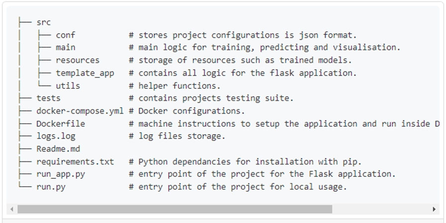

# Question 286

You have a Jupyter Notebook that contains Python code that is used to train a model.

You must create a Python script for the production deployment. The solution must minimize code maintenance.

Which two actions should you perform? Each correct answer presents part of the solution.

NOTE: Each correct selection is worth one point.

- A.Refactor the Jupyter Notebook code into functions
- B.Save each function to a separate Python file
- C.Define a main() function in the Python script
- D.Remove all comments and functions from the Python script

  
Show Suggested Answer

<strong>AC</strong> 

C: Python main function is a starting point of any program. When the program is run, the python interpreter runs the code sequentially. Main function is executed only when it is run as a Python program.

A: Refactoring, code style and testing

The first step is to modularise the notebook into a reasonable folder structure, this effectively means to convert files from .ipynb format to .py format, ensure each script has a clear distinct purpose and organise these files in a coherent way.

 

Once the project is nicely structured we can tidy up or refactor the code.

Reference:

https://www.guru99.com/learn-python-main-function-with-examples-understand-main.html https://towardsdatascience.com/from-jupyter-notebook-to-deployment-a-straightforward-example-1838c203a437

  
Show Discussions

<blockquote>
<strong>evangelist</strong> <code>(Sun 08 Dec 2024 08:00)</code> - <em>Upvotes: 1</em>

given answers are correct
</blockquote>
<blockquote>
<strong>Kakusaif</strong> <code>(Sat 08 Apr 2023 17:04)</code> - <em>Upvotes: 2</em>

correct - official MS reference  is here - https://learn.microsoft.com/en-us/azure/machine-learning/v1/how-to-convert-ml-experiment-to-production
</blockquote>
<blockquote>
<strong>chevyli</strong> <code>(Thu 02 Mar 2023 04:29)</code> - <em>Upvotes: 1</em>

Seems correct
</blockquote>

---

[<< Previous Question](question_285.md) | [Home](../index.md) | [Next Question >>](question_287.md)
