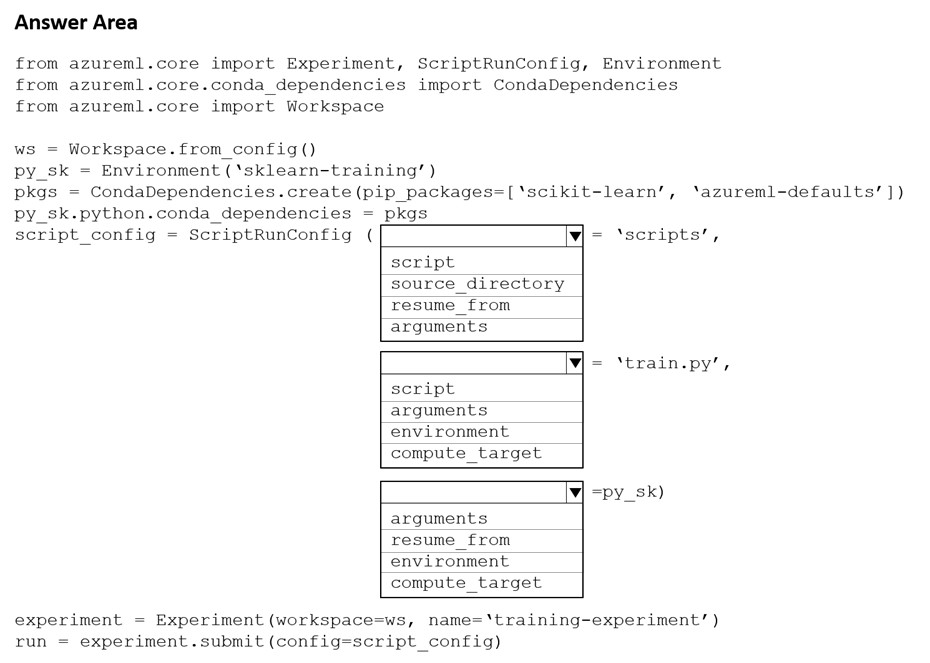
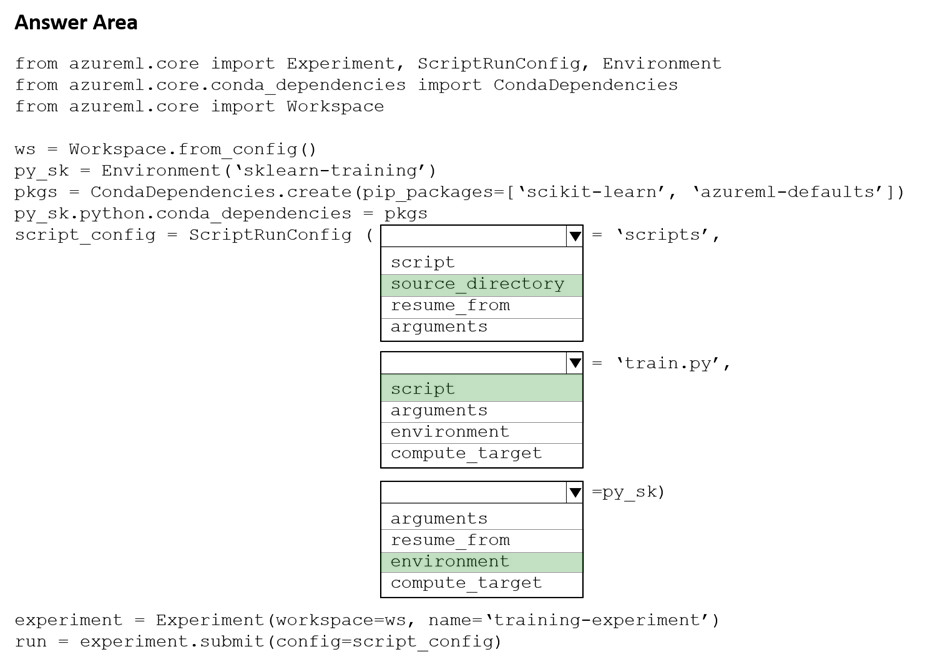

# Question 288

HOTSPOT -

You create a Python script named train.py and save it in a folder named scripts. The script uses the scikit-learn framework to train a machine learning model.

You must run the script as an Azure Machine Learning experiment on your local workstation.

You need to write Python code to initiate an experiment that runs the train.py script.

How should you complete the code segment? To answer, select the appropriate options in the answer area.

NOTE: Each correct selection is worth one point.

Hot Area:

  
Show Suggested Answer

 

Box 1: source_directory -

source_directory: A local directory containing code files needed for a run.

Box 2: script -

Script: The file path relative to the source_directory of the script to be run.

Box 3: environment -

Reference:

https://docs.microsoft.com/en-us/python/api/azureml-core/azureml.core.scriptrunconfig

  
Show Discussions

<blockquote>
<strong>michaelmorar</strong> <code>(Sat 10 Jun 2023 19:26)</code> - <em>Upvotes: 5</em>

Answer is correct.
</blockquote>
<blockquote>
<strong>evangelist</strong> <code>(Sun 08 Dec 2024 08:04)</code> - <em>Upvotes: 2</em>

Answer is correct
</blockquote>
<blockquote>
<strong>JTWang</strong> <code>(Fri 21 Apr 2023 02:59)</code> - <em>Upvotes: 4</em>

The Answer is correct.
</blockquote>

---

[<< Previous Question](question_287.md) | [Home](/index.md) | [Next Question >>](question_289.md)
