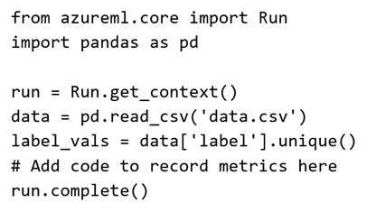

# Question 289

Note: This question is part of a series of questions that present the same scenario. Each question in the series contains a unique solution that might meet the stated goals. Some question sets might have more than one correct solution, while others might not have a correct solution.

After you answer a question in this section, you will NOT be able to return to it. As a result, these questions will not appear in the review screen.

You plan to use a Python script to run an Azure Machine Learning experiment. The script creates a reference to the experiment run context, loads data from a file, identifies the set of unique values for the label column, and completes the experiment run:

The experiment must record the unique labels in the data as metrics for the run that can be reviewed later.

You must add code to the script to record the unique label values as run metrics at the point indicated by the comment.

Solution: Replace the comment with the following code:

run.log_list('Label Values', label_vals)

Does the solution meet the goal?

- A.Yes
- B.No

  
Show Suggested Answer

<strong>A</strong> 

  
Show Discussions

<blockquote>
<strong>AP_15</strong> <code>(Mon 29 May 2023 18:00)</code> - <em>Upvotes: 5</em>

Correct
</blockquote>
<blockquote>
<strong>Peeking</strong> <code>(Fri 15 Sep 2023 09:07)</code> - <em>Upvotes: 2</em>

https://learn.microsoft.com/en-us/python/api/azureml-core/azureml.core.run(class)?view=azure-ml-py
</blockquote>
<blockquote>
<strong>Matt2000</strong> <code>(Mon 29 Jul 2024 15:30)</code> - <em>Upvotes: 2</em>

Unique() returns no list but a numpy.ndarray or ExtensionArray but run.log_list requires a list as output. So it should be a &#x27;No&#x27;. Did someone actually test whether it works?
</blockquote>

---

[<< Previous Question](question_288.md) | [Home](/index.md) | [Next Question >>](question_290.md)
