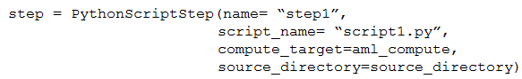

# Question 290

You use the Azure Machine Learning SDK for Python to create a pipeline that includes the following step:

The output of the step run must be cached and reused on subsequent runs when the source_directory value has not changed.

You need to define the step.

What should you include in the step definition?

- A.allow_reuse
- B.version
- C.data.as_input(name=…)
- D.hash_paths

  
Show Suggested Answer

<strong>A</strong> 

  
Show Discussions

<blockquote>
<strong>snegnik</strong> <code>(Sun 01 Dec 2024 18:13)</code> - <em>Upvotes: 3</em>

allow_reuse - default value: True
Indicates whether the step should reuse previous results when re-run with the same settings. Reuse is enabled by default. If the step contents (scripts/dependencies) as well as inputs and parameters remain unchanged, the output from the previous run of this step is reused. When reusing the step, instead of submitting the job to compute, the results from the previous run are immediately made available to any subsequent steps. If you use Azure Machine Learning datasets as inputs, reuse is determined by whether the dataset&#x27;s definition has changed, not by whether the underlying data has changed.

https://learn.microsoft.com/en-us/python/api/azureml-pipeline-steps/azureml.pipeline.steps.python_script_step.pythonscriptstep?view=azure-ml-py
</blockquote>

<blockquote>
<strong>sap_dg</strong> <code>(Tue 01 Oct 2024 03:34)</code> - <em>Upvotes: 3</em>

Correct!
</blockquote>

---

[<< Previous Question](question_289.md) | [Home](/index.md) | [Next Question >>](question_291.md)
