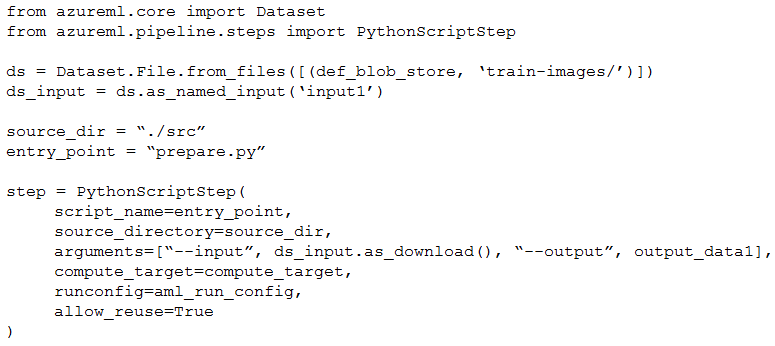
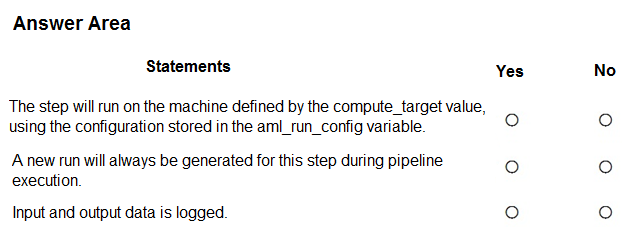
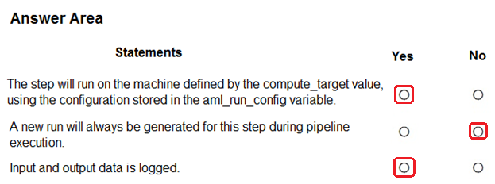

# Question 291

HOTSPOT

-

You build a data pipeline in an Azure Machine Learning workspace by using the Azure Machine Learning SDK for Python. You create a data preparation step in the data pipeline.

You create the following code fragment in Python:

For each of the following statements, select Yes if the statement is true. Otherwise, select No.

NOTE: Each correct selection is worth one point.

  
Show Suggested Answer

 

  
Show Discussions

<blockquote>
<strong>sap_dg</strong> <code>(Mon 27 Mar 2023 16:36)</code> - <em>Upvotes: 7</em>

1. Yes
2. No
3. Yes - the input and output data are passed as arguments and are therefore logged by default in Azure Machine Learning.
</blockquote>
<blockquote>
<strong>AzureGeek79</strong> <code>(Wed 09 Oct 2024 01:33)</code> - <em>Upvotes: 1</em>

1. Yes
2. No
3. No
</blockquote>
<blockquote>
<strong>deyoz</strong> <code>(Sat 03 Feb 2024 22:13)</code> - <em>Upvotes: 1</em>

Yes
not sure
No.
this one is not because we need the object (PipelineData) to store the output of steps. No PipelineData object is defined, hence no. correct me if i am wrong.
</blockquote>
<blockquote>
<strong>deyoz</strong> <code>(Sat 02 Mar 2024 20:58)</code> - <em>Upvotes: 1</em>

yes,
no,
yes
</blockquote>
<blockquote>
<strong>esimsek</strong> <code>(Mon 27 Mar 2023 08:12)</code> - <em>Upvotes: 4</em>

I think 
Yes = configurations are correct.
No = Since allow_reuse is set.
No = There is nothing about log.
</blockquote>
<blockquote>
<strong>Tommo565</strong> <code>(Fri 24 Mar 2023 12:33)</code> - <em>Upvotes: 2</em>

I think YYY
</blockquote>

---

[<< Previous Question](question_290.md) | [Home](../index.md) | [Next Question >>](question_292.md)
