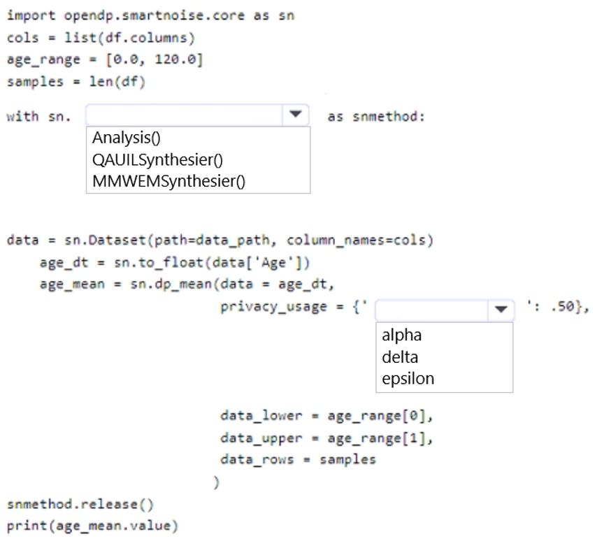
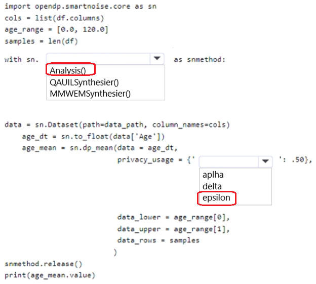

# Question 292

HOTSPOT

-

You load data from a notebook in an Azure Machine Learning workspace into a pandas dataframe named df. The data contains 10,000 patient records. Each record includes the Age property for the corresponding patient.

You must identify the mean age value from the differentially private data generated by SmartNoise SDK.

You need to complete the Python code that will generate the mean age value from the differentially private data.

Which code segments should you use? To answer, select the appropriate options in the answer area.

NOTE: Each correct selection is worth one point.

  
Show Suggested Answer

 

  
Show Discussions

<blockquote>
<strong>oakmm</strong> <code>(Sun 22 Sep 2024 23:30)</code> - <em>Upvotes: 5</em>

https://github.com/MicrosoftLearning/mslearn-dp100/blob/main/13%20-%20Explore%20Differential%20Privacy.ipynb
</blockquote>

---

[<< Previous Question](question_291.md) | [Home](/index.md) | [Next Question >>](question_293.md)
