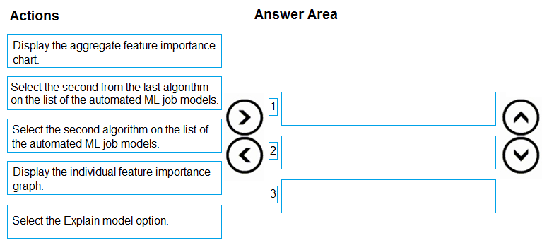
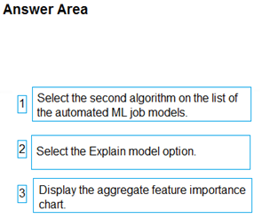

# Question 294

DRAG DROP

-

You create an Azure Machine Learning workspace. You are training a classification model with no-code AutoML in Azure Machine Learning studio.

The model must predict if a client of a financial institution will subscribe to a fixed-term deposit. You must identify the feature that has the most influence on the predictions of the model for the second highest scoring algorithm. You must minimize the effort and time to identify the feature.

You need to complete the identification.

Which three actions should you perform in sequence? To answer, move the appropriate actions from the list of actions to the answer area and arrange them in the correct order.

  
Show Suggested Answer

 

  
Show Discussions

<blockquote>
<strong>Mal42</strong> <code>(Thu 22 Feb 2024 10:00)</code> - <em>Upvotes: 5</em>

On exam 18 Aug 2023
</blockquote>
<blockquote>
<strong>evangelist</strong> <code>(Sun 08 Dec 2024 08:33)</code> - <em>Upvotes: 1</em>

selection and sequence are both correct:
model explainabillity is most important
</blockquote>
<blockquote>
<strong>Lukemao</strong> <code>(Mon 04 Dec 2023 14:42)</code> - <em>Upvotes: 1</em>

agree with above
</blockquote>
<blockquote>
<strong>esimsek</strong> <code>(Wed 27 Sep 2023 08:23)</code> - <em>Upvotes: 2</em>

Select the Explain Model option, 
Display the Aggregate feature importance chart,
Select the second algorithm on the list
</blockquote>
<blockquote>
<strong>deyoz</strong> <code>(Thu 15 Aug 2024 00:46)</code> - <em>Upvotes: 1</em>

need appropriate sequence. They are select the second algo, Select explain model, and display aggregate feature
</blockquote>

---

[<< Previous Question](question_293.md) | [Home](../index.md) | [Next Question >>](question_295.md)
