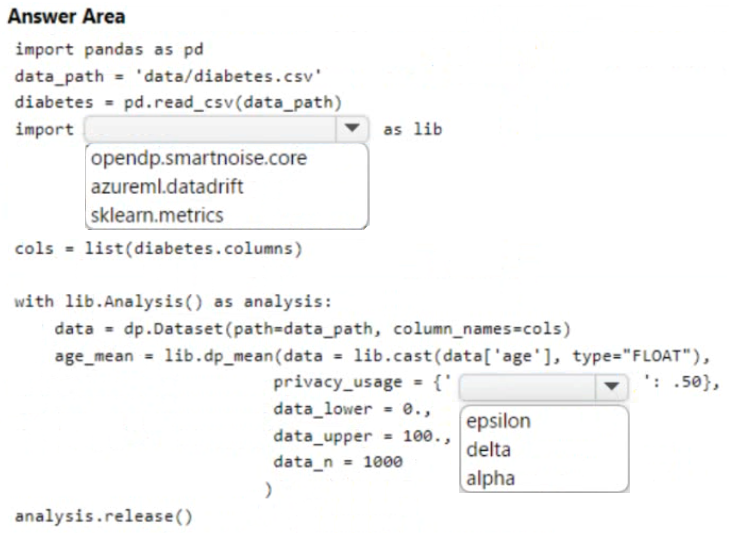
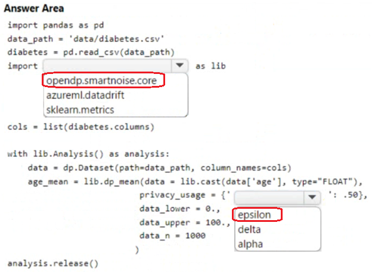

# Question 297

HOTSPOT

-

You are developing code to analyze a dataset that includes age information for a large group of diabetes patients. You create an Azure Machine Learning workspace and install all required libraries. You set the privacy budget to 1.0.

You must analyze the dataset and preserve data privacy. The code must run twice before the privacy budget is depleted.

You need to complete the code.

Which values should you use? To answer, select the appropriate options in the answer area.

NOTE: Each correct selection is worth one point.

  
Show Suggested Answer

 

  
Show Discussions

<blockquote>
<strong>Mikku123</strong> <code>(Tue 06 Aug 2024 03:48)</code> - <em>Upvotes: 2</em>

correct!
</blockquote>

---

[<< Previous Question](question_296.md) | [Home](../index.md) | [Next Question >>](question_298.md)
