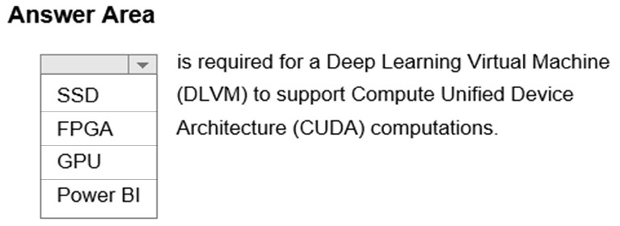
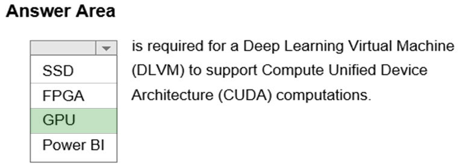

# Question 3

HOTSPOT -

Complete the sentence by selecting the correct option in the answer area.

Hot Area:

  
Show Suggested Answer

 

A Deep Learning Virtual Machine is a pre-configured environment for deep learning using GPU instances.

  
Show Discussions

<blockquote>
<strong>ranjsi01</strong> <code>(Wed 25 Jan 2023 20:28)</code> - <em>Upvotes: 9</em>

correct
</blockquote>
<blockquote>
<strong>james2033</strong> <code>(Sat 12 Oct 2024 04:23)</code> - <em>Upvotes: 2</em>

GPU is required for a Deep Learning Virtual Machine (DLVM) to support Compute Unified Device Architecture (CUDA) computations.
</blockquote>
<blockquote>
<strong>PopeyeDS</strong> <code>(Sun 14 Jul 2024 07:13)</code> - <em>Upvotes: 1</em>

By using DLVM, developers and researchers can focus on their deep learning tasks without spending time on manual software setup, ensuring a streamlined and optimized environment for deep learning model training and inference using CUDA-based acceleration.

The DLVM image is typically used on cloud platforms or local machines equipped with NVIDIA GPUs.
</blockquote>

<blockquote>
<strong>Yoshizn</strong> <code>(Wed 31 Jan 2024 16:25)</code> - <em>Upvotes: 1</em>

Correct.
CUDA (Compute Unified Device Architecture) is a parallel computing platform and application programming interface model created by Nvidia, crucial for supporting the various deep learning applications.
</blockquote>
<blockquote>
<strong>emmanuelodenyire</strong> <code>(Wed 31 Jan 2024 07:07)</code> - <em>Upvotes: 1</em>

A Deep Learning Virtual Machine is a pre-configured environment for deep learning that is optimized for use with GPU instances, providing the necessary hardware resources for training and running large deep learning models. These virtual machines typically come pre-installed with popular deep learning frameworks and tools, making it easy to get started with deep learning projects.

So for this question, the answer is correct
</blockquote>

---

[<< Previous Question](question_2.md) | [Home](/index.md) | [Next Question >>](question_4.md)
