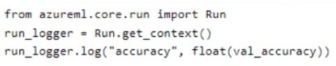
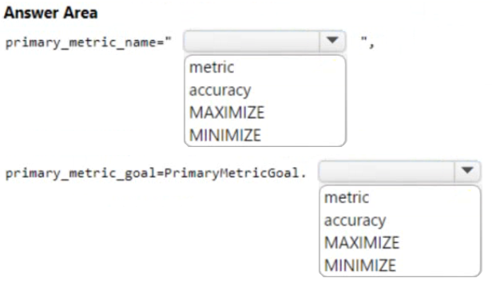
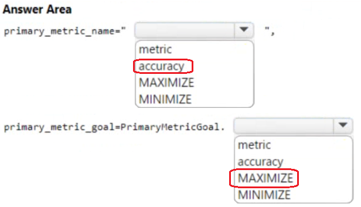

# Question 300

HOTSPOT

-

You train a machine learning model by using Azure Machine Learning.

You use the following training script in Python to log an accuracy value:

You must use a Python script to define a sweep job.

You need to provide the primary metric and goal you want hyperparameter tuning to optimize.

How should you complete the Python script? To answer, select the appropriate options in the answer area.

NOTE: Each correct selection is worth one point.

  
Show Suggested Answer

 

  
Show Discussions

<blockquote>
<strong>fqc</strong> <code>(Wed 20 Nov 2024 11:39)</code> - <em>Upvotes: 3</em>

The primary_metric_name should be set to &quot;accuracy&quot; to indicate that the accuracy metric is the primary metric you want to optimize during hyperparameter tuning.

The primary_metric_goal should be set to PrimaryMetricGoal.MAXIMIZE to specify that you want to maximize the value of the primary metric during the tuning process.
</blockquote>

---

[<< Previous Question](question_299.md) | [Home](/index.md) | [Next Question >>](question_301.md)
