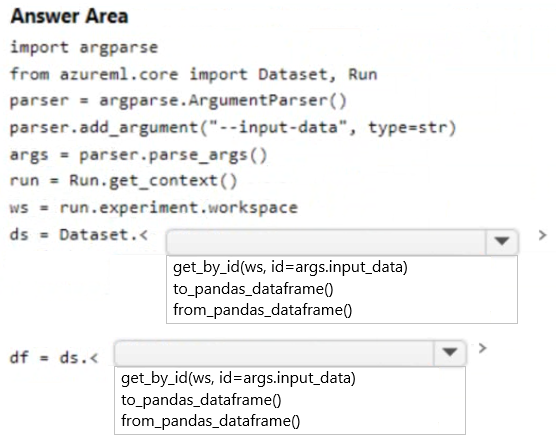
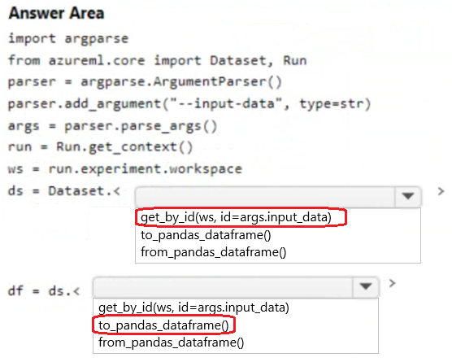

# Question 301

HOTSPOT

-

You have an Azure Machine learning workspace. The workspace contains a dataset with data in a tabular form.

You plan to use the Azure Machine Learning SDK for Python v1 to create a control script that will load the dataset into a pandas dataframe in preparation for model training. The script will accept a parameter designating the dataset.

You need to complete the script.

How should you complete the script? To answer, select the appropriate options in the answer area.

NOTE: Each correct selection is worth one point.

  
Show Suggested Answer

 

  
Show Discussions

<blockquote>
<strong>Mikku123</strong> <code>(Tue 06 Aug 2024 03:56)</code> - <em>Upvotes: 3</em>

Correct!
</blockquote>

---

[<< Previous Question](question_300.md) | [Home](/index.md) | [Next Question >>](question_302.md)
