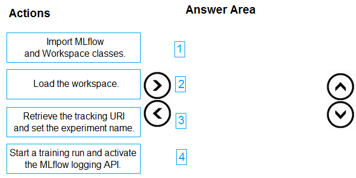
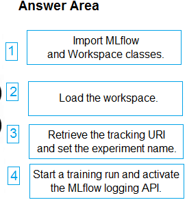

# Question 309

DRAG DROP

-

You have an Azure Machine Learning workspace. You are running an experiment on your local computer.

You need to use MLflow Tracking to store metrics and artifacts from your local experiment runs in the workspace.

In which order should you perform the actions? To answer, move all actions from the list of actions to the answer area and arrange them in the correct order.

  
Show Suggested Answer

 

  
Show Discussions

<blockquote>
<strong>sap_dg</strong> <code>(Wed 27 Sep 2023 17:43)</code> - <em>Upvotes: 6</em>

Correct!
</blockquote>
<blockquote>
<strong>Tin_Tin</strong> <code>(Thu 18 Jul 2024 13:02)</code> - <em>Upvotes: 2</em>

seems correct.
https://learn.microsoft.com/en-us/azure/machine-learning/how-to-use-mlflow-cli-runs?view=azureml-api-2&amp;tabs=interactive%2Ccli
</blockquote>

---

[<< Previous Question](question_308.md) | [Home](../index.md) | [Next Question >>](question_310.md)
