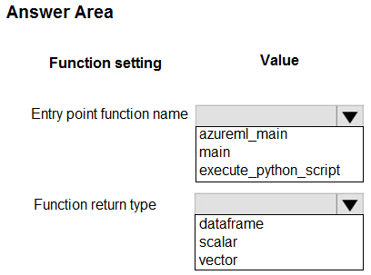
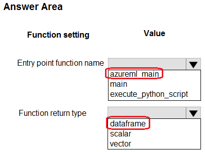

# Question 311

HOTSPOT

-

You create an Azure Machine Learning dataset containing automobile price data. The dataset includes 10,000 rows and 10 columns. You use the Azure Machine Learning designer to transform the dataset by using an Execute Python Script component and custom code.

The code must combine three columns to create a new column.

You need to configure the code function.

Which configurations should you use? To answer, select the appropriate options in the answer area.

NOTE: Each correct selection is worth one point.

  
Show Suggested Answer

 

  
Show Discussions

<blockquote>
<strong>oakmm</strong> <code>(Sun 22 Sep 2024 21:30)</code> - <em>Upvotes: 5</em>

correct answer
https://learn.microsoft.com/en-us/azure/machine-learning/how-to-designer-python#write-your-python-code
</blockquote>
<blockquote>
<strong>Nghia1</strong> <code>(Fri 06 Dec 2024 20:52)</code> - <em>Upvotes: 1</em>

Yes it is right. The entry point script must contain the function azureml_main. The function has two function parameters that map to the two input ports for the Execute Python Script component.
</blockquote>

---

[<< Previous Question](question_310.md) | [Home](/index.md) | [Next Question >>](question_312.md)
