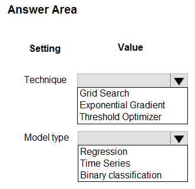
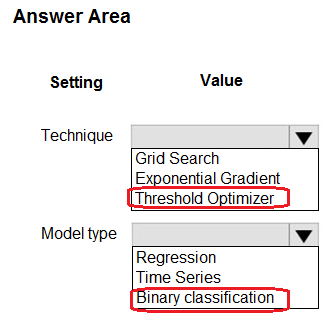

# Question 314

HOTSPOT

-

You have machine learning models that produce unfair predictions across sensitive features.

You must use a post-processing technique to apply a constraint to the models to mitigate their unfairness.

You need to select a post-processing technique and model type.

What should you use? To answer, select the appropriate options in the answer area.

NOTE: Each correct selection is worth one point.

  
Show Suggested Answer

 

  
Show Discussions

<blockquote>
<strong>oakmm</strong> <code>(Fri 22 Sep 2023 21:05)</code> - <em>Upvotes: 5</em>

correct answer
https://learn.microsoft.com/en-us/azure/machine-learning/concept-fairness-ml#mitigation-algorithms
</blockquote>
<blockquote>
<strong>sl_mslconsulting</strong> <code>(Sun 24 Nov 2024 19:48)</code> - <em>Upvotes: 1</em>

The question is asking for post-processing so you have to choose ThresholdOptimizer.
</blockquote>
<blockquote>
<strong>snegnik</strong> <code>(Sun 03 Dec 2023 14:55)</code> - <em>Upvotes: 2</em>

GPT-3.5

To mitigate the unfairness in machine learning models that produce unfair predictions across sensitive features, you can use the following post-processing technique and model type:

Post-processing technique: Threshold optimizer technique

Model type: Binary classification model

The Threshold optimizer technique is a post-processing technique that adjusts the decision threshold of a binary classification model to achieve fairness. By selecting an appropriate threshold, you can balance the trade-off between false positives and false negatives, thereby mitigating unfairness in predictions across sensitive features.

In this case, since the question specifically mentions unfair predictions across sensitive features, we can infer that the problem involves binary classification (predicting two classes) rather than regression (predicting continuous values) or time series forecasting (predicting future values over time).
</blockquote>

---

[<< Previous Question](question_313.md) | [Home](/index.md) | [Next Question >>](question_315.md)
