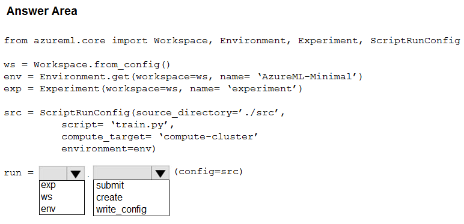
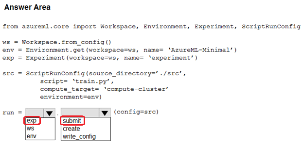

# Question 315

HOTSPOT

-

You have an Azure Machine Learning workspace.

You plan to use the Azure Machine Learning SDK for Python v1 to submit a job to run a training script.

You need to complete the script to ensure that it will execute the training script.

How should you complete the script? To answer, select the appropriate options in the answer area.

NOTE: Each correct selection is worth one point.

  
Show Suggested Answer

 

  
Show Discussions

<blockquote>
<strong>orionduo</strong> <code>(Sun 01 Sep 2024 04:19)</code> - <em>Upvotes: 3</em>

correct
https://azure.github.io/azureml-cheatsheets/docs/cheatsheets/python/v1/script-run-config/
</blockquote>
<blockquote>
<strong>Nghia1</strong> <code>(Thu 06 Jun 2024 19:35)</code> - <em>Upvotes: 2</em>

correct
</blockquote>

---

[<< Previous Question](question_314.md) | [Home](../index.md) | [Next Question >>](question_316.md)
