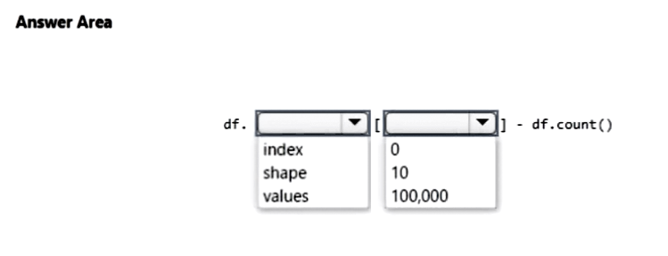
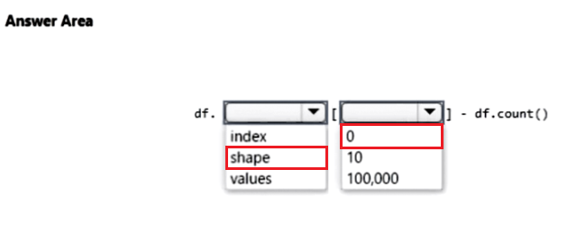

# Question 316

HOTSPOT -

You load data from a notebook in an Azure Machine Learning workspace into a pandas dataframe. The data contains 10,000 records. Each record consists of 10 columns.

You must identify the number of missing values in each of the columns.

You need to complete the Python code that will return the number of missing values in each of the columns.

Which code segments should you use? To answer, select the appropriate options in the answer area.

NOTE: Each correct selection is worth one point.

  
Show Suggested Answer

 

  
Show Discussions

<blockquote>
<strong>avotofu</strong> <code>(Wed 18 Oct 2023 11:59)</code> - <em>Upvotes: 19</em>

Answer is df.shape[0] - df.count()

df.shape[0] = total number of rows.
df.count() = non-missing values
</blockquote>

<blockquote>
<strong>Lion007</strong> <code>(Sun 30 Jun 2024 10:54)</code> - <em>Upvotes: 5</em>

WRONG. The Correct answer is:   shape   and   0

The shape attribute of a DataFrame returns the dimensionality of the DataFrame, where shape[0] returns the number of Rows and shape[1] returns the number of Columns.

If you have 10,000 rows ( df.shape[0] equals 10,000 ) and you want to find out how many values are missing in each Column, you would use df.shape[0] and subtract the number of non-missing values per column from the total number of rows to get the number of missing values like this:
missing_values_per_column = df.shape[0] - df.count()

The df.count() method returns the number of non-NA/non-missing values in each column. By subtracting this from the total number of rows (df.shape[0]), you get the count of missing values per column.
</blockquote>

<blockquote>
<strong>BR_CS</strong> <code>(Sat 17 Feb 2024 09:29)</code> - <em>Upvotes: 1</em>

A pretty silly approach, but df.shape[0] would be correct to get the #of total rows.
</blockquote>
<blockquote>
<strong>snegnik</strong> <code>(Sun 03 Dec 2023 15:04)</code> - <em>Upvotes: 1</em>

strange examples. I use this approach
# Assuming you have loaded the data into a pandas DataFrame named &#x27;df&#x27;
missing_values_count = df.isnull().sum()

# Output the number of missing values in each column

print(missing_values_count)
</blockquote>

---

[<< Previous Question](question_315.md) | [Home](/index.md) | [Next Question >>](question_317.md)
