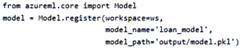

# Question 317

You register a model in an Azure Machine Learning workspace by running the following code:

You are creating a scoring script to use in a real-time service for the model.

You need to write code in the scoring script to set the path of the registered model so that it can be loaded by the service. You include the necessary import statements.

Which code segment should you use?

- A.path = Model.get_model_path(‘loan_model’)
- B.path = ‘model.pkl’
- C.path = ws.models(‘loan_model’)
- D.path = ‘outputs/model.pkl’

  
Show Suggested Answer

<strong>A</strong> 

  
Show Discussions

<blockquote>
<strong>Nghia1</strong> <code>(Fri 06 Dec 2024 20:30)</code> - <em>Upvotes: 5</em>

correct
</blockquote>

---

[<< Previous Question](question_316.md) | [Home](../index.md) | [Next Question >>](question_318.md)
