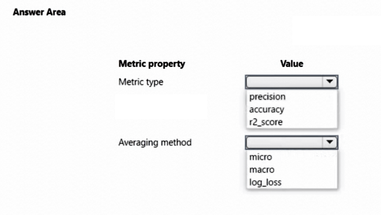
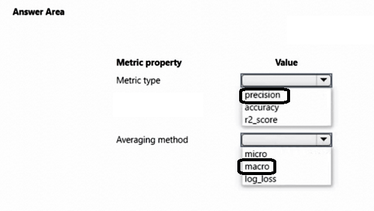

# Question 319

HOTSPOT

-

You create an Azure Machine Learning workspace. You train a classification model by using automated machine learning (automated ML) in Azure Machine Learning studio. The training data contains multiple classes that have significantly different numbers of samples.

You must use a metric type to avoid labeling negative samples as positive and an averaging method that will minimize the class imbalance.

You need to configure the metric type and the averaging method.

Which configurations should you use? To answer, select the appropriate options in the answer area.

NOTE: Each correct selection is worth one point.

  
Show Suggested Answer

 

  
Show Discussions

<blockquote>
<strong>snegnik</strong> <code>(Sun 03 Dec 2023 15:54)</code> - <em>Upvotes: 5</em>

I think it is correct
ChatGPT-3.5 answer 
To avoid labeling negative samples as positive and handle class imbalance, you can use the following configurations:

Metric type: Area Under the Precision-Recall Curve (AUPRC) or Average Precision Score (AP). These metrics are suitable for imbalanced classification tasks as they focus on the trade-off between precision and recall, instead of relying solely on accuracy. They are more robust when dealing with class imbalance.

Averaging method: Macro
Macro averaging calculates the metric independently for each class and then takes the average across all classes. It treats each class equally, regardless of the class distribution. It can be useful when you want to evaluate the model&#x27;s performance across all classes without bias towards the majority class.
</blockquote>

<blockquote>
<strong>kay1101</strong> <code>(Sat 23 Nov 2024 11:51)</code> - <em>Upvotes: 1</em>

Metric type: precision
Precision is the ability of a model to avoid labeling negative samples as positive.
reference:
https://learn.microsoft.com/en-us/azure/machine-learning/how-to-understand-automated-ml?view=azureml-api-2#classification-metrics

Averaging method: macro
While each averaging method has its benefits, one common consideration when selecting the appropriate method is class imbalance. If classes have different numbers of samples, it might be more informative to use a macro average where minority classes are given equal weighting to majority classes.
reference:
https://learn.microsoft.com/en-us/azure/machine-learning/how-to-understand-automated-ml?view=azureml-api-2#classification-metrics
</blockquote>

<blockquote>
<strong>PI_Team</strong> <code>(Fri 23 Feb 2024 11:59)</code> - <em>Upvotes: 1</em>

Metric Type: Precision
Averaging Method: Micro

Micro- and macro-averages (for whatever metric) will compute slightly different things, and thus their interpretation differs. A macro-average will compute the metric independently for each class and then take the average (hence treating all classes equally), whereas a micro-average will aggregate the contributions of all classes to compute the average metric. In a multi-class classification setup, micro-average is preferable if you suspect there might be class imbalance (i.e you may have many more examples of one class than of other classes).

SaM
</blockquote>

<blockquote>
<strong>BR_CS</strong> <code>(Sat 17 Feb 2024 11:44)</code> - <em>Upvotes: 1</em>

I am not sure about the averaging method. Macro just takes the mean over all classes whereas micro incorporates class contribution.
</blockquote>

---

[<< Previous Question](question_318.md) | [Home](../index.md) | [Next Question >>](question_320.md)
