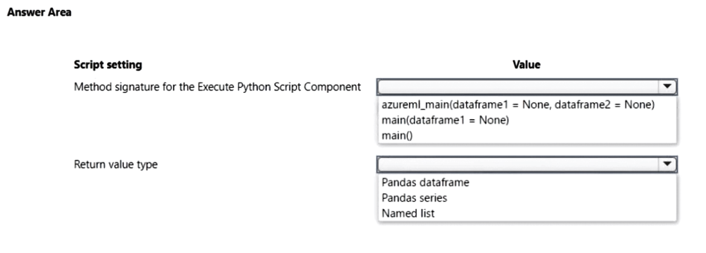
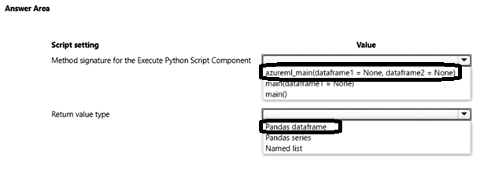

# Question 322

HOTSPOT

-

You are using the Azure Machine Learning designer to transform a dataset by using an Execute Python Script component and custom code.

You need to define the method signature for the Execute Python Script component and return value type.

What should you define? To answer, select the appropriate options in the answer area.

NOTE: Each correct selection is worth one point.

  
Show Suggested Answer

 

  
Show Discussions

<blockquote>
<strong>Mikku123</strong> <code>(Tue 06 Aug 2024 17:09)</code> - <em>Upvotes: 3</em>

Correct answer!
</blockquote>

---

[<< Previous Question](question_321.md) | [Home](/index.md) | [Next Question >>](question_323.md)
